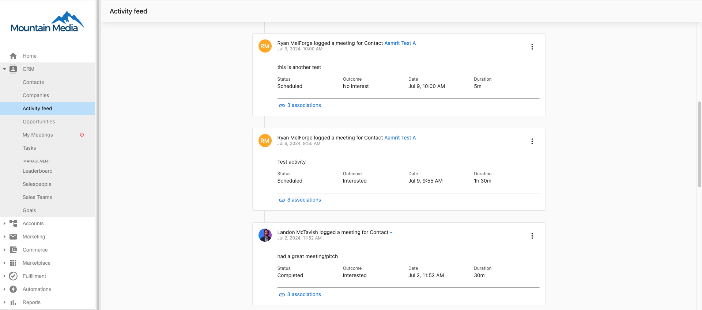

# Activity feed overview

The Activity Feed in the `Partner Center` CRM is a centralized feed that provides real-time updates on all sales activities across your organization. This powerful tool keeps your team informed about what's happening with prospects and enables better coordination between team members. Sales managers can quickly see activities at a glance to coach their team on calls or meetings. The Activity Feed serves as your single source of truth for all sales activities happening throughout your organization.

## Why use the activity feed?

The Activity Feed eliminates information silos and ensures no important sales interactions are missed, enabling better team coordination and more effective sales management.

## What's included

- Real-time updates on all sales activities across your organization
- Filtering capabilities for `Emails`, `Notes`, `Calls`, and `Meetings`
- Keyword search functionality for activity content
- Centralized view for sales managers to coach their teams

## Get started

1. **Navigate to the activity feed**
   - Go to `Partner Center` > `CRM` > `Activity Feed`
   - Access the centralized feed for all sales activities

2. **Filter activities**
   - Use the quick view to filter by `Emails`, `Notes`, `Calls`, or `Meetings`
   - Search by activity content to find specific keywords

3. **Review team activities**
   - Monitor real-time updates on sales activities
   - Track what's happening with prospects across the organization

4. **Use for sales management**
   - Coach team members based on visible activities
   - Ensure no important interactions are missed

## How to use the activity feed

Navigate to `Partner Center` > `CRM` > `Activity Feed`.

Filter on the quick view to find the list of `Emails`, `Notes`, `Calls`, or `Meetings`, or you can search by the activity content and see if any keywords are mentioned in any activities.

## What is the activity feed?

The Activity Feed in the `Partner Center` CRM is a centralized feed that provides real-time updates on all sales activities, so that your team can stay informed about what's happening with prospects in the organization. The Activity Feed is one place to stay in the loop for all the sales activities that happen across the organization, and is a quick way for sales manager to see the sales activities at a glance so they can coach their team on their calls or meetings.

## Activity feed features

The Activity Feed provides comprehensive visibility into your team's sales activities with powerful filtering and search capabilities. You can quickly sort through different types of interactions and find specific activities using keyword searches, making it easy to stay informed about prospect engagement across your entire organization.

## Frequently asked questions

Will this be available in Business App?

Yes, it will be available in `Business App` soon! Stay tuned for updates on how this will work.

<iframe 
  src="https://www.youtube-nocookie.com/embed/LyHT_ZZWOks" 
  width="560" 
  height="315" 
  frameBorder="0" 
  allow="accelerometer; autoplay; clipboard-write; encrypted-media; gyroscope; picture-in-picture" 
  allowFullScreen
></iframe>