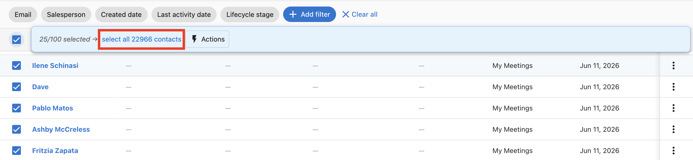
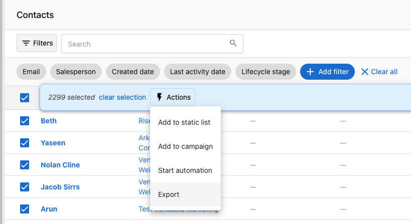
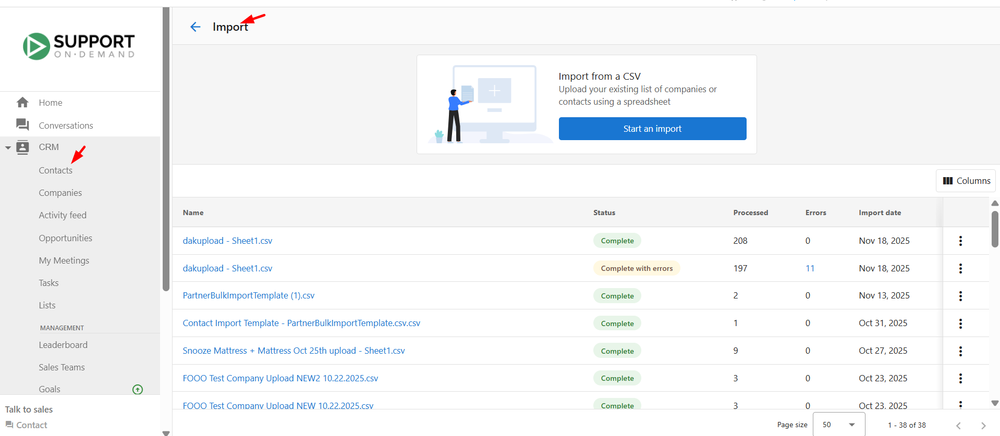
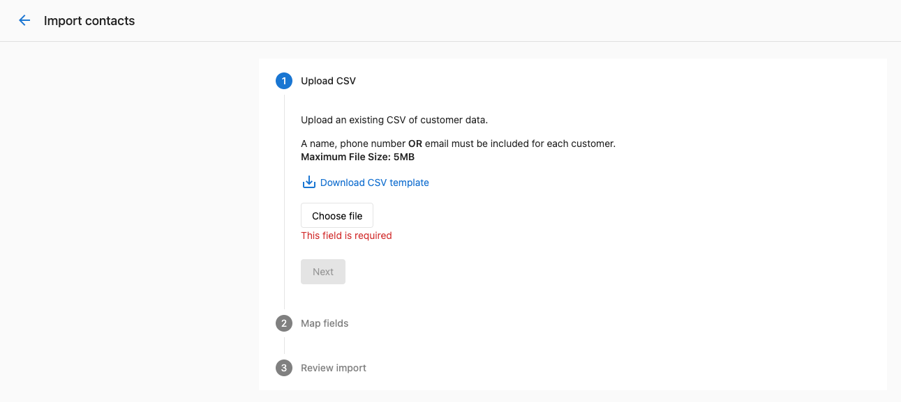
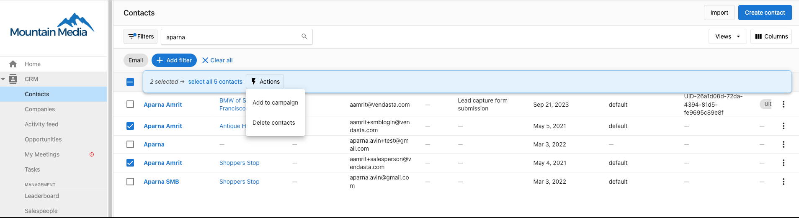
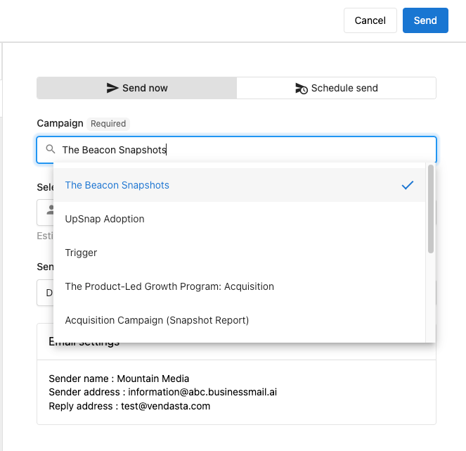
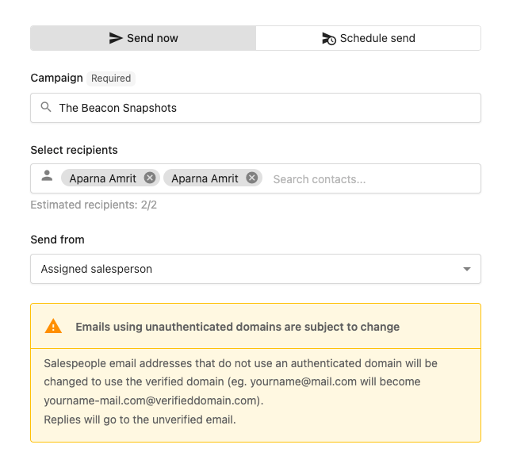

# Contacts

Manage your contacts effectively with Vendasta's CRM system. This comprehensive contact management solution enables you to import and export contacts in bulk, schedule targeted email campaigns, and customize contact fields to match your business needs. The Contacts section provides powerful tools for organizing, segmenting, and engaging with your audience throughout the customer journey. With advanced campaign scheduling and contact field management, you can ensure timely communication and maintain detailed records of all prospect interactions.

## Why use contacts?

The Contacts section eliminates manual processes through bulk import/export capabilities and automated campaign scheduling, ensuring consistent communication with your audience while maintaining comprehensive contact records.

## What's included

- **Importing and exporting**: Efficiently add or update multiple contacts and companies in bulk through CSV files
- **Campaign management**: Control campaign delivery and scheduling for individual contacts or groups
- **Contact field customization**: Standard and custom fields for tracking detailed contact information
- **[CRM default contact fields](./crm-default-contact-fields.mdx)**: Standard fields available for tracking contact information

## Get started

1. **Navigate to contacts**
   - Go to `Partner Center` → `CRM` → `Contacts`
   - Access your contact management workspace

2. **Import existing contacts**
   - Use bulk import to add multiple contacts at once
   - Map fields during import process for accurate data transfer
   - Contact will be deduplicated based on contact ID, external ID, email or phone number during the import

3. **Set up contact fields**
   - Review default contact fields available
   - Customize fields based on your business requirements

4. **Send your first marketing email**
   - Select contacts for campaign targeting
   - Navigate to `Partner Center` → `Contacts` > Select contacts
   - Click `Actions` → `Add to Campaign`
   - Learn more about [sending marketing emails](../../marketing/campaigns/send-marketing-emails.mdx)

## Importing and exporting contacts and companies

In the Vendasta CRM, you can efficiently add or update multiple contacts and companies at once by importing them in a single file. This powerful feature streamlines contact management and ensures data accuracy through proper field mapping during the import process.

### Partner Center vs. Business App imports

The import rules differ depending on where you import:

| | Partner Center import | Business App import |
|---|---|---|
| Flow | B2B — contacts are linked to companies | B2C — contacts can stand alone |
| Company name required? | Yes, on the first contact row | No |
| Use case | Sales CRM, account management | Consumer/client-facing lists |

If you're importing contacts for B2B sales work, import through **Partner Center > CRM > Contacts**. If you're managing consumer contacts for a Business App client, import through Business App.

### Before you begin

Before initiating an import:

- Ensure you have permission to manage CRM contacts and companies
- Confirm that each contact entry includes at least one of the following: First name, last name, email, or phone number
- **Company name (first-row rule)**: In Partner Center imports, company name must be populated on the **first** contact row. It does not need to appear on every subsequent row — but the first row requires it or the import will fail with "Company name is required."
- **Business categories**: If your CSV includes a business category, select it from the dropdown during field mapping — do not type it as free text. Free-text categories do not map to the CRM's category list and will silently break downstream syncing.
- **No blank rows**: Blank rows in your CSV cause "No company or contact found" errors. Remove all empty rows before importing.
- **Import limits**: Maximum file size is 5 MB, which typically allows for up to 35,000 contacts per import
- Prepare your data with unique identifiers for bulk updates (Contact ID, External ID, or email)

### Deduplication and matching logic

The CRM uses intelligent deduplication to prevent duplicate records during import:

**Contact matching hierarchy** (checked in this order):
1. **Contact ID** - Exact match on existing CRM Contact ID (highest priority)
2. **External ID** - Match on External ID field if provided
3. **Email address** - Match on primary email address (most common method)
4. **Phone number** - Match on primary phone number if email not available

**How deduplication works:**
- If a match is found using any of these criteria, the system will **update the existing contact** rather than create a duplicate
- If no match is found, a **new contact record** is created
- The system processes matches in the order listed above (Contact ID first, phone number last)
- You can choose whether to update existing records or skip them during the import process

**Best practices for deduplication:**
- Include Contact ID in your CSV for guaranteed exact matches during bulk updates
- Use consistent email formatting to ensure proper matching
- Clean phone number formatting before import (remove spaces, dashes, parentheses)
- Include External ID if you're syncing with another system

### How to export contacts and companies

To export all contacts or companies from the CRM:

1. Navigate to `CRM` → `Contacts` (or `Companies`)
2. Click the checkbox in the top-left corner to select the current page's records, then click the blue `select all [N] contacts` link to select all records

3. Click `Actions` → `Export`

### How to import CRM records

To import records, follow these steps:

**Step 1: Upload CSV**

To import CRM records, go to CRM > Contacts in Partner Center. In the top-right corner of the Contacts table, click Import. This opens the Import History page, where all previous uploads are displayed.

:::caution
Uploaded import files are automatically deleted after 30 days. After this period, files can no longer be downloaded from the import history. Save a local copy of any import file you may need to reference later.
:::

At the top of the page, you will see the option Import from a CSV with a button that says Start an import. Click this to begin.

Upload your CSV file containing the contacts or companies you want to import. You may use the optional CSV template to ensure your file is formatted correctly. After uploading the file, click Next and follow the steps to map your fields and complete the import.

:::caution Note
Users will only see the imports their user has actioned.
:::

**Step 2: Map fields**

- Map the fields from your CSV file to the corresponding fields in the CRM for contacts and companies. The system will attempt to auto-map columns to existing CRM fields, but you can manually adjust these mappings as needed
- For each column, choose whether it relates to a contact or company, then select the specific CRM field to map it to. Once you've completed the mapping, click `Next`

**Step 3: Review import**

- Review the records to be imported and deduplication settings
- **Choose update behavior**: 
  - "Update existing records" - Overwrites existing contact data when matches are found
  - "Skip existing records" - Leaves existing contacts unchanged, only imports new ones
- After confirming your settings, click `Finish`

After completing the import, you can return to the contact or company table to view the newly created records. Records added through this process will be created with the record source "Bulk import" and record source drill down 1 with the bulk import ID for easy reference.

### Bulk-assigning salespeople during import

You can assign salespeople to companies during a CSV import by including a `SalespersonID` column. This avoids manual reassignment after the import.

**How to find a salesperson's ID:**

1. Go to `Partner Center` → `Administration` → `My team`.
2. Click the three dots next to the salesperson and select **Edit Salesperson**.
3. The salesperson's UID appears in the browser URL bar — copy the value after `/salespeople/`.

**How to use it in your CSV:**

1. Add a column named `SalespersonID` to your import CSV.
2. Paste each salesperson's UID into the column for the rows (companies) they should own.
3. During import, map the `SalespersonID` column to the **Salesperson** CRM field.

To assign multiple salespeople to a single company, add additional columns named `AdditionalSalespersonID1`, `AdditionalSalespersonID2`, etc., and map them during import.

### Bulk update process

To perform bulk updates of existing contacts:

1. **Export existing contacts**
   - Follow the steps in [How to export contacts and companies](#how-to-export-contacts-and-companies) above to download your current contact data

2. **Prepare update file**
   - **Important**: Keep the `Contact ID` column from your export - this ensures exact matching
   - Modify only the fields you want to update
   - Do not change Contact ID, Created Date, or other system fields
   - Save as CSV format

3. **Import with updates**
   - Use the import process described above
   - The system will match on Contact ID for precise updates
   - Choose "Update existing records" in Step 3
   - Select which fields to update to avoid overwriting important data

**Pro tip**: For large bulk updates, you can export specific contact segments using filters, update only those records, and import them back for targeted updates.

### Common import errors

| Error | Most likely cause | Fix |
|-------|-------------------|-----|
| "Company name is required" | The first contact row in the CSV has no company name | Add a company name to the first row. Subsequent rows don't require it. |
| "No company or contact found" | Blank rows in the CSV, or the file is malformed | Remove all empty rows. Open in a text editor to check for hidden characters. |
| CSV parsing failures | File saved in the wrong format or encoding | Save as **CSV UTF-8** and ensure no merged cells or special formatting. |
| Category not syncing | Category entered as free text instead of selected from dropdown | Re-import and select the category from the dropdown during field mapping. |

## Campaign management

### Schedule campaigns for optimal engagement

When creating an email marketing campaign, you have the ability to schedule it for a later date and time. This feature ensures timely and consistent communication with your audience without the need for manual intervention. By scheduling your emails, you can optimize engagement and manage your time more effectively, ensuring your messages reach your audience at the perfect moment.

#### How to schedule campaigns for CRM contacts

**Step 1:** Navigate to `Partner Center` → `Contacts` > Select the contacts you wish to send the campaigns to. Click `Actions` → `Add to Campaign`.

**Step 2:** Schedule the campaign for now, or a later date/time.

**Step 3:** Select the campaigns.

**Step 4:** Select the email type - Default, custom or from the assigned salesperson. If the default email is selected, the details pulled in will be from your email settings.

- If a custom email is selected:

- If a Salesperson is selected:

**Step 5:** The `schedule send` option will allow you to pick a date and time for campaigns to be sent at.

### Pause or resume campaigns for individual contacts

You can pause or resume campaigns for an individual contact in the CRM. This is useful when a contact is temporarily unavailable or if they request a break from communications.

#### How to pause campaigns for a contact

1. Navigate to the `Contacts` section of your CRM
2. Find and select the contact for whom you wish to pause campaigns
3. Click on the `Campaigns` tab in the contact details

4. Click on the three dots menu to access more options

5. Select `Pause Campaigns` from the dropdown menu

6. Confirm your action when prompted

Once you pause campaigns for a contact, all active campaigns for that contact will be suspended until you decide to resume them. The contact will not receive any campaign emails, tasks, or notifications during this period.

#### How to resume campaigns for a contact

To resume campaigns for a contact:

1. Navigate to the `Contacts` section of your CRM
2. Find and select the contact whose campaigns you want to resume
3. Click on the `Campaigns` tab in the contact details
4. Click on the three dots menu to access more options
5. Select `Resume Campaigns` from the dropdown menu

6. Confirm your action when prompted

After resuming campaigns, the contact will start receiving campaign emails, tasks, and notifications again according to the campaign schedules.

## Upload files to contacts

You can upload files directly to contact records to maintain organized documentation:

1. Open a contact profile page
2. Navigate to the `Files` section
3. Click `Add a file` to upload documents, images, or other files
4. View AI-generated summaries for better file organization

Learn more about [file uploads](../file/crm-file-upload.mdx) and supported file types.

## Bulk deleting contacts

You can delete multiple contact records at once to clean up CRM data.

:::warning
Bulk deletion is **permanent and cannot be undone**. Export any records you may need before deleting.
:::

**Limits:** Contacts are deleted in batches of **100 records** at a time.

**Steps:**

1. Go to `Partner Center` → `CRM` → `Contacts`.
2. Increase the items-per-page setting to show more records (up to 100).
3. Use filters or search to narrow to the records you want to delete.
4. Click the top-left checkbox to select all visible records.
5. Click `Actions` → `Delete`.
6. In the confirmation modal, type `Delete` and confirm.

Repeat for additional batches if you need to delete more than 100 contacts.

## Tag formatting rules

Tags help you organize and filter contact records. To work correctly in filters and search, tags must follow these formatting rules:

- **Character limit**: 50 characters maximum
- **Allowed characters**: Letters (A–Z, a–z), numbers (0–9), dashes (`-`), spaces, and underscores (`_`)
- **Special characters**: Not supported — tags containing characters such as `@`, `#`, `&`, `!`, or `%` may appear to save but will not work correctly in filters or search

:::warning
Tags with unsupported characters may appear to save successfully but will silently fail in filtering and search. If a tag filter isn't returning expected results, check the tags on those records for special characters.
:::

## Contact field management

The CRM provides comprehensive default contact fields that help you store and track important information about your contacts. These fields can be customized to match your specific business needs and ensure you capture all relevant prospect information throughout your sales process.

### Creating custom contact fields

Beyond the default contact fields, you can create custom fields to capture information specific to your business:

**Available custom field types:**
- **Text**: Single line or multi-line text for names, descriptions, or notes. You can also define a list of predefined options to maintain data integrity (e.g., "Hot", "Warm", "Cold" for lead temperature)
- **Number**: Whole numbers like employee count, scores, or quantities
- **Decimal number**: Numbers with decimal places for revenue, percentages, or precise measurements
- **Email**: Additional email addresses for different purposes
- **Phone number**: Additional phone numbers for various contact methods
- **Date**: Important dates like contract renewal, follow-up dates, or anniversaries
- **Date and time**: Specific timestamps for appointments, deadlines, or scheduled events
- **True or false**: Yes/No or boolean data points for qualification criteria or status flags

**How to create custom fields:**
1. Navigate to `Administration` → `CRM objects`
2. Select "Contact" from the sidebar
3. Click "Create field"
4. Choose the field type that matches your data needs
5. Configure field properties:
     - **Field label**: Display name shown in the interface
     - **External Identifier**: System identifier (Cannot be changed after saved)
     - **Description**: Additional information about the field's purpose
     - **Read only**: Whether the field can be updated through the UI
     - **Field options** (Text fields only): Define a list of predefined values to ensure data consistency

**Custom field best practices:**
- Plan your custom fields before creating them - external identifiers cannot be changed after saving
- Use clear, descriptive labels that your team will understand
- Group related fields logically (e.g., all qualification fields together)
- For Text fields, use predefined options when you want consistent data entry (e.g., "Industry" field with options like "Healthcare", "Technology", "Retail")
- Consider making important qualification fields required
- Test custom fields with a few sample contacts before rolling out to your team
- Document custom field purposes and usage for team training

**Text field options examples:**
- **Lead Source**: "Website", "Referral", "Cold Call", "Trade Show", "Social Media"
- **Industry**: "Healthcare", "Technology", "Retail", "Manufacturing", "Financial Services"
- **Company Size**: "1-10 employees", "11-50 employees", "51-200 employees", "200+ employees"
- **Lead Temperature**: "Hot", "Warm", "Cold"
- **Decision Timeline**: "Immediate", "1-3 months", "3-6 months", "6+ months"

**Field visibility:**
- Custom fields appear in contact records alongside default fields
- Custom fields are available in imports/exports, reporting, and automation workflows
- All custom fields are searchable and can be used in list filtering

## Frequently asked questions

What is the maximum number of contacts you can import in Partner Center?

The maximum number of contacts you can import at one time depends on the file size and the fields included. The file size limit is 5 MB, which typically allows for up to 35,000 contacts per import.

To import contacts:
1. Navigate to `Partner Center`
2. Go to `CRM` → `Contacts`
3. Select `Import` to upload your file

Ensure your file meets the size and format requirements before importing.

What happens when I pause campaigns for a contact?

When you pause campaigns for a contact, all active campaigns for that contact will be suspended. The contact will not receive any campaign emails, tasks, or notifications during this period until you resume campaigns.

Can I schedule campaigns for multiple contacts at once?

Yes, you can select multiple contacts from the contact table and use the `Actions` → `Add to Campaign` option to schedule campaigns for all selected contacts simultaneously.

What information is required when importing contacts?

Each contact entry must include at least one of the following: First name, last name, email, or phone number. For companies, a company name is required.

