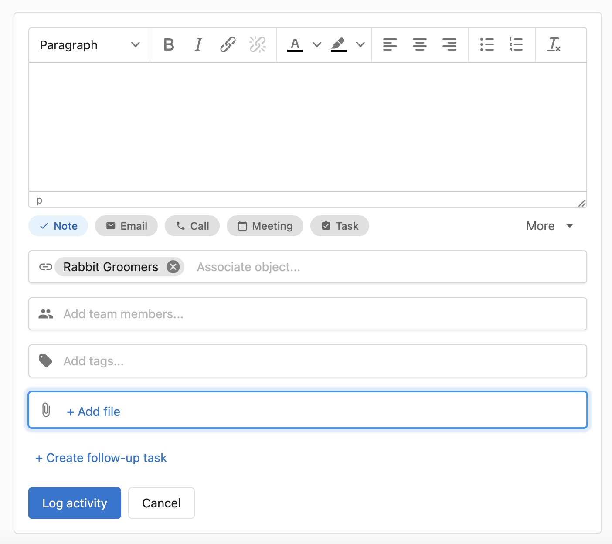

## Overview

Upload files—PDFs, images, documents, spreadsheets, and more—and associate them with any **Contact**, **Company**, or **Opportunity** in CRM. After upload, an **AI-generated summary** of the file content appears automatically.

---

## Why It Matters

- **Improves context and organization**  
  Files are properly linked to CRM objects for easier access and review.

- **Enhances file discoverability**  
  AI-generated summaries help you understand the contents at a glance, without needing to open the file.

- **Supports future automation and workflows**  
  Structured file data enables better search, AI-driven engagement, and future support for lead capture via form uploads.

---

## Where to Find It

This feature is available in both **Partner Center** and **Business App**.

- Navigate to any **Contact**, **Company**, or **Opportunity** record
- Open the `Files` section to view or upload

---

## How to Upload a File in CRM

**Steps (Partner Center and Business App):**

1. Open a CRM record (Contact or Company in Partner Center; Contact, Company, or Opportunity in Business App)
2. Go to the `Files` section
3. Click `Add a file`
4. Upload a supported file (e.g., PDF, PNG, JPEG)
5. After upload, an AI-generated summary appears automatically

:::info
Business App supports file uploads to **Opportunities** in addition to Contacts and Companies.
:::
---

## How to Upload a File When Logging an Activity

**Steps:**

1. Navigate to a **Contact** or **Company** record
2. Click on the activity logger (`Log Activity`)
3. Click `Add a file`
4. Upload a supported file
5. Log the activity

Uploaded files will appear in:
- The `Files` section
- The activity timeline under the associated log

---

## Frequently Asked Questions (FAQ)

What file types support AI-generated summaries?

AI summaries are supported for the following file types:  
- **Images**: PNG, JPEG  
- **Documents**: PDF, DOC, DOCX, TXT, MD  
- **Spreadsheets**: XLS, XLSX, CSV  
- **Presentations**: PPT, PPTX  

Is this feature available in both Partner Center and Business App?

Yes.  
- Partner Center: Contacts and Companies  
- Business App: Contacts, Companies, and Opportunities  

Can I upload multiple files at once?

No. Only one file can be uploaded at a time.

Can I delete or replace an uploaded file?

Yes. You can delete files directly from the `Files` section. Uploading a new version will generate a new AI summary.

How long does it take to generate the AI summary?

Summaries typically appear within a few seconds after uploading, depending on file size and format.

Where do uploaded files appear in CRM?

Files show up in the `Files` section of the record (Contact, Company, or Opportunity), and under any associated activity if uploaded during logging.

Does uploading a file during activity logging associate it with the CRM record?

Yes. The file will be linked to the relevant Contact or Company and visible in both the activity and file sections.

Can I search for files by the content of the AI summary?

Not yet. Summaries are not currently searchable.

Can I edit or customize the AI-generated summary?

No. Summaries are generated automatically and cannot be manually edited.

Are uploaded files public or private?

Users can choose the file's visibility before upload:

- **Private**: Only you and authorized users can access the file.
- **Public**: Anyone with the file link can access it, even without CRM access.

Can I upload a file when submitting a form?

Yes. You can include a file upload field on Business App Forms. When a visitor submits a form with a file, the file is attached to the CRM record that the form creates (Contact or Company) and an AI-generated summary is created for the uploaded file.

Notes:

- **Supported file types**: Images (PNG, JPEG), Documents (PDF, DOC, DOCX, TXT, MD), Spreadsheets (XLS, XLSX, CSV), Presentations (PPT, PPTX).
- **Single file per submission**: Forms accept one file upload per submission.
- **Visibility & access**: Files follow the same visibility rules as files uploaded directly in CRM—choose private or public when configuring the field or after upload.
- **AI summary**: Summaries are generated automatically after upload and may take a few seconds depending on file size.

What happens if I upload an unsupported file type?

Unsupported files may not upload, or may upload without generating a summary.

Can I automate actions based on uploaded files?

Not at this time. However, structured metadata support may enable automation in the future.

