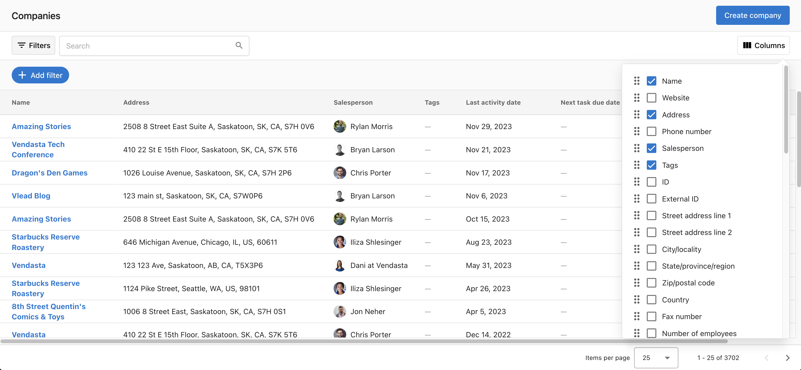
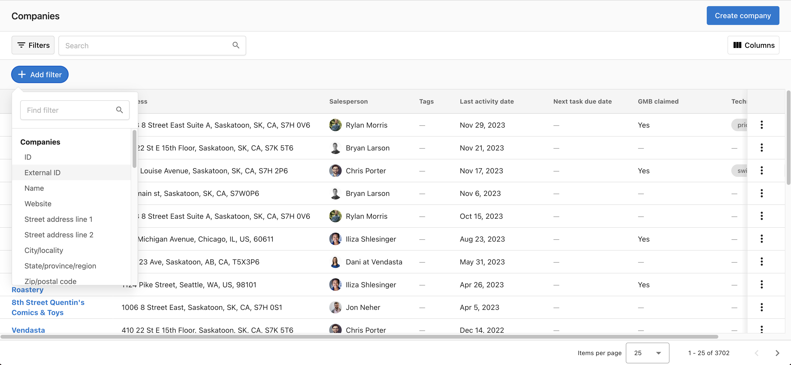

# CRM Overview

The Vendasta CRM provides comprehensive tools for managing customer relationships, tracking interactions, and nurturing business prospects. Built to streamline sales processes and improve client engagement, the CRM integrates seamlessly with your existing workflows. This centralized platform helps you organize contacts, track opportunities, and automate communications to drive revenue growth.

## Why use the CRM?

Transform your sales process with powerful relationship management tools that keep your team organized and your prospects engaged. The Vendasta CRM eliminates data silos, automates routine tasks, and provides insights that help you close more deals faster.

## What's Included

- **[Contacts](./contacts/index.mdx)**: Manage people, import/export, and run campaigns
- **[Companies](./companies/index.mdx)**: Manage organizations, associate contacts and opportunities  
- **[Lists](./lists/index.mdx)**: Segment contacts and companies with static or smart lists
- **[Forms](../business-app/crm/forms-to-capture-leads.mdx)**: Capture leads from your website directly into the CRM
- **[Tasks](./tasks/index.mdx)**: Plan and complete sales activities
- **[Opportunities](./opportunities/index.mdx)**: Track and manage deals in table or board views
- **[My Meetings](./my-meetings/index.mdx)**: Schedule and manage appointments with prospects
- **[Activity Feed](./activity-feed/index.mdx)**: Track all interactions and engagement history
- **[Sales Teams](./sales-teams/index.mdx)**: Organize and manage your sales team performance
- **[Leaderboard](./leaderboard/index.mdx)**: Monitor sales performance and team rankings

## Get Started

1. **Go to CRM in Partner Center**
   - Navigate to `Partner Center` and click on `CRM`
   - Choose between `Contacts` and `Companies` views

2. **Set up your Companies view** 
   - Customize columns to show information that matters to you
   - Enable, display, and reorder columns based on your preferences
   - Configure filters to focus on your assigned accounts

3. **Create your first contact**
   - Click `Create contact` in the top right corner
   - Fill in name, email, and phone number (email recommended)
   - The system will check for duplicates automatically

4. **Import existing data**
   - Use bulk import to add your existing contacts and companies
   - Map fields during import to ensure data accuracy

## Setting up your view

Navigate to `CRM` > `Companies`. You are now on the company page. The very first thing you want to do is ask yourself what information matters to you. There is tons of information, and you will want to consider what data matters to you. You can set up your view by enabling, displaying, and reordering the columns. Say, the website is not important to you, while the address is. Check off the boxes according to your preferences. You may also want to see whether or not a company has claimed its Google Business Profile, which will be available if you have created a Snapshot Report.

## Searching, filtering, and sorting

You can find the company that is assigned to you by clicking on the `Add filter` button, and then searching for `Salesperson`. You can then find yourself using your name or email.

If you know the name of the company, you can find it by searching in the search bar on the table where you can also search for a company by phone number, `Partner ID`, `Account Group ID`, and more.

You can also find when you last touched base with your current customers by looking at the `last activity date`. You can sort, and see if there are any customers you have missed catching up with so you can keep conversations fresh!

## Automatic Email Capture

With Vendasta, you can automatically log emails sent from outside to the CRM through the BCC address and forwarding address.

Emails that are logged to the Vendasta CRM will include the email subject and contents with a max length of 4000 characters. The logged email will automatically be associated with the recipient's contact record and its associated primary company record.

### Requirements for logging emails to the CRM using the BCC & forwarding address

**Your email must meet the following criteria in order to be logged in the CRM:**

- The email address from which you are sending the email must be a user in the platform
- The email address of the recipient is a contact record in the CRM
- It is important to note that there is no standard formatting for a forwarded email. If Vendasta is unable to process your email format, the email will not log to Vendasta CRM.

### Log Sent Emails

When you send an email from your mail client, add the `BCC address` to the `BCC line` of the email. After sending, the email will be recorded in the Vendasta CRM automatically.

**For your CRM in Partner Center:**

- If you are setting this up for your own CRM in `Partner Center`, you can use your `Partner ID` as the prefix of the email address, following this format: [Partner ID]@sent-mail.yourdigitalagents.com
  - For example, if your `Partner ID` is VEND, your BCC email address will be VEND@sent-mail.yourdigitalagents.com

**For Client's CRM in the Business App:**

- If you are setting this up for your client's CRM in the `Business App`, you should use the `account group ID` as the prefix of the email address, following this format: [Account Group ID]@sent-mail.yourdigitalagents.com
- For example if your client's `account group ID` is AG-1234567, your client's BCC email address will be AG-1234567@sent-mail.yourdigitalagents.com

### Adding the BCC address automatically to the BCC line of the email through Yesware

There are a lot of software allowing you to add the BCC address automatically. In Vendasta, you can set this up through Yesware, if you have access to Yesware in your subscription. Here's how:

- `Marketplace` > `My Purchases` > Click into `Yesware`
- Install the [Yesware chrome extension](https://chrome.google.com/webstore/detail/yesware-for-chrome/gkjnkapjmjfpipfcccnjbjcbgdnahpjp?hl=en)
- Allow `Yesware` to access your `Gmail`
- When this is complete, refresh your `Gmail` tab and you should see the `Yesware` options at the top of your inbox.

- Using the `Yesware` drop-down menu in the top left corner of `Gmail`, select `Preferences`
- Go to the `Integrations` section
- Turn `BCC to CRM` to `ON`
- Input your unique BCC address
- Click `Save & Reload`
- Ensure that the `CRM` button is checked when you send out an email
- The `CRM` button will remain checked moving forward and your emails will be logged seamlessly right into Vendasta CRM

### Log Received Emails

Through Vendasta, you can use a forwarding address to log an email reply or any incoming emails from your clients. Before getting started, you will need to make sure your email client supports auto-forwarding. If your email client does not support auto-forwarding, you can forward the emails manually to have them captured in the Vendasta CRM.

Learn how to set up auto-forwarding on [**Outlook**](https://support.microsoft.com/en-au/office/turn-on-automatic-forwarding-in-outlook-7f2670a1-7fff-4475-8a3c-5822d63b0c8e)/[**Gmail**](https://support.google.com/mail/answer/10957?hl=en)/[**Apple Mail**](https://support.apple.com/en-hk/guide/icloud/mm6b1a3960/icloud)/[**Yahoo! Mail**](https://help.yahoo.com/kb/SLN29133.html).

**For your CRM in Partner Center:**

- If you are setting this up for your own CRM in `Partner Center`, you can use your `Partner ID` as the prefix of the email address, like this: [Partner ID]@received-mail.yourdigitalagents.com
  - For example, if your `Partner ID` is VEND, your forwarding email address will be VEND@received-mail.yourdigitalagents.com

**For Client's CRM in the Business App:**

- If you are setting this up for your client's CRM in the `Business App`, you should use the `account group ID` as the prefix of the email address, like this: [Account Group ID]@received-mail.yourdigitalagents.com
  - For example, if your client's `account group ID` is AG-1234567, your client's forwarding email address will be AG-1234567@received-mail.yourdigitalagents.com

The forwarded email will be logged to the contact's record, as well as the primary associated company in the Vendasta CRM.

### Privacy and Security note

As part of setting up an auto-forwarding rule, it's important to know that Vendasta will receive a copy of all emails you receive, however, we want to reassure you that our automated system is designed with your privacy in mind. The system discards any emails that do not include at least one contact's email address, ensuring only relevant communications are logged.

Furthermore, we can verify that the implementation does not retain a copy of those email bodies in our logs or audit tables. This measure is crucial to prevent any sensitive information, such as medical details sent through a work email, from being stored in our database. Our priority is to respect your privacy and security, ensuring that the Vendasta CRM remains a safe and reliable tool for managing your client interactions.

## Record Sources

In Vendasta, you can view a record's source to understand how it was created or see its property history to track updates over time. The source values below indicate the tool or process that updated the record. For example, a record might be created by an import or have its property values changed via a workflow.

**Records can be updated through the following sources:**

- **`CRM UI`:** Manually creating a company or contact in Vendasta CRM.
- **`Account Group`:** Created when an account group is made (only for Company records).
- **`Find-Businesses`:** Created using the `find businesses` feature (only for Company records).
- **`User`:** Created when an account group user is added (only for Contact records).
- **`Legacy Customer List`:** Created from the legacy customer list in the `Business App` (only for Contact records), `Customer Voice`, `Website Pro`, or `Marketplace` product integration.
- **`Bulk Import`:** Added through the bulk import process via CSV upload.
- **`Web Chat`:** Created via the AI lead capture widget.
- **`Form`:** Created when a user fills out a form built with the form builder.
- **`Facebook Messenger`:** Created from conversations initiated through `Facebook Messenger`.
- **`Google Business Messages`:** Created from conversations on `Google Business Messages`.
- **`Instagram Messaging`:** Created from `Instagram` direct messaging.
- **`Inbox`:** Manually created in Vendasta `Inbox`.
- **`SMS`:** Records of conversations initiated through inbound SMS.
- **`GingrApp`:** Created through the `Gingr` integration.
- **`Jobber`:** Created through the `Jobber` integration.

## Frequently Asked Questions

Who can see these new tabs in Partner Center? Can I change this?

Yes, you can control who can see the new tabs in `Partner Center` for users with admin roles, here's how:

1. **Navigate to the My Teams Page**:
   - Begin by navigating to the [`My Teams` page](https://partners.vendasta.com/my-team) in the `Partner Center`.

2. **Edit User Settings**:
   - Locate the user whose tab visibility you want to control.
   - Click on the row action menu (often represented by three dots or a similar icon) next to their name.
   - Select `Edit member` from the menu to modify their settings.

3. **Adjust Admin Permissions**:
   - In the user's settings, find the section labeled `Admin`.
   - Click on `Show more permissions` to expand the list of available permissions.

4. **Configure Specific Permissions**:
   - You will see various permission settings. Focus on the following three to control CRM tab visibility:
     - **Can manage contacts in the platform**: Enabling this permission controls whether the user can see and manage the contact page, including the ability to create, edit, and delete contacts.
     - **Can manage activities in the platform**: This permission allows the user to create, edit, and delete activities, including tasks.
     - **Can manage companies in the platform**: By enabling this, the user gains or loses the ability to see the company page and to create, edit, or delete company information.

Adjusting these permissions will effectively control the user's ability to view and interact with specific pages and features within the `Partner Center`, ensuring they have access to only the necessary tools for their role.

Does a contact have access like a user has access?

By default, a contact does not automatically gain access to the company's `Business App`, however, you can easily provide them with access by sending an invitation. Here's how to do it:

1. **Navigate to the Business App Instance**:
   - Start by going to the company's profile page that corresponds to the specific `Business App` instance you want the contact to access.

2. **Access the Contacts Section**:
   - On the company's profile page, look for the `Contacts` option in the association panel, typically found on the right side of the page.

3. **Locate or Add the Contact**:
   - Search for the contact you wish to grant access to within the contacts list.
   - If the contact is not listed, click `Add Contact` to associate a new contact with the company.

4. **Send the Invitation**:
   - Once you find or add the contact, check their information card for an `Invite to Business App` button.
   - If instead, you see a last login date, this indicates that the contact already has access to `Business App`.

Following these steps will allow you to manage access to the company's `Business App`, ensuring that the right contacts have the necessary permissions.

Why would I use companies over accounts right now?

Accounts and companies serve different purposes:

- **Accounts:** These are mainly used for handling your financial dealings within Vendasta. This covers billing details, product activations, and payment histories. To initiate these processes, you will need to create an account from the company if it has not already been created.
  
- **Companies:** These are centered on building and maintaining customer relationships. They help you track potential leads and manage ongoing client interactions through the activity timeline.

So, if your role revolves around administrative functions, handling billing issues, and managing orders, opt for **Accounts**. They provide the necessary tools for effective financial management and operational administration.

If your job is focused on generating new sales, nurturing client relationships, and growing revenue, **Companies** are more apt. They offer the resources and framework for tracking leads, maintaining client relationships, and boosting sales.

While we are moving towards integrating account features into company pages, currently, the choice between using accounts or companies depends heavily on your specific job functions. Accounts are tailored for financial and administrative tasks, whereas companies are ideal for sales, CRM, and revenue growth activities.

