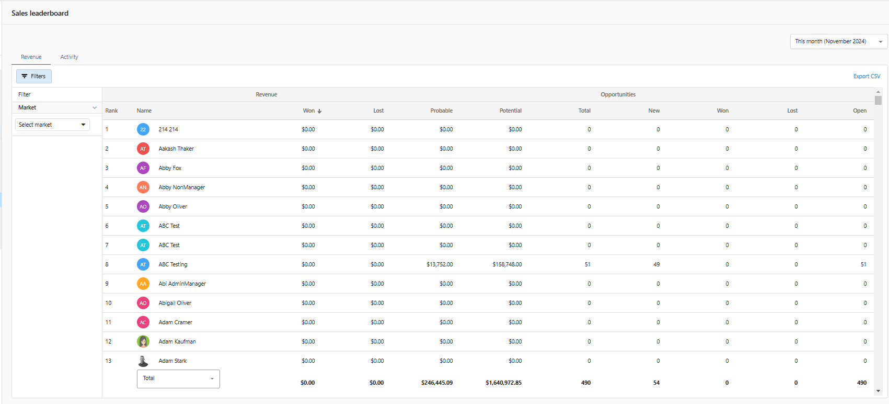

The sales leaderboard is a great way for you and your team to compare performance metrics and encourage healthy competition amongst your team.

Your leaderboard showcases all of your salespeople and important revenue metrics. You can filter your leaderboard based on sales teams and markets and you can adjust for custom date ranges. Your leaderboard can also be exported into a CSV so you can leverage the information in your own reporting as well.

  <iframe 
    src="https://www.youtube-nocookie.com/embed/PKTo_YFGNPU" 
    width="560" 
    height="315" 
    frameBorder="0" 
    allowFullScreen
  ></iframe>

