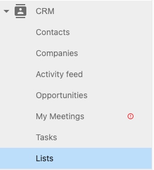
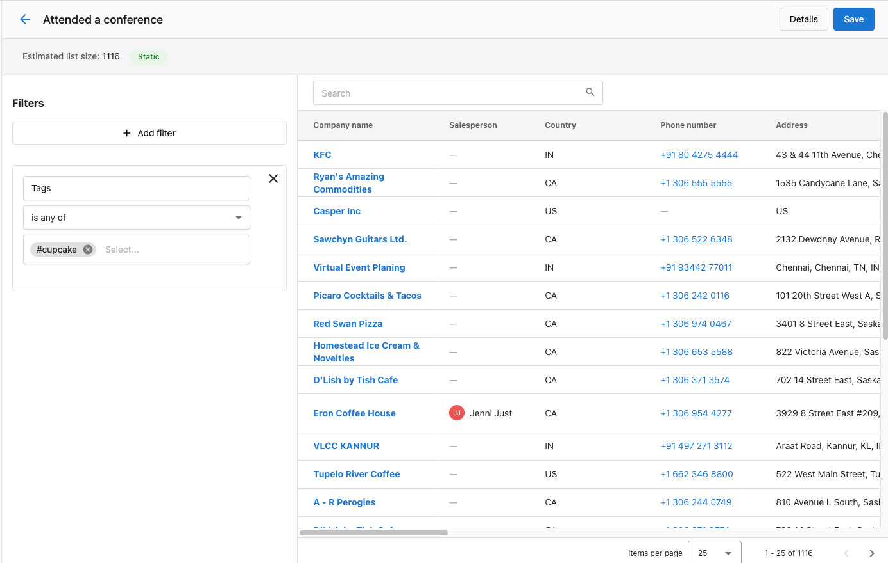
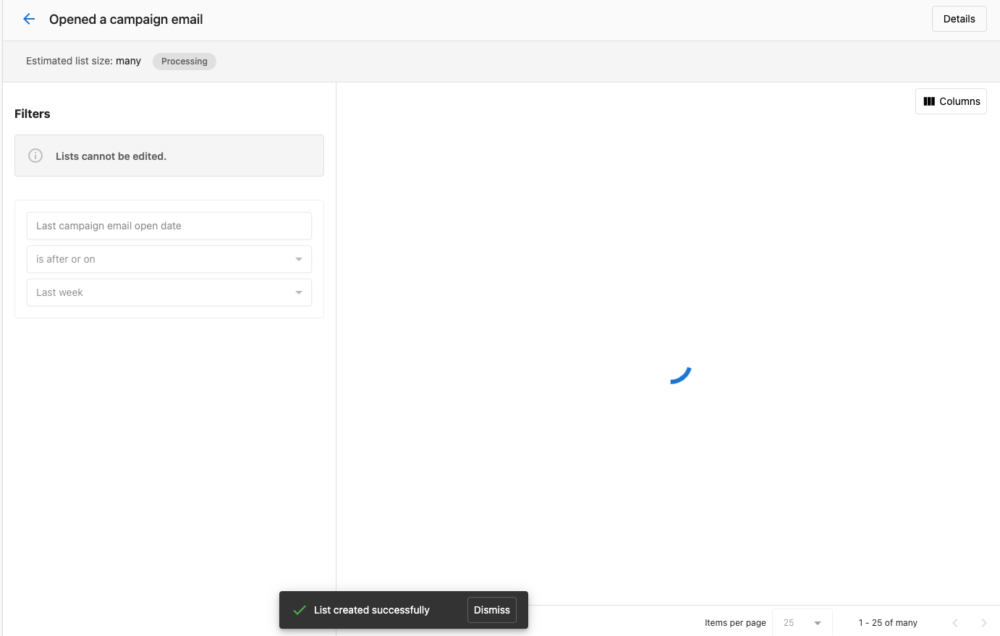
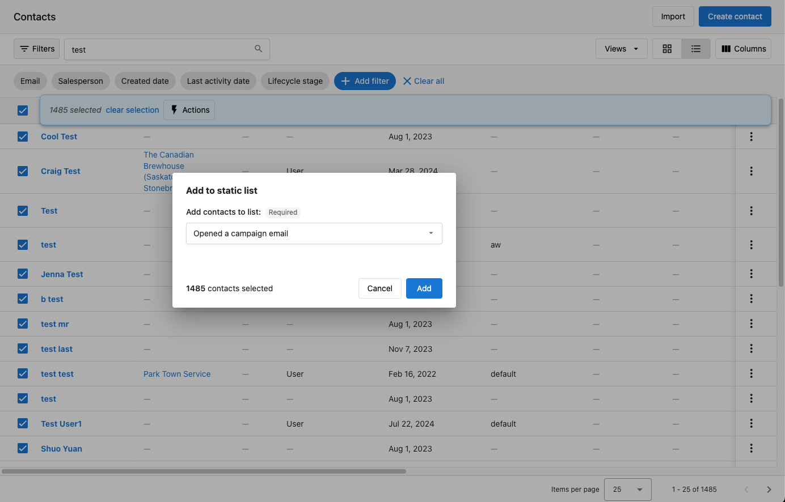
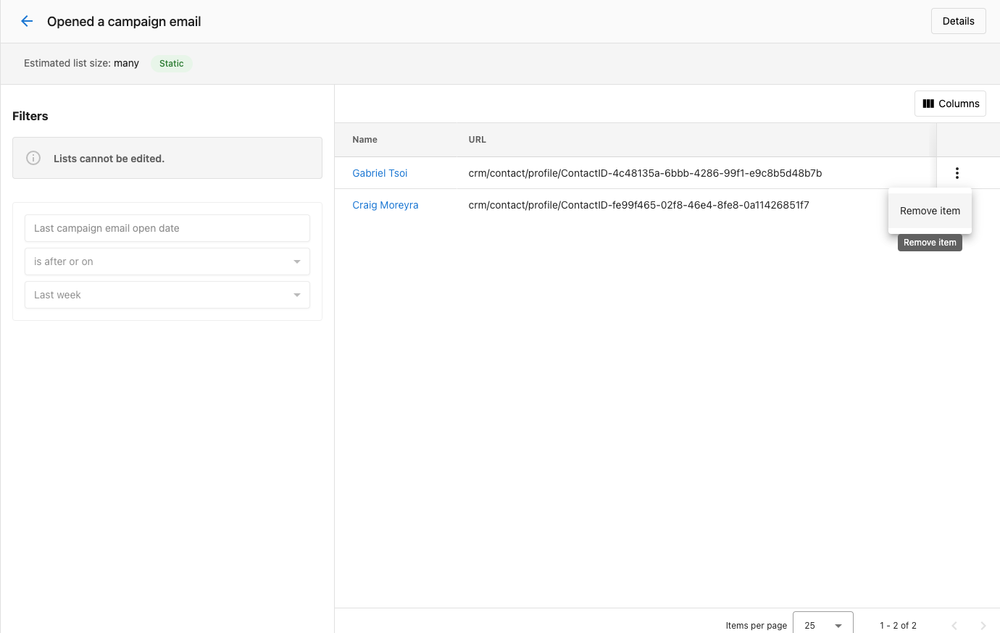
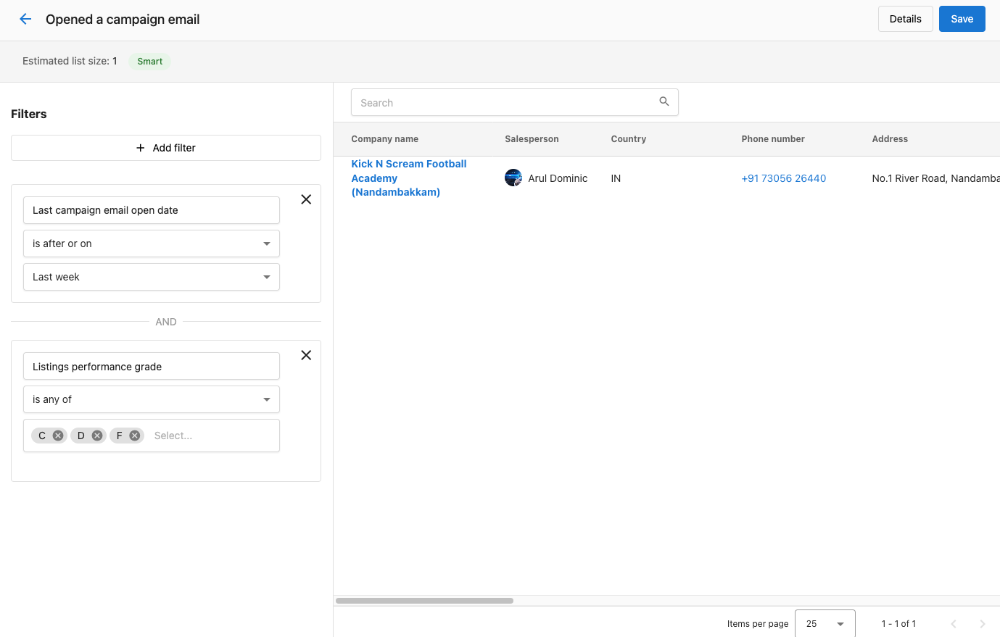
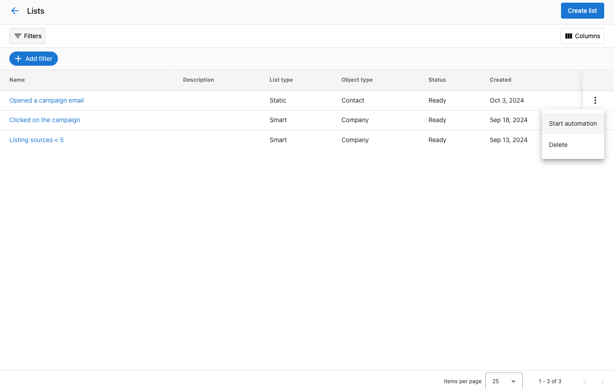
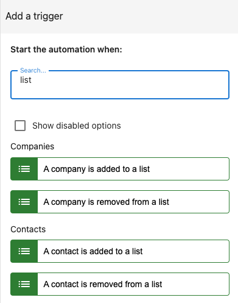
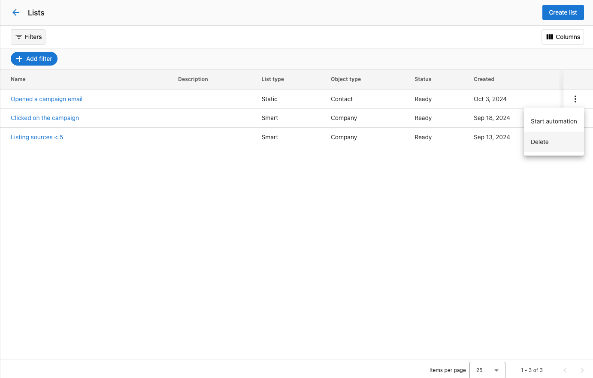

# Create and Use Lists in the CRM

## What are lists in the CRM?

The list feature allows users to create either static or dynamically updated lists of contacts or companies that are shared among team members. Users can start automations based on these lists or trigger automations when a contact or company is added, making lead nurturing and bulk actions much simpler and more efficient.

There are two types of lists in the CRM: 

**1. Static Lists:** Users can set a filter to create an initial list of companies or contacts, then manually add or remove entries. This list doesn't change automatically, making it useful for fixed groups, like targeting attendees from a specific event.

**2. Smart Lists:** Smart lists automatically update based on rules you set, such as how contacts interact with emails. For example, a marketer could create a smart list that automatically includes contacts who have clicked on your marketing email or match your buyer profile. As customer behaviors or details change, the list updates in real time, helping the marketer keep track of engaged leads and nurture them automatically without manual updates.

## How to use lists in the CRM

**Step 1:** Navigate to **Partner Center > CRM > Lists.**

**Step 2:** Click "Create." You will be given the option to create either a Static or Smart list.

## Creating a Static List

**1. Specify Filters:** Use filters to select the contacts or companies you want to add initially. You can filter by criteria such as location, industry, interaction history, or any custom fields you've set up.

**2. Click Save:** Once you've applied the filters, click **Save.**

**Note:** It may take some time for the static list to populate fully with the selected contacts or companies, depending on the size of your CRM data.

**3. Manually Manage the List:**

- **Adding Contacts/Companies:** After the list is created, you can manually add new contacts or companies by going to the Contact or the Company table, selecting the records you would like to add to a list, and then selecting a list to assign them to.

**4. Removing Contacts/Companies:** Similarly, you can manually remove any contact or company by selecting the record in the list and clicking the remove option.

## Creating a Smart List

**1. Specify Filters:** Define dynamic rules for the list, such as contact engagement, email opens, or other behaviors. For example, you can create a rule for "Companies who have a contact that has opened a marketing email in these two weeks" and "Companies who have a listing grade of C, D or F."

**2. Click Save:** Once saved, the smart list will automatically update based on the criteria you've set. Contacts and companies will be added or removed in real time as their details or behaviors change. You don't need to manage this list manually.

## Triggering Automations from the List

This process is the same for both static and smart lists:

**1. Locate the List:**
- On the List Table screen, find the list you want to automate actions for.

**2. Start Automation:**
- Click on the action menu (three dots) next to the list and select "Start Automation."

**3. Choose the Automation:**

a. Depending on whether your list is for contacts or companies, you will see a list of available automations with triggers **"Manually trigger for contact"** or **"Manually trigger for company."**

b. Select the automation you want to run, and it will start immediately for all the entries in the list.

## How Do I Automate Actions When Contacts or Companies Are Added or Removed From a List?

You can set up automations to trigger specific actions when a contact or company is added to or removed from a list. There are four available automation triggers for this:

1. When a contact is added to a list
2. When a contact is removed from a list
3. When a company is added to a list
4. When a company is removed from a list

These triggers allow you to automate workflows, such as sending follow-up emails, notifying a sales team, or moving a contact to another CRM stage when they join or leave a list. Simply set up the automation with the appropriate trigger, and the system will handle the rest based on your criteria.

## How do I delete a list?

**1. Locate the List:**
- On the **List Table** screen, find the list you want to delete.

**2. Click delete:**
- Click on the action menu (three dots) next to the list and select "Delete."

**3. Confirm the deletion:**
- A modal will pop up. Clicking "Delete" will allow you to delete the list.

## Q&A

**Q: Will this be available for my customers?**

**A:** Yes, this is also available for your clients in Business App.

**Q: Can I share lists with my team members?**

**A:** Yes, both static and smart lists can be shared across your team. This ensures everyone is working with the same up-to-date information and helps improve collaboration.

**Q: What's the difference between a static list and a smart list?**

**A:** A static list is manually managed and doesn't change unless you update it. It's great for fixed groups like event attendees. A smart list updates automatically based on rules you set, such as contact engagement or behaviors, making it ideal for dynamic targeting.

**Q: How do I set up automations for my lists?**

**A:** You can easily set up automations by going to the list, clicking the action menu (three dots), and selecting "Start Automation." From there, choose the automation you want to run, and it will trigger for all entries in the list. You can also set up an automation to automatically conduct actions when contact/companies are added/removed from the list.

**Q: Is there a limit to how many lists I can create?**

**A:** There's no specific limit on the number of lists you can create, so you can organize your contacts or companies as needed for different campaigns or workflows.