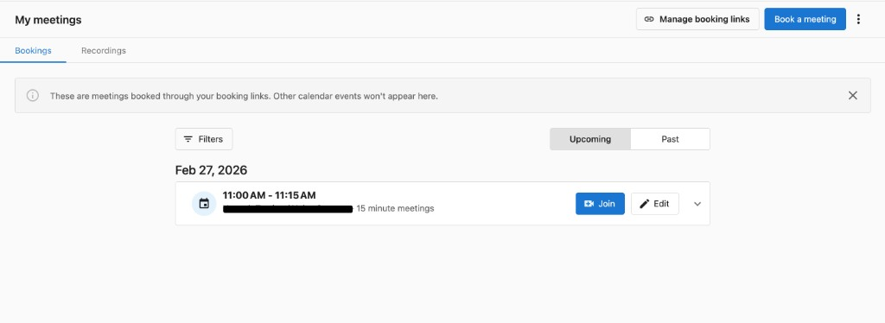

# Create booking links

Meetings don't necessarily fit into a one size fits all format, which is why the Meeting Scheduler allows you to create your own booking links. Want a quick 15-minute coffee meeting? You got it! How about a 60-minute consultation call? We've got you covered.

## Create booking link

1. Go to `CRM` > `My Meetings`
2. Click `Book a meeting`

3. Fill in the **Book a meeting** form with the following details:
   - **Contact** - Search for an existing contact or click **+Add contact** to create one
   - **Additional guest email(s)** - Add email addresses for other attendees
   - **Event type** - Search and select the type of meeting
   - **Timezone** - Confirm or change the timezone for the meeting
   - **Date & Time** - Select the meeting date and time

4. Click **Book a meeting** to confirm.

Once booked, the meeting appears under the **Bookings** tab on the **My Meetings** page. From here you can **Join** the meeting directly or click **Edit** to make changes. Use the **Upcoming** and **Past** toggles to filter your view, and switch to the **Recordings** tab to review past meeting recordings.

## Other options

You can edit any of the default meetings or ones you've already created by opening up the menu on the left side of each meeting and clicking `Settings`.

:::note
If a meeting type is deleted, it will not cancel any appointments already booked using that link. This does mean that the specific link will be deactivated and will no longer allow for any new bookings. If it was deleted in error, there is no way to restore it, you will need to create a new booking link.
:::

With that, you now have your own custom meeting type that you can share with your prospects. You can share the individual links or, if you prefer, send them the general booking link that will showcase all the meeting types available.

