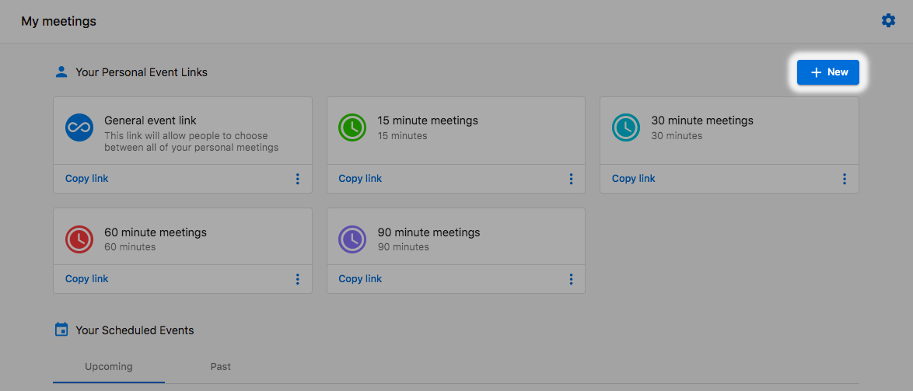

Meetings don't necessarily fit into a one size fits all format, which is why our Meeting Scheduler allows you to create your own booking links. Want a quick 15-minute coffee meeting? You got it! How about a 60-minute consultation call? We've got you covered.

## Create booking link

1. Go to **CRM > My Meetings**
2. Click **+ New**

4. Fill in the booking link form. You'll have the following options:
   - **Name** - The name used to identify the booking link
   - **Link** - The URL visitors will use to book meetings
   - **Duration** - How long meetings booked via the link will run
   - **Description (optional)** - Describes what meetings booked at this link are for
   - **Color** - This helps to visually distinguish each booking link, allowing for quicker recognition

If you want, you can also add questions to the booking link. These are useful if you'd like to request additional information from the person booking the meeting so that you can prepare beforehand. To add a new question, click **Questions for invitee**.

Once you've finished building out your custom meeting type, click **Create event link** in the bottom right. This will add it to your list of available meetings.

## Other options

You can edit any of the default meetings or ones you've already created by opening up the menu on the left side of each meeting and clicking **Settings.**

:::note
If a meeting type is deleted, it will not cancel any appointments already booked using that link. This does mean that the specific link will be deactivated and will no longer allow for any new bookings. If it was deleted in error, there is no way to restore it, you will need to create a new booking link.
:::

With that, you now have your own custom meeting type that you can share with your prospects. You can share the individual links or, if you prefer, send them the general booking link that will showcase all the meeting types available.

