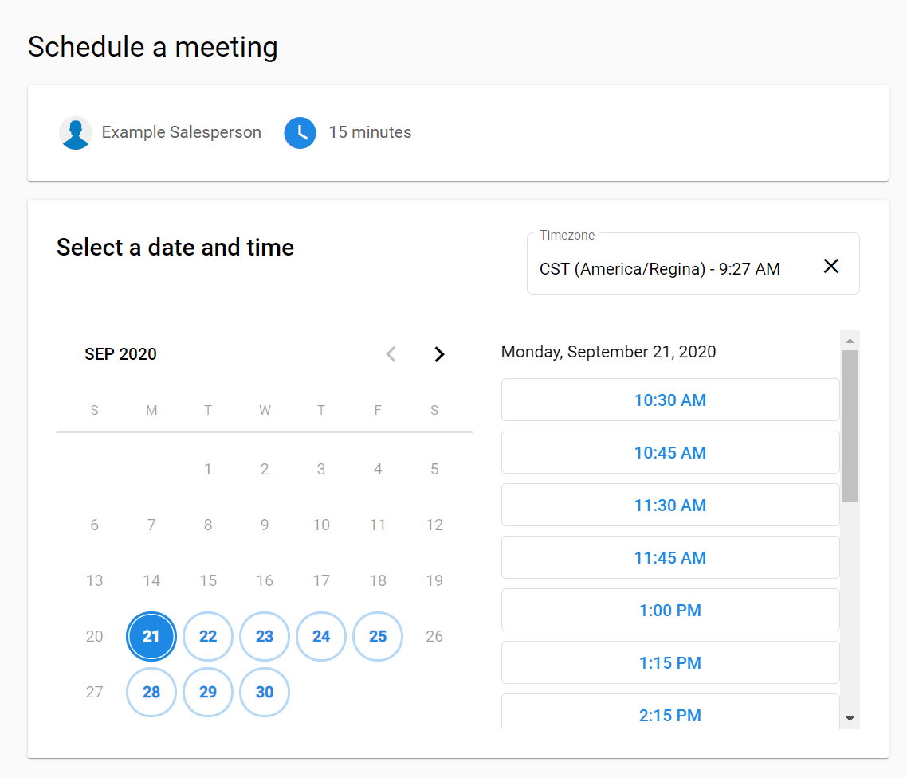
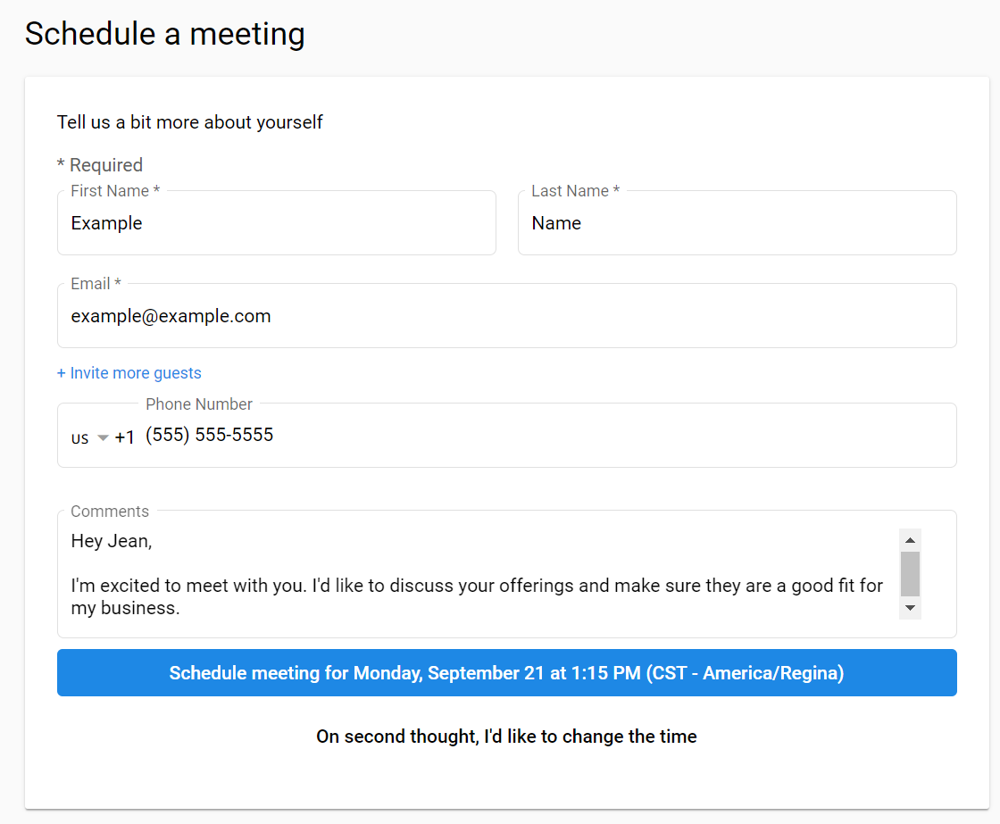

# How does a prospect schedule a meeting?

Scheduling a meeting is easy with Meeting Scheduler. To do so, a prospect needs to do the following:

1. Access one of the Salesperson's booking links.
   - If they were sent the general booking link, they'll need to also select the type/length of meeting they wish to book.

2. Select the date. This will show the available times for that date.
   - These times are based on the salesperson's working hours and already scheduled events.

3. Select the time they wish to meet.
   - Meeting Scheduler will choose the time zone based on the time zone the user has set on their computer. This can be changed by clicking the **Time Zone** option.

   

4. Fill out the required **Schedule a meeting fields**.

5. Click **Schedule meeting for**.

   

After the meeting is scheduled, the scheduler and salesperson will receive an email confirming the scheduled meeting along with the default video conferencing link. Here, either of them can reschedule, cancel, or add the meeting to their calendar.

:::note
If the salesperson has connected their Google account, the meeting will automatically be added to their Google calendar.
:::