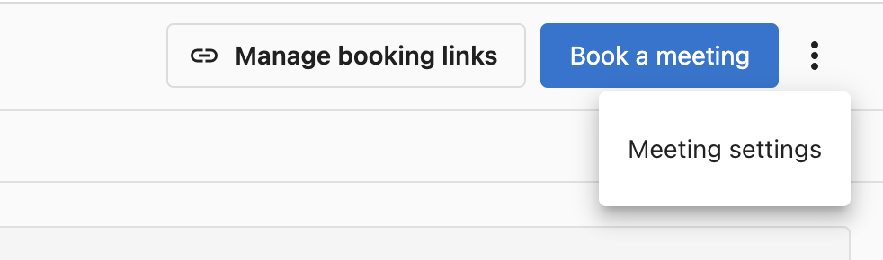
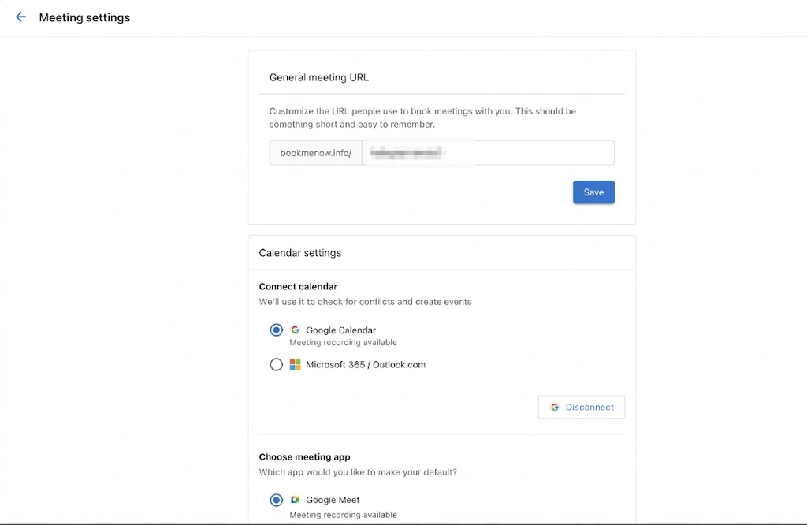
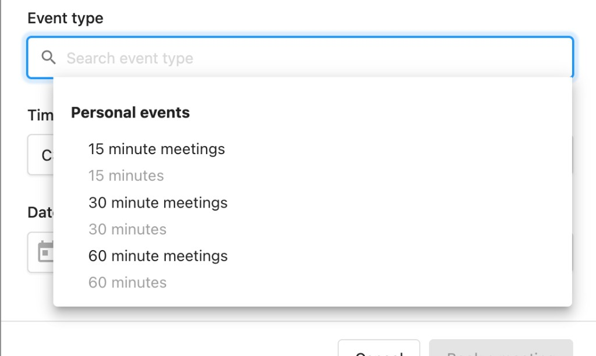

# How do I set up and book meetings in My Meetings?

My Meetings, at `CRM` → `My Meetings` in Partner Center, lets you book meetings with contacts and create booking links for different event types. You connect your Google or Microsoft 365 calendar, choose a meeting app, and set your availability.

Each booking link is tied to an event type, so you can offer different meeting lengths and formats, such as a 15-minute call or a 60-minute consultation.

## How do I book a meeting with a contact? {#create-booking-link}

1. Go to `CRM` → `My Meetings`
2. Click `Book a meeting`

3. Fill in the **Book a meeting** form with the following details:
   - **Contact** - Search for an existing contact or click **+Add contact** to create one
   - **Additional guest email(s)** - Add email addresses for other attendees
   - **Event type** - Search and select the type of meeting
   - **Timezone** - Confirm or change the timezone for the meeting
   - **Date & Time** - Select the meeting date and time

4. Click **Book a meeting** to confirm.

Once booked, the meeting appears under the **Bookings** tab on the **My Meetings** page. From here you can **Join** the meeting directly or click **Edit** to make changes. Use the **Upcoming** and **Past** toggles to filter your view, and switch to the **Recordings** tab to review past meeting recordings.

## How do I set up My Meetings for the first time? {#initial-setup}

When you first log in to **My Meetings**, you'll be guided through a setup wizard to configure your meeting preferences. The wizard walks you through four steps:

1. **Set URL** - Customize your personal booking URL.
2. **Connect calendar** - Link your Google Calendar or Microsoft 365 / Outlook calendar.
3. **Choose meeting app** - Select your default meeting app (Google Meet, Zoom, or Microsoft Teams).
4. **Set default settings** - Configure your scheduling preferences like availability, buffers, and timezone.

Once the setup is complete, you can update any of these settings at any time from **Meeting settings**.

## How do I change my meeting settings? {#meeting-settings}

To configure your general meeting preferences, click the **three-dot menu** in the top-right corner of the **My Meetings** page and select **Meeting settings**.

From here you can configure:

- **General meeting URL** - Customize the URL people use to book meetings with you. This should be something short and easy to remember.
- **Calendar settings** - Connect your Google Calendar or Microsoft 365 / Outlook calendar to check for conflicts and create events.

- **Choose meeting app** - Select your default meeting app from Google Meet, Zoom, or Microsoft Teams.
- **Scheduling settings** - Control how your availability is displayed:
  - **Availability increment** - Show time slots in increments of 5, 10, 15, 30, 60, or 90 minutes.
  - **Meeting buffer before/after** - Set buffer time before and after meetings for travel, notes, or preparation.

- **Advance notice** - Set the minimum lead time required to prevent last-minute bookings.
- **General availability** - Select which days of the week you can accept meetings and set your available hours.
- **Timezone** - Confirm or change your timezone.

## How do I manage my booking links? {#manage-booking-links}

Click **Manage booking links** to view all of your event types. This page lists each event type along with its link, duration, and whether it is a personal or team event.

### How do I create a new event type? {#create-a-new-event-type}

Click **Create event type** to set up a new type of meeting. Fill in the event type details:

- **Name** - Give the event type a name.
- **Link** - A unique booking link is generated automatically.
- **Location** - Choose where the meeting takes place:
  - **Video** - Meeting is held over video conference (Google Meet, Zoom, or Microsoft Teams link is inserted automatically).
  - **In Person** - Meeting is held at a physical location. Choose who sets the address:
    - **I'll set the location** - You provide the address (pre-filled from your business profile). Optionally enable **Include video conferencing** to make it a hybrid meeting.
    - **Invitee sets the location** - The person booking provides their address at booking time. Useful for on-site service calls.
- **Duration** - Select a duration of 15, 30, 45, or 60 minutes, or set a custom length.
- **Description** - Add an optional description.
- **Color** - Pick a color to help identify this event type.

You can also configure additional options for each event type. Settings configured here override your user-level defaults for this event type only:

- **General availability** - Override your default availability for this specific event type.
- **Questions for invitee** - Add custom questions that invitees answer when booking. Making **Phone Number** and/or **Email** required fields controls which channels are available for confirmations and reminders.

  Choose a **confirmation channel** - **Email**, **SMS**, or **Both** - for the confirmation guests receive when they book. Choose a **reminder channel** the same way; it defaults to your confirmation channel until you change it, after which the two work independently - for example, an Email confirmation with an SMS reminder.

  - Turning off **Phone Number** required disables **SMS** and **Both** in both channel controls, and any current SMS/Both selection falls back to Email.
  - Turning off **Email** required disables **Email** and **Both** in both channel controls, and any current Email/Both selection falls back to SMS.
  - If both **Phone Number** and **Email** are off, all channel options are disabled and an inline warning appears - the event type can't be saved until at least one channel is selected.

  Set the **reminder lead time** - an integer plus a unit (minutes, hours, or days) - to control how far ahead of the meeting the reminder sends. The default is 24 hours, and the maximum is 10 days; values entered above the maximum are clamped, and switching units re-clamps the value. Only one reminder can be configured per event type.

  :::note
  SMS confirmations and reminders require an active subscription to Conversations AI Pro or Premium (Reputation AI Premium and Campaigns Pro also unlock this), and the business's phone number must be registered first. Configure at `Administration` → `SMS Configuration`.
  :::

- **Customize invitation email** - Customize the email subject and body sent when you request a meeting via the CRM Contacts page.
- **Availability increment** - Override the default time slot increment (5, 10, 15, 30, 60, or 90 minutes).
- **Meeting buffer before/after** - Override the default buffer times.
- **Advance notice** - Override the minimum lead time required to prevent last-minute bookings.
- **Add to my website** - Get an embed code to add your booking form directly to a website as an inline widget. Copy and paste the code into your site's HTML wherever you want the booking form to appear.

- **Limit future meetings** - Control how far into the future meetings can be scheduled. Set limits by days, weeks, months, or choose a custom date range. When the limit is reached, no time slots are shown beyond that point.

Once you create a new event type, it appears as an option when you go to book a meeting.

:::note
If a meeting type is deleted, it will not cancel any appointments already booked using that link. The link will be deactivated and will no longer allow new bookings. If it was deleted in error, there is no way to restore it — you will need to create a new booking link.
:::

## Frequently asked questions

Which calendars can I connect to My Meetings?

You can connect Google Calendar or Microsoft 365 / Outlook. My Meetings checks the connected calendar for conflicts and creates events in it. Connect it during initial setup or later in **Meeting settings** → **Calendar settings**.

Which meeting apps does My Meetings support?

You can choose Google Meet, Zoom, or Microsoft Teams as your default meeting app. For event types with the **Video** location, the meeting link is inserted automatically.

Why are only some time slots showing on my booking link?

The slots shown depend on your connected calendar's conflicts and your availability increment, meeting buffers, advance notice, general availability, and any limit on future meetings. Settings on an event type override your defaults for that event type, so check both **Meeting settings** and the event type's options.

Can I book in-person meetings or on-site visits?

Yes. Set the event type's location to **In Person**, then choose **I'll set the location** to use your address or **Invitee sets the location** so the person booking provides their address, which is useful for on-site service calls.

Can invitees get SMS confirmations and reminders?

Yes. Make **Phone Number** a required question on the event type, then choose **SMS** or **Both** for the confirmation and reminder channels. SMS requires an active subscription to Conversations AI Pro or Premium (Reputation AI Premium and Campaigns Pro also unlock this) and a business phone number registered at `Administration` → `SMS Configuration`.

What happens to booked meetings if I delete an event type?

Meetings already booked with that link aren't canceled, but the link is deactivated and no longer accepts new bookings. A deleted event type can't be restored, so you'd need to create a new booking link.

