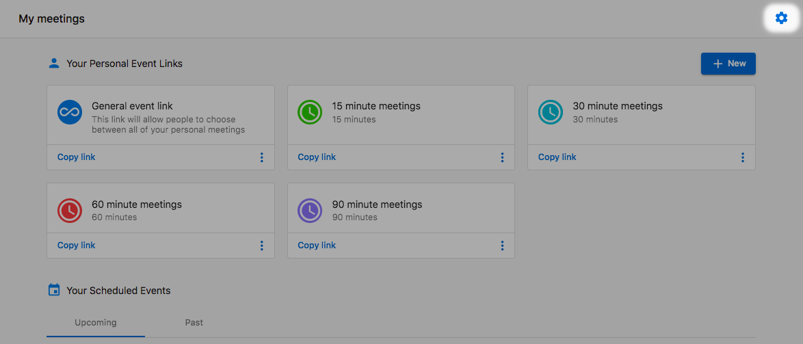
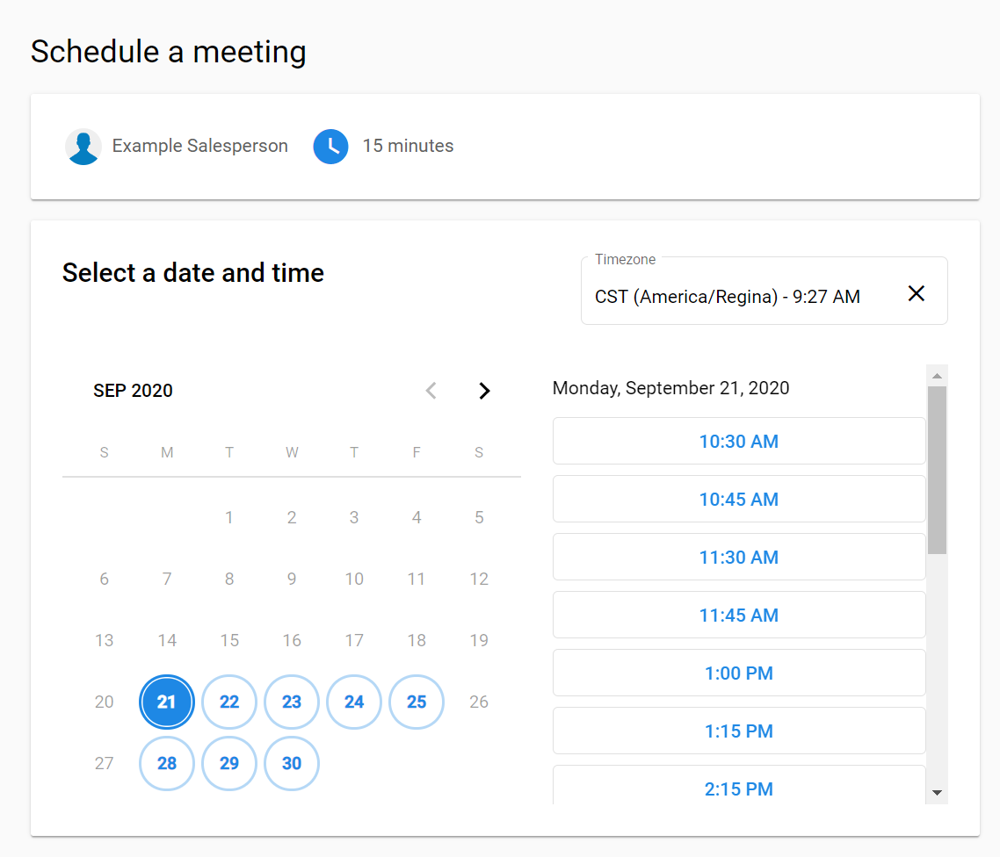
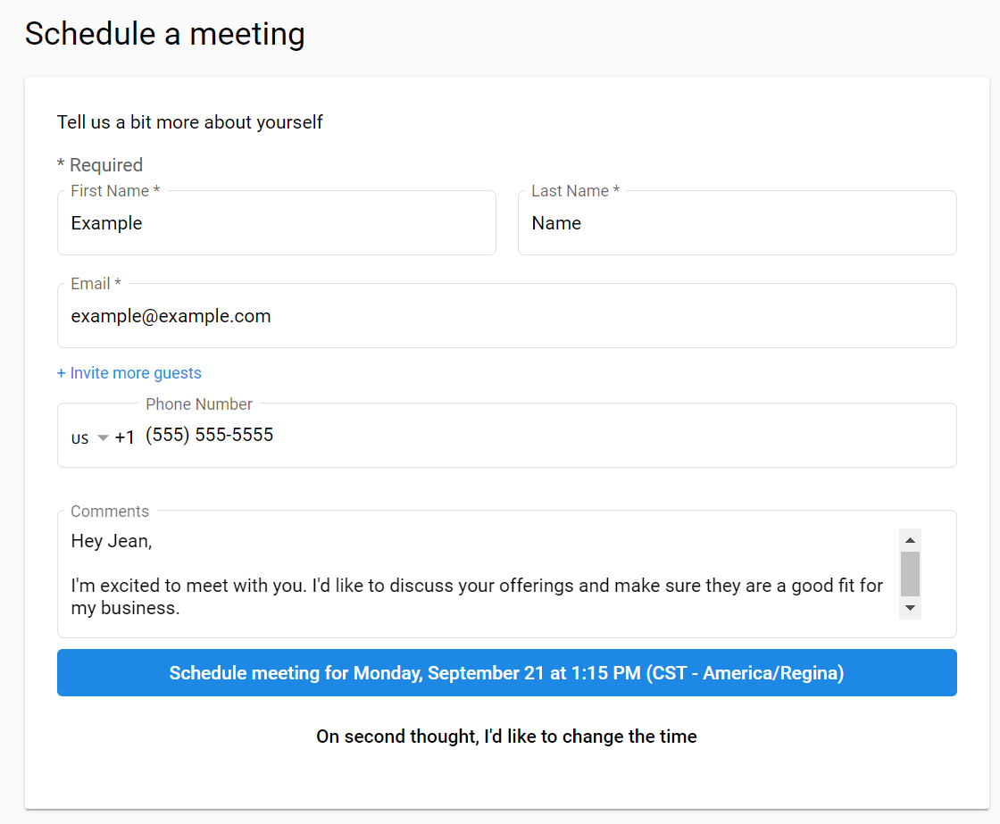
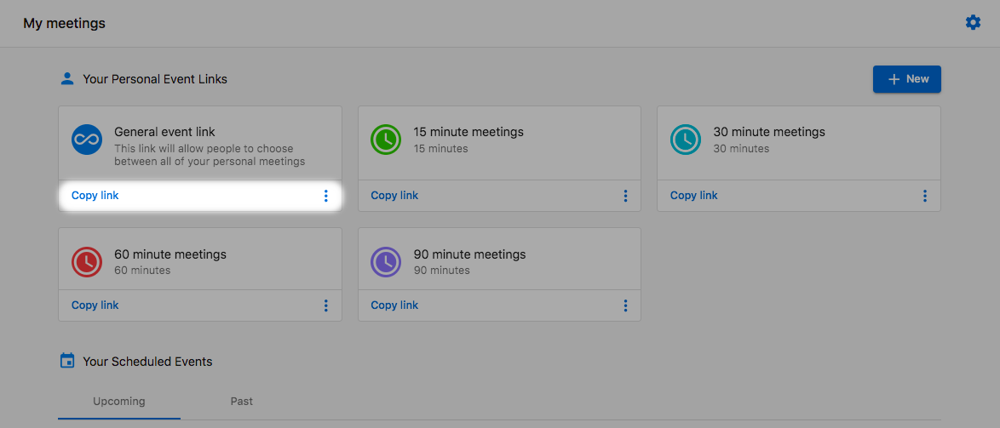
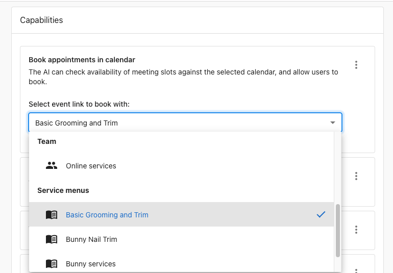
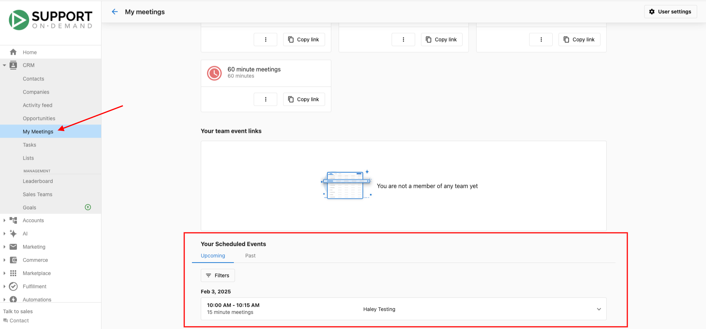

# My meetings

Vendasta's meeting scheduling features help you set up and manage meetings with prospects and customers effectively. This comprehensive scheduling solution eliminates the back-and-forth of manual meeting coordination by providing customizable booking links and automated scheduling. With support for different meeting types, team booking capabilities, and AI-powered features, My Meetings streamlines the entire meeting process from initial booking to follow-up.

## Why use My Meetings?

Connecting with prospects is vital in providing them with the solutions they need. Previously, there were two ways to schedule meetings: reach out to prospects manually to find a time that worked, or have them contact you directly. While these methods worked, they required back-and-forth communication to coordinate timezones and availability. My Meetings eliminates this coordination challenge by allowing prospects to use a link to easily book meetings, cutting out the back-and-forth so both parties can spend less time on logistics and more time preparing for productive meetings.

## What's included

- **[Meeting scheduler: Create booking links](./create-booking-links.mdx)**: Customizable booking link creation for different meeting types and durations
- **[Team booking links](./team-booking-links.mdx)**: Shared scheduling for team-based meetings with distribution methods and availability management
- Personal booking links with custom URLs and meeting options
- Google Calendar integration for conflict checking and automatic event creation
- Meeting app connections for video conferencing links
- Availability settings based on your timezone
- AI-powered booking through Chat Receptionist
- Business App integration for client-facing scheduling

## Get started

1. **Access My Meetings**
   - Log in to `Partner Center`
   - Go to `CRM` > `My Meetings`

2. **Complete initial setup** (first-time users)
   - **Set your booking URL**: Customize your booking URL with a unique name
   - **Connect calendar**: Connect your `Google Calendar` to check for conflicts and create events
   - **Choose meeting app**: Connect a meeting app to automatically populate meeting links in invites
   - **Set availability**: Configure the hours you're available based on your timezone

3. **Create your booking links**
   - Access multiple meeting types with specific lengths
   - Click `Copy link` under any meeting type to share with prospects
   - Use the menu icon and `View event link` to book meetings on clients' behalf

4. **Share and manage**
   - Each salesperson has unique booking links
   - View scheduled events in `Your Scheduled Events` tab
   - Toggle between upcoming and past meetings

:::note
You can change setup options at any time using the `Meeting settings` or `User Settings` option.
:::

## How My Meetings works

When a prospect visits your booking link, they can choose the date and time for their meeting. Available times are selected from your configured availability, and prospects won't see times when you're already booked (if `Google Calendar` is connected).

### Prospect scheduling process

1. **Access booking link**: Prospects use your shared booking link
   - If using the general link, they select meeting type/length
2. **Select date**: Shows available times based on your working hours and scheduled events
3. **Choose time**: Meeting Scheduler automatically detects timezone from the user's device
   - Time zone can be changed by clicking the `Time Zone` option
4. **Fill details**: Complete required "Schedule a meeting" fields
5. **Confirm booking**: Click `Schedule meeting`

After scheduling, both the prospect and salesperson receive email confirmation with the video conferencing link. Either party can reschedule, cancel, or add the meeting to their calendar. If you use `Google Calendar`, the meeting automatically appears in your calendar.

:::note
Meeting times display in the user's local timezone.
:::

## Booking links and customization

Once you complete setup, you'll have access to multiple meeting types with specific durations. Find your booking links by:

- Clicking `Copy link` under any meeting type to copy to clipboard
- Using the menu icon and selecting `View event link` to access the portal directly
- Creating custom booking links with different durations, descriptions, and colors

Each booking link can be customized with:
- **Name**: Identifies the booking link
- **Duration**: Meeting length (15 minutes, 30 minutes, 60 minutes, etc.)
- **Description**: What the meeting is for
- **Color**: Visual distinction for quick recognition
- **Custom questions**: Gather additional information from prospects

## AI-powered booking

Book Appointments is a capability within the Chat Receptionist that allows the AI Workforce to schedule meetings using your Vendasta Calendar link. This feature converts user intent into scheduled meetings in real time, reducing drop-off and enabling seamless engagement.

### Setting up AI booking

1. Go to `AI Workforce` → `Chat Receptionist` → `Add a capability`
2. Select `Book appointments in calendar`
3. Choose your calendar link type:
   - **Personal**: Individual meetings
   - **Team**: Shared calendars
   - **Service menu**: Multiple service options for the AI to choose from

Once active, the AI assistant:
- Listens for user interest in scheduling meetings
- Prompts users to choose preferred times
- Checks availability and presents open slots
- Collects necessary details and confirms bookings

## My Meetings in Business App

My Meetings is a free addition to `Business App` that allows your clients to set up booking links, sync with `Google Calendar`, set availability, and manage appointments. This gives your clients the same powerful scheduling capabilities you use in `Partner Center`.

The `Business App` version works the same way as `Partner Center`, helping eliminate the tedious back-and-forth of meeting coordination while integrating with existing software and handling reminders automatically.

:::note
If accessing `Business App` through `Partner Center`, users may encounter authorization errors. We recommend having users connect their accounts by logging into `Business App` directly.
:::

## Viewing your scheduled meetings

Upcoming meetings are visible in `Partner Center` via `CRM` > `My Meetings` > `Your Scheduled Events`:

- Toggle between tabs to see upcoming or past meetings
- Add filters to view meetings by time length
- Monitor meeting distribution and performance

## Frequently asked questions

Why are clients able to double-book me for the same time slot?

If clients can double-book you, these bookings might be on a secondary calendar, or the `Google Calendar` connected to Meeting Scheduler isn't your default calendar. Meeting Scheduler only syncs with your default calendar. Once a time slot is booked, it blocks that time on your default calendar (usually associated with your default Google account).

Can I connect my Google Meet account after scheduling meetings?

Yes, you can connect at any time using the `Meeting settings` option. However, any previously scheduled meetings will not be updated with a meeting link.

Where does Meeting Scheduler get the default timezone from?

Meeting Scheduler determines the default based on the timezone your web browser reports, which is usually derived from your device's timezone.

What if the default timezone is incorrect?

Correct the timezone in your device or browser settings, then return to `Meeting settings`. Scroll to the general availability settings where you can edit the timezone and click `Save`.

When are email reminders sent to meeting invitees?

Meeting reminders are sent twice:
- 24 hours before the meeting
- 15 minutes before the meeting

Depending on your calendar (Gmail, Outlook, etc.), you may be able to add additional email reminders to meetings.

Can I remove the header from the booking portal?

To remove the header/logo from your booking portal, add `hide_header=true` to the end of your booking URL. If you already have a modifier in your URL, add `&hide_header=true` instead.

What languages are supported by Meeting Scheduler?

Currently, Meeting Scheduler supports German, French, Canadian French, Dutch, Czech, and Spanish.

:::note
Confirmation emails cannot be translated and remain in English. Meeting titles also remain in English unless your account is set to one of the supported languages.
:::

How does AI booking work with Lead Capture?

If Lead Capture is enabled, the AI gathers contact information (name, email, phone) before completing bookings, preserving leads even if users exit before scheduling. If Lead Capture is off, only essential booking details are collected based on your calendar requirements.

Can I use different booking links for different AI receptionists?

Yes, each receptionist can be configured with its own booking link by updating its capability settings in the `Configure` panel.

What happens if no time slots are available?

The AI assistant notifies users and prompts them to try again later or provides alternative options.

Can users reschedule through the AI assistant?

Not currently. Users must use the rescheduling options provided in the booking confirmation email.

Can I set or customize my meeting reminders in BookMeNow?

At this time, meeting reminder emails in BookMeNow cannot be customized.  
The timing and content of these reminders are system-generated within Vendasta and cannot be modified.

