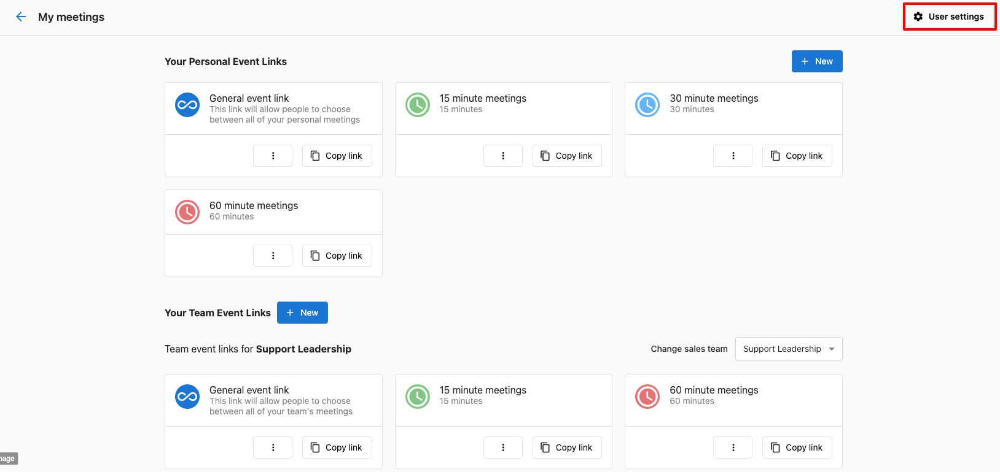
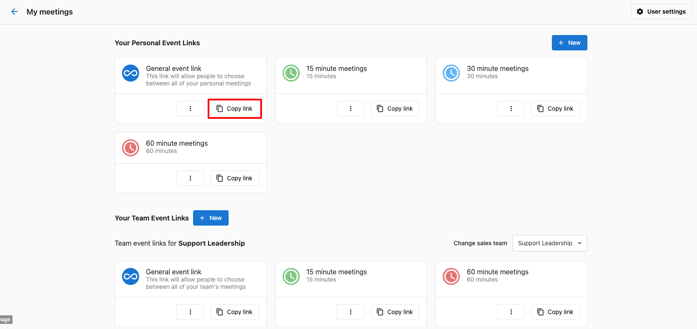
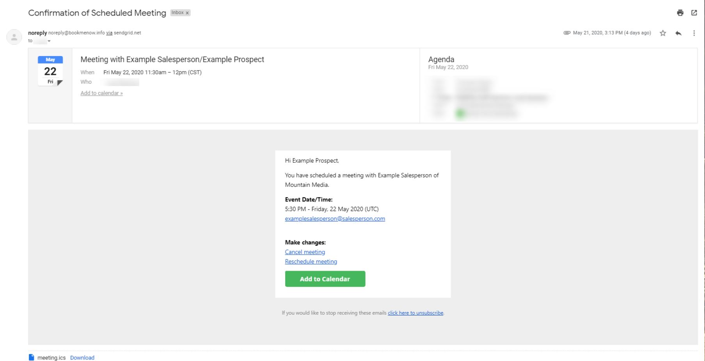

## How do Salespeople access Meeting Scheduler?

1. Log into Partner Center
2. Go to **My Meetings**

If this is the first time accessing My Meetings, setup steps will be required:

**Set your booking URL** - This step allows you to customize your 'bookmenow,' booking URL with a unique name.

- **Connect calendar** - This is where a Salesperson can connect their calendar (only available with Google Calendar) to check for conflicts and create events.
- **Choose a meeting app** - Here, Salespeople can connect Google to automatically populate a meeting link in the meeting invite.
- **Set availability** - Here, Salespeople can set the hours in which they are available.

:::note
You can change these options at any time by using the **User Settings** option.
:::

## Where can they find their booking link?

Once the Salesperson has completed setup, they'll have access to multiple meetings, all with specific lengths of time. By clicking the **Copy link** under the specific meeting type, the link can be copied directly to their clipboard and shared out. This will ensure that the meeting is booked for that specific length of time.

The Salesperson can also click the menu icon  and click the **View event link** to access the portal directly and book a meeting on their client's behalf.

:::note
Each Salesperson will have their own unique booking links.
:::

## How does it work?

When a prospect visits the Salesperson's booking link, they'll be able to choose the date and time of their meeting. The available times are selected from the Salesperson's set availability. Prospects won't see times when the Salesperson is already booked as long as their Google Calendar is connected.

:::note
The times shown will be in the user's local time.
:::

After the meeting is scheduled, the scheduler and Salesperson will receive an email confirming the scheduled meeting along with the default video conferencing link. Here, either of them can reschedule, cancel, or add the meeting to their calendar.

## FAQs

**Can my Salespeople connect their Google Meet account after they've scheduled a meeting?**

Yes, they can connect at any time using the **Meeting settings** option. Please be aware, however, that any scheduled meetings will **not** be updated with a meeting link.

**Where can Salespeople see their upcoming meetings?**

Upcoming meetings are visible in the Partner Center under **My Meetings > Your Scheduled Events.**

**Where does Meeting Scheduler pull the default timezone from?**

Meeting Scheduler determines the default based on the timezone that the web browser reports, which is most often derived from the timezone of the device.

**What if the default timezone is incorrect?**

Simply correct the timezone in either the device or browser, and return to your **Meeting settings**. Scroll to the general availability settings, and you can edit the time zone. Click **save.**

**When are email reminders sent out to meeting invitees?**

Meeting reminders are sent out twice:

- 24 hours before the meeting.
- 15 minutes before the meeting.

Depending on the calendar (Gmail, Outlook, etc.), you may be able to add more email reminders to a meeting.

**Anything else?**

If the Salesperson or prospect uses Google Calendar, the meeting will automatically be added to their calendar without the need to manually add it.

**Can I remove the header from the booking portal?**

To completely remove the header/logo from your booking portal, simply add **hide_header=true** to the end of your booking URL. If you already have a modifier at the end of your URL, you can add **&hide_header=true** instead and it will remove the header.

**What languages are supported by Meeting Scheduler?**

Currently, Meeting Scheduler supports German, French, Canadian French, Dutch, Czech, and Spanish.

:::note
At this time, confirmation emails can not be translated and will remain in English. Meeting Titles will also remain in English unless the user has their account set to one of the languages listed above.
:::