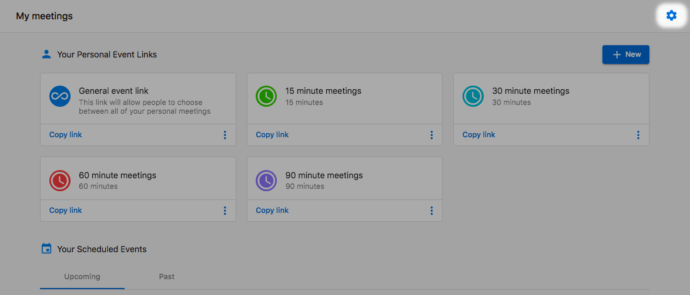
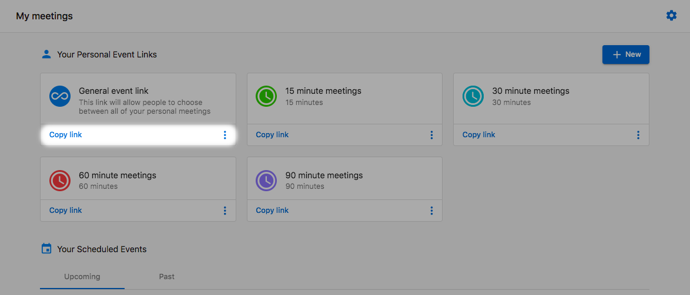
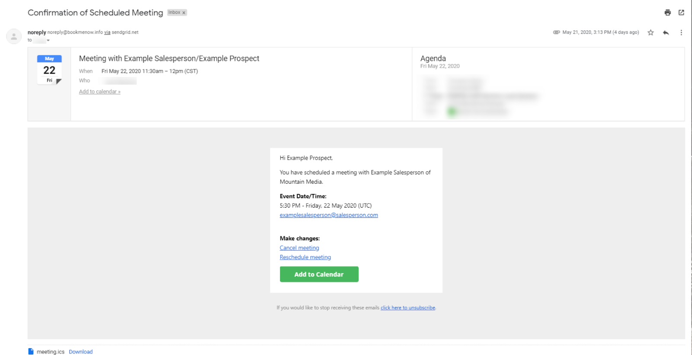
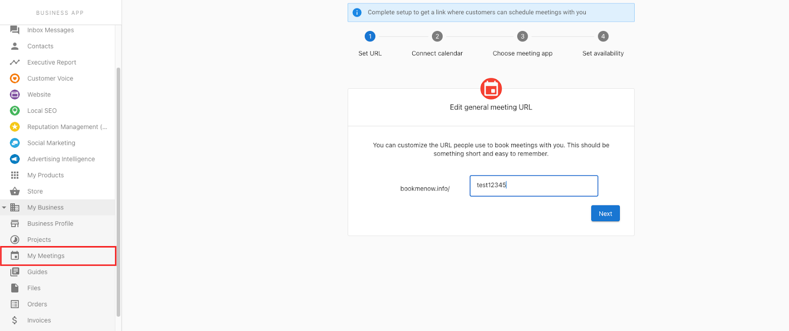

# My Meetings

## What is the My Meetings tab used for?

Connecting with prospects is vital in providing them with the solutions they need. Previously, there were two ways to do this:

1. Reach out to prospects manually to find a time that worked to meet.
2. Have them contact you directly to find a time to meet.

While these worked, it could require a bit of back-and-forth to find a time that worked for both parties. Timezones had to be taken into account, as well as whether or not the salesperson had other meetings booked.

With the Meeting Scheduler, prospects can use a link to easily book a meeting with their salesperson. This cuts out the back-and-forth and allows both parties to spend less time working out the details of the meeting and more time prepping for it.

### How do my salespeople access the Meeting Scheduler?

1. Log in to Partner Center.
2. Go to **CRM > My Meetings.**

If this is the salesperson's first time accessing this tab, they will need to complete the Meeting Scheduler setup:

- Set your booking URL - This step allows you to customize your booking URL with a unique name.
- Connect calendar - This is where a salesperson can connect their calendar (only available with Google Calendar) to check for conflicts and create events.
- Choose meeting app - Here, salespeople can connect a meeting app to automatically populate a meeting link in the meeting invite.
- Set availability - Here, salespeople can set the hours in which they are available. We base this on the Salesperson's timezone.

**Note:** You can change these options at any time by using the Meeting settings option.

## Where can they find their booking link?

Once the salesperson has completed setup, they'll have access to multiple meetings, all with specific lengths of time. By clicking the **Copy link** under the specific meeting type, the link can be copied directly to their clipboard and shared out. This will ensure that the meeting is booked for that specific length of time.

The salesperson can also click the menu icon and click the **View event link** to access the portal directly and book a meeting on their client's behalf.

**Note:** Each salesperson will have their own unique booking links.

### How does it work?

When a prospect visits the salesperson's booking link, they'll be able to choose the date and time of their meeting. The available times are selected from the salesperson's set availability. Prospects won't see times where the salesperson is already booked as long as their Google Calendar is connected.

**Note:** The times shown will be in the user's local time.

After the meeting is scheduled, the scheduler and salesperson will receive an email confirming the scheduled meeting along with the default video conferencing link. Here, either of them can reschedule, cancel, or add the meeting to their calendar.

If the salesperson or prospect uses Google Calendar, the meeting will automatically be added to their calendar without the need to manually add it.

### Meeting Scheduler in Business App

Meeting Scheduler is a free addition to the Business App. Users can set up booking links, sync meetings with Google Calendar, set their availability, and more. It allows their clients to find times that work for both parties!

### How does Meeting Scheduler in Business App work?

If you've used Meeting Scheduler in Partner Center, you'll find Meeting Scheduler in Business App works the same way. Resources specific to Business App users are provided upon launch.

**Note:** If accessing Business App through Partner Center, users may encounter an error when authorizing. We recommend having users connect their accounts by directly logging in to Business App.