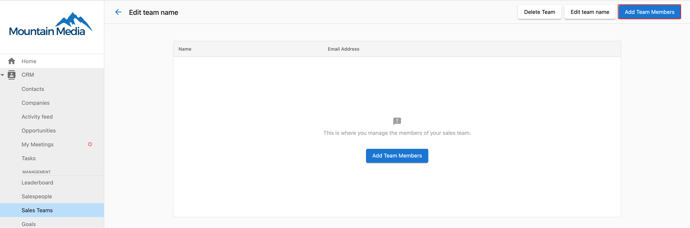
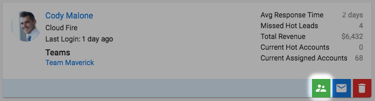
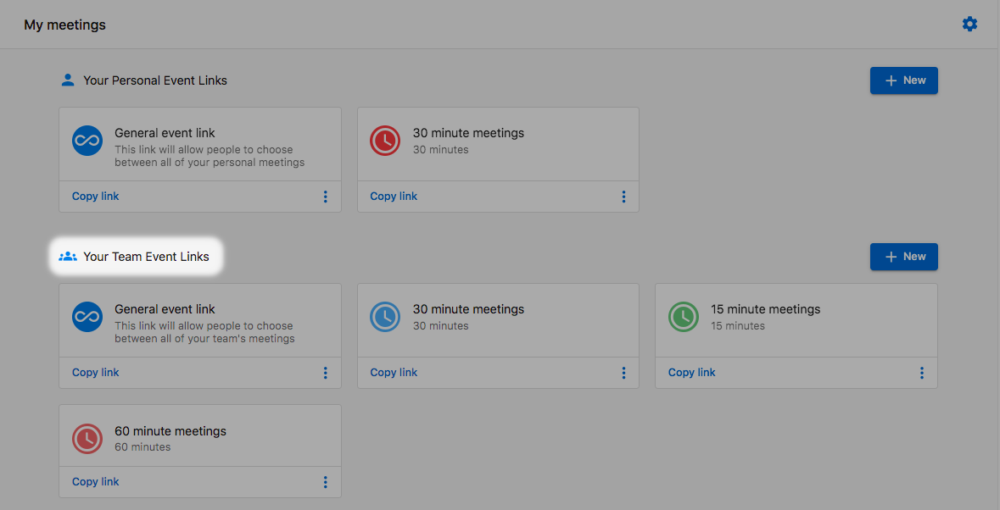
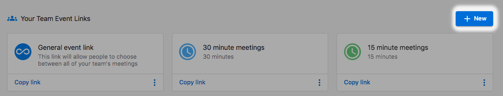
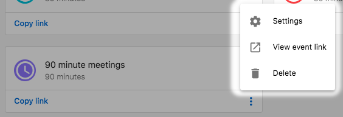

# Team booking links

Team booking links allow you to create a single booking link that will distribute meetings to a team of users. For example, your business might do a qualification call before handing a prospect over to a sales rep. You can create a team booking link for your qualification team and let My Meetings randomly distribute meetings to team members. This page explains how to set up and manage team booking links.

## Creating team booking links

You will need admin permissions to set up team booking links.

First, you will need to create a Sales Team in `Partner Center`. To do this, navigate to `CRM` > `Sales Teams` in the left-hand menu and click `Create Team`.

To create a team booking link:

1. Log in to `Partner Center`
2. Navigate to `My Meetings`
3. Click on `Admin` (this option is only available to users assigned the admin role for the My Meetings section)
4. Click on `TEAM BOOKING LINKS`

## Create a new team booking link

1. Click on `+ New Team booking` to start the process

2. Configure the following fields in the form:

- **Event Title**: This is what clients will see when they book a meeting
- **Event Link Name**: This creates the URL for your booking link (e.g., /team-meeting)
- **Description**: Optional information about the meeting
- **Duration**: Length of the meeting
- **Team Members**: Select team members to include in this booking link (see Calendar Customization section below for details)

3. Click `SAVE` to create the team booking link

## Assignment methods

When creating a team booking link, you can choose how meetings will be distributed to team members. Select which team members this service can be booked with and how meetings are assigned.

There are four assignment options:

### 1. Round robin
Meetings are assigned to team members in a rotating sequence, ensuring equal distribution of bookings across all available team members. This method provides the most balanced workload distribution.

**How it works:**
- Team members are assigned meetings in a predetermined order (e.g., Member A, then Member B, then Member C, then back to Member A)
- Each team member gets an equal number of meetings over time
- System automatically tracks the rotation and assigns the next meeting to the next person in sequence
- Only available team members (based on calendar availability) are included in the rotation

### 2. Priority assignment
Meetings are assigned based on a priority hierarchy you set for team members. Higher priority members receive meetings first, with lower priority members receiving bookings only when higher priority members are unavailable.

**How it works:**
- Assign priority levels to each team member (1 = highest priority, 2 = second priority, etc.)
- System always tries to assign meetings to the highest priority available member first
- If the highest priority member is unavailable, the system moves to the next priority level
- Useful for senior/junior team structures or when certain team members should handle most bookings

**Best for:**
- Teams with different experience levels
- Situations where certain team members should be the primary contact
- Hierarchical assignment based on expertise or seniority

### 3. Client selection
Allows the person booking the meeting to choose which specific team member they want to meet with from the available options.

**How it works:**
- Booking page displays available team members with their names and potentially photos/bios
- Client selects their preferred team member during the booking process
- Only team members who are available at the selected time will be shown as options
- Provides maximum flexibility and choice for the client

**Best for:**
- Service-oriented businesses where clients may have preferences
- Teams where members have different specializations or expertise areas
- Building personal relationships between clients and specific team members
- Situations where client comfort and choice are priorities

### 4. Multi host
Multiple team members attend the same meeting together, rather than just one person being assigned.

**How it works:**
- All selected team members are invited to every booked meeting
- Meeting appears on all participating team members' calendars
- Useful for meetings that require multiple perspectives or expertise areas
- System checks availability for all selected team members before allowing booking

**Best for:**
- Complex sales processes requiring multiple stakeholders
- Training sessions or consultations needing multiple experts
- Team meetings with prospects or clients
- Situations requiring diverse expertise in a single meeting
- Onboarding sessions that benefit from multiple team perspectives

## Selecting team members

For all assignment methods, you need to select which team members can participate in the booking link:

1. **Add team members**: Click in the team member selection field and choose from your available team members
2. **Remove team members**: Click the "X" next to any team member's name to remove them from the booking link
3. **Team member requirements**: Each selected team member must have their calendar connected and properly configured

**Important considerations:**
- Only team members with connected calendars will show as available for booking
- Team members' individual availability settings and working hours are respected
- For Multi host assignments, all selected team members must be available for the booking to be possible

## Managing availability

You can set specific days and times when team members are available for bookings.

Team members can be assigned to different days and time periods. For example, some team members might be available Monday-Wednesday while others are available Thursday-Friday.

## Calendar customization

You have complete control over which team members' calendars are included in your team booking link and how their availability is managed:

### Selecting team members for calendar inclusion

When creating or editing a team booking link, you can customize which team members participate:

**Adding team members:**
1. In the "Team Members" section of the booking link setup
2. Click "Add Team Member" or select from the dropdown
3. Choose specific individuals from your Sales Team
4. Only selected team members will have their calendars checked for availability

**Removing team members:**
- Click the "X" or remove button next to any team member's name
- Removed members will no longer receive bookings through this link
- Their existing booked meetings remain unaffected

### Calendar integration requirements

For team members to appear as available for booking:
- **Calendar connection**: Each team member must have their personal calendar connected to My Meetings (Google Calendar, Outlook, etc.)
- **Availability sync**: Team members' calendars are automatically checked for conflicts when prospects try to book
- **Permission settings**: Team members must grant calendar access permissions during initial setup

### Managing individual calendar availability

Each team member included in the team booking link maintains individual control:

**Calendar blocking:**
- Events marked as "busy" in personal calendars automatically block availability
- All-day events prevent bookings for the entire day
- Private events are respected without revealing details to prospects

**Buffer time settings:**
- Individual buffer time preferences apply (e.g., 15 minutes before/after meetings)
- Team members can set different buffer times for different meeting types
- Buffer times prevent back-to-back bookings

**Working hours enforcement:**
- Each team member's individual working hours are respected
- If someone sets 9 AM - 5 PM availability, bookings outside those hours are blocked
- Different team members can have different working hour preferences

### Advanced calendar customization options

**Conditional availability:**
- **Skill-based routing**: Assign different team members to different types of meetings based on expertise
- **Capacity limits**: Set maximum number of meetings per day/week for individual team members  
- **Priority weighting**: Give certain team members priority for high-value prospects

**Calendar conflict resolution:**
- **Real-time checking**: System checks all selected calendars before showing available slots
- **Automatic exclusions**: Team members with conflicts are temporarily excluded from assignment
- **Fallback options**: If no team members are available, system can show alternative time slots

### Best practices for calendar management

**Setup recommendations:**
- Ensure all team members have properly synced calendars before adding to team booking links
- Test booking links with each team member to verify calendar integration
- Set clear expectations with team members about calendar maintenance

**Ongoing maintenance:**
- Regularly review team member inclusion based on role changes
- Monitor booking distribution to ensure fair assignment
- Update team composition when members join or leave the team
- Check for calendar sync issues if bookings aren't distributing properly

**Team coordination:**
- Encourage team members to keep personal calendars up-to-date
- Establish protocols for handling scheduling conflicts
- Create backup assignment rules for when primary team members are unavailable

## Timezone settings

You can choose how timezone settings are handled for team bookings.

Options include:
- Using the company timezone
- Adjusting to the visitor's timezone
- Setting a specific timezone

## Customizing your booking page

Personalize the team booking page with custom colors and booking questions.

You can add custom questions that visitors must complete when booking a meeting. This information will be available to the team member who receives the booking.

## Viewing and sharing your team booking link

After creating a team booking link, you can view and share it with prospects and clients.

1. Click the `VIEW` button to see how your booking page appears to visitors
2. Use the `COPY LINK` button to copy the booking URL to your clipboard
3. Share the link via email, social media, or add it to your website

## Monitoring performance

Admins can monitor the performance of team booking links by viewing the dashboard, which shows metrics such as:

- Number of meetings booked
- Distribution of meetings among team members
- Booking conversion rates
- Popular booking times

Use this data to optimize your team's availability and improve the booking experience for your customers.