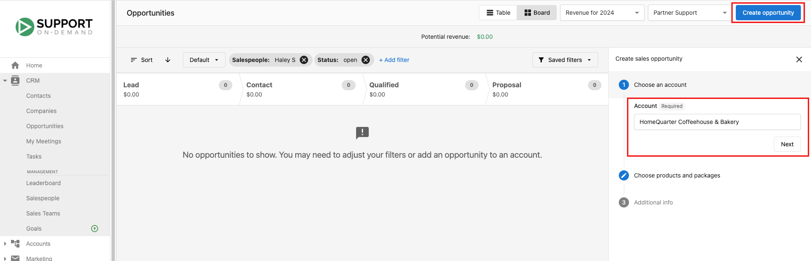
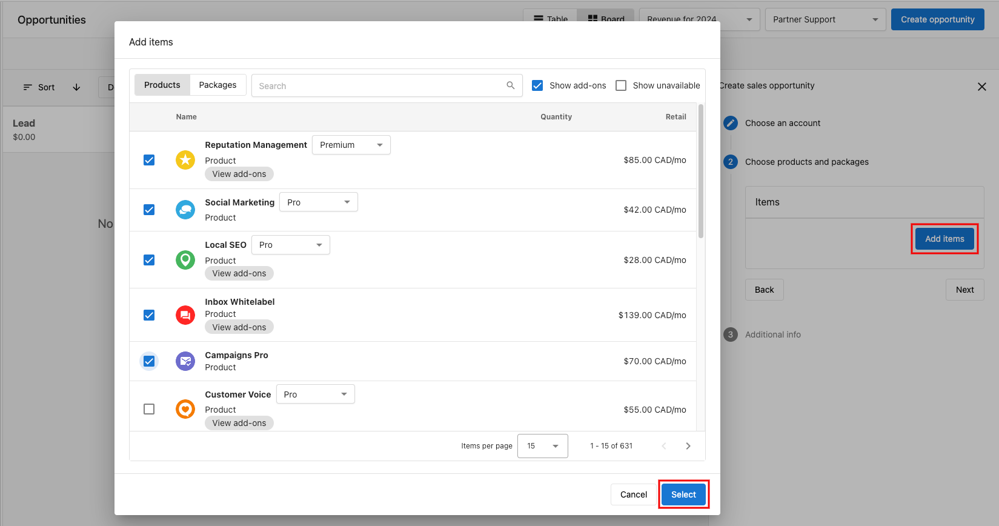

In the Vendasta CRM, opportunities are a crucial element of the sales pipeline, enabling you to effectively track and manage the potential of each prospect. This article will guide you through the process of creating and editing opportunities within the sales pipeline, ensuring that you can accurately monitor and capitalize on every potential sale. By understanding how to manage opportunities, you'll be better equipped to prioritize your efforts and drive successful outcomes in your sales process.

## How to create opportunities from the pipeline board

**Step 1:** Go to `Partner Center` > `CRM` > `Opportunities` > `Board`

**Step 2:** Click `Create opportunity`

**Step 3:** Select the `Account` field, choose an account for the opportunity, then click `Next` → `Add Items`.

**Step 4:** Check the boxes next to the products or packages you want to add and click `Select` to confirm.

**Step 5:** Click `Next` to continue.

**Step 6:** Add any additional sales information such as:
- `Pipeline`
- `Stage`
- `Expected close date`
- `Type`
- `Contract length`

**Step 7:** Click `Create` to add the opportunity to your pipeline.

## Access an opportunity

1. Go to `Partner Center` → `CRM` → `Opportunities` → `Board` (alternatively, go to `CRM` → `Companies` → `Company Name` → `Opportunities`)
2. Click the opportunity you want to access.
3. The opportunity opens in a side panel for you to access or edit.

## Edit an opportunity

From an open opportunity, click into each section of the Opportunity info to edit.

Opportunity Fields:
- `Opportunity name`
- `Expected close`
- `Contract Length`
- `Assignee`
- `Subscribers`
- `Pipeline`
- `Stage`
- `Type`

In addition, you can also click `Create order` to automatically add the products in the opportunity to a new order for the account, or `Create invoice` to create an [invoice](/commerce/invoices/create-and-send-invoices#creating-an-invoice-from-an-opportunity) for those products that stays linked to the opportunity and shows its live payment status.

:::info
Please note that it is not possible to delete opportunities in Partner Center once they are created. The opportunity can only be marked as won or lost.
:::
