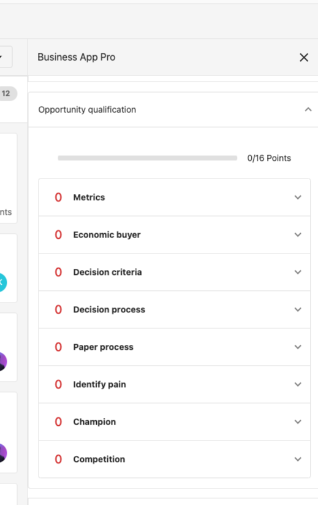

# Opportunities

The Opportunities section in Vendasta's CRM provides comprehensive tools for managing your sales pipeline and tracking deals from prospect to close. This vital system guides leads from prospects to paying customers, providing both salespeople and sales managers with clear visibility into each opportunity's status and potential revenue. With advanced features like pipeline visualization, revenue forecasting, and qualification frameworks, the Opportunities section ensures your team can prioritize efforts where they yield the highest return. The system supports both table and board views for flexible opportunity management that fits your sales process.

## Why use opportunities?

Opportunities eliminate guesswork in sales forecasting and ensure your team focuses time and effort on the most promising prospects while maintaining comprehensive tracking of all potential deals.

## What's included

- **[Sales pipeline overview](./sales-pipeline-overview.mdx)**: Comprehensive guide to pipeline management, visualization, and revenue tracking
- **[Create and edit opportunities](./create-and-edit-opportunities.mdx)**: Step-by-step opportunity creation and management
- **MEDDIC qualification framework**: Qualification methodology for better deal assessment and closure rates

## Get started

1. **Navigate to opportunities**
   - Go to `Partner Center` > `CRM` > `Opportunities`
   - Choose between `Table` or `Board` view

2. **Create your first opportunity**
   - Click `Create opportunity` from the pipeline board
   - Fill in opportunity details and revenue information
   - Assign to appropriate pipeline stage

3. **Set up pipeline stages**
   - Configure pipeline stages to match your sales process
   - Set probability percentages for revenue forecasting
   - Enable weighted revenue calculations

4. **Implement qualification framework**
   - Use MEDDIC qualification to assess deal quality
   - Track qualification criteria for each opportunity
   - Improve deal closure rates through better qualification

## Pipeline management capabilities

The Sales Pipeline is a vital tool for guiding leads from prospects to paying customers, providing both salespeople and sales managers with a clear view of each opportunity's status. By understanding what stage their opportunities are in, salespeople can take the necessary steps to close deals, while managers can track potential revenue and support their teams in driving more sales.

## Table and board views

The pipeline offers flexible viewing options to match your workflow:

- **Table View**: Get a full list of your own or your team's sales opportunities with comprehensive filtering and search capabilities
- **Board View**: Visual pipeline management with drag-and-drop functionality for moving opportunities between stages

## Revenue forecasting

The pipeline's ability to organize, filter, and visualize opportunities makes it an indispensable resource for revenue forecasting. With weighted revenue calculations and stage-based probability tracking, managers can accurately predict future revenue and make informed business decisions.

## MEDDIC opportunity qualification

Closing opportunities can be challenging. Just as a salesperson thinks a deal is a sure thing, it can fall apart, leaving the salesperson with no closure on what went wrong. To combat this, MEDDIC was created. This simple but effective approach to qualifying sales opportunities allows salespeople to intelligently qualify how likely the opportunity is to be won. It takes six key areas important to closing deals, leading to better conversations and fewer burnt leads.

### What does MEDDIC stand for?

MEDDIC is an acronym that tackles six key areas of any deal:

**Metrics** are the criteria your prospect uses to determine the success of this solution. This helps you prove return on investment (ROI) to your prospect.

The **economic buyer** is the person that can ultimately approve the purchase of this solution. If possible, try to establish a relationship directly with this person.

**Decision criteria** are factors that impact whether your prospect purchases your solution. Common examples include budget constraints, the potential return on investment (ROI), the learning curve, and integration options.

The **decision process** covers how your prospect decides to purchase new solutions. Examples include who makes decisions, what formalities are involved, and general turn-around time. This is useful in ensuring your deal won't fall apart or end up in limbo.

When you **identify pain**, you know exactly which problems your solution solves for your prospect. Try to be as specific as possible to best pitch your solution.

A **champion** is a well-respected advocate within the prospect's company. They are invested in your solution and will push for the company to purchase.

### How does MEDDIC work?

MEDDIC scores six key categories on a scale of 0 to 2. These are based on how well the salesperson knows each portion of the sales process. From there, the scores are tallied, giving the salesperson their overall score.

In general, the higher the score, the more likely the deal is to be closed successfully.

### How to use MEDDIC qualification

The `Qualification` section exists on all opportunities. To access this view:

1. Log in to `Partner Center`
2. Go to `CRM` > `Opportunities`
3. Select an opportunity
4. Click `Opportunity Qualification`

Salespeople will see a section for each part of MEDDIC. Salespeople can click any of these sections to rate how well they know the details for the opportunity.

Each section is rated as follows:

- **0** - The salesperson has no information on this section
- **1** - The salesperson has some idea of the information
- **2** - The salesperson has all the information they need for the section

You also have the ability to enter notes in each section, making it easier to track.