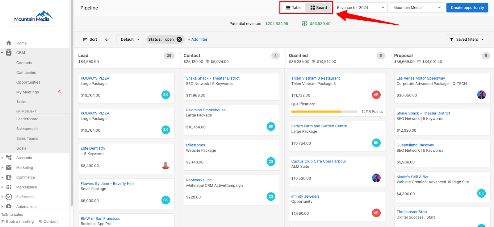

The sales pipeline is a vital tool for guiding leads from prospects to paying customers, giving you a clear view of each opportunity's status. Understanding what stage your opportunities are in helps you take the necessary steps to close deals, track potential revenue, and support your team in driving more sales. The pipeline's ability to organize, filter, and visualize opportunities makes it an indispensable resource, helping you focus your time and effort where they yield the highest return.

## Table view

The table view is a great way to get a full list of either your own, or a teams sales opportunities.

- To access the table view, log in to `Partner Center` and navigate to `CRM` → `Opportunities` → `Table`
- In this view, you have a range of options on how you'd like to filter or organize the list of opportunities.
- You will find a search box above the pipeline, allowing you to search for specific types of opportunities.
  - **Note:** Currently, you can only search for opportunity types, ex: Website Creation, Visibility & SEO. You won't be able to search for any other categories at this time.

## Table sort options

- You can sort the pipeline table columns in either descending or ascending order. Click the name of the column you'd like to sort once for descending order, or twice for ascending order.
- You can also sort the pipeline using the drop-down menu in the top right. This allows you to sort by expected closed date and contract length to get an idea of your monthly revenue. As an example: If a 6-month opportunity is expected to close on May 1st, you would see that reflected in your potential revenue for May-October.

## Board view

- The board view is a visual interface that allows you to see opportunities at a glance including which stage of the pipeline the opportunity is in.
- To access the board view, log in to `Partner Center`. Go to `CRM` → `Opportunities` → `Board`
- In this view, you can drag and drop opportunities to transition them between stages.

## Moving opportunities

- On the Board view of the Pipeline tab, each active opportunity will appear on the board. These are broken down into various pipeline stages.
- To move opportunities to different stages, simply click and hold the opportunity you wish to move. From there, drag it to its new stage.
- Clicking on the name of an opportunity will bring you to the opportunity details page.

## Board sort options

- You can sort the pipeline board using the sort options menu and click the arrow to switch between descending or ascending order

Sorting categories:

- Potential Revenue
- Expected close date
- Actual close date
- Last connected date
- Last sales activity
- Opportunity name
- Created date
- Assigned date
- Qualification

## Filter customization

- To add filters to your table view, click `+ Add Filter` at the top of the pipeline. You can also remove a filter by clicking the X next to the filter's name.

You have a range of filtering options to choose from, including:

- Account
- Type
- Salespeople
- Salesteam
- Status
- Packages
- Products
- Tag
- Expected close date
- Actual close
- Created
- Assigned

## Create a new pipeline stage

The default pipeline includes four stages: "Lead," "Contact," "Qualified," and "Proposal." The default percentage is 0%, 20%, 40%, and 60% respectively, and it will show you the revenue forecast based on the percentage of the pipeline stages.

The default pipeline doesn't fit your business? Don't worry, you have the flexibility to create custom pipelines and define your own forecast percentages.

## Create pipelines in Vendasta

1. Log into `Partner Center` and open the pipeline by going to `CRM` → `Opportunities` → `Board`
2. Click the pipeline view dropdown and select `Manage Pipelines`
3. Click `Create Pipeline`
4. Give your pipeline an easily identifiable name.
5. Add your pipeline stages.
6. Assign default percentages for each pipeline stage. These appear in your Pipeline in order of the probability of success you assign them.
7. Click `Save` to save your new pipeline.

## Total and weighted revenue tracking

Vendasta's CRM offers an enhanced feature that displays both total and weighted revenue for each stage of your sales pipeline. This revenue data is calculated using the probability assigned to each stage, giving you a clear and actionable view of expected outcomes at every point in your sales process.

### The balance icon

The scale/balance icon (⚖) in the pipeline represents **weighted revenue**, not total potential revenue. Weighted revenue is calculated as:

**Weighted revenue = opportunity value × stage probability %**

For example, a $10,000 opportunity in a stage with 40% probability contributes $4,000 to the weighted total. The balance icon sums these weighted values across all open opportunities, giving you a realistic forecast based on likelihood of closing rather than a best-case total.

### What this means for you

With this feature, you can:

- **Track performance**: Easily demonstrate the total and expected revenue generated for your local business clients
- **Improve forecasting**: Understand the potential value of deals in progress and make informed decisions to drive sales
- **Enhance transparency**: Showcase proof of performance by quantifying your CRM's impact on revenue generation

By incorporating total and weighted revenue metrics into your pipeline stages, you'll have a more accurate representation of your sales performance and potential outcomes.

### Flexibility to create opportunities in the right pipeline stage

You understand that not every contact starts at the same point in their customer journey. Some leads are already further along when they enter your CRM, for example, if a contact has already booked an appointment. To address this, Vendasta's CRM allows you to create opportunities directly in the most appropriate stage of the pipeline.

#### Key benefits

- **Customize based on maturity**: Reflect the true position of a contact in their journey by assigning opportunities to the correct pipeline stage
- **Streamline automation**: Save time and avoid manual adjustments by setting opportunities to start where they belong
- **Improve workflow accuracy**: Ensure your pipeline accurately mirrors the progress of every lead and opportunity

This added flexibility ensures that your CRM setup aligns perfectly with the diverse needs of your customer base, enhancing the efficiency of your automation processes.

## Frequently asked questions

Why is my weighted revenue lower than my total revenue?

This is expected. Weighted revenue reflects the probability of each deal closing. It answers "what can we realistically expect?" rather than "what is our maximum possible revenue?" A pipeline with $100,000 in total opportunity value across stages averaging 30% probability will show $30,000 in weighted revenue.

To increase weighted revenue, close more deals (moving them to higher-probability stages) or review your stage probability settings.

How do I set or change stage probabilities?

Stage probabilities are set when you create or edit a pipeline:

1. Go to `Partner Center` → `CRM` → `Opportunities` → `Board`.
2. Click the pipeline dropdown and select `Manage Pipelines`.
3. Click the three dots next to the pipeline and select `Edit`.
4. Adjust the percentage for each stage.
5. Click `Save`.

Changes apply to weighted revenue calculations across all open opportunities in that pipeline.

