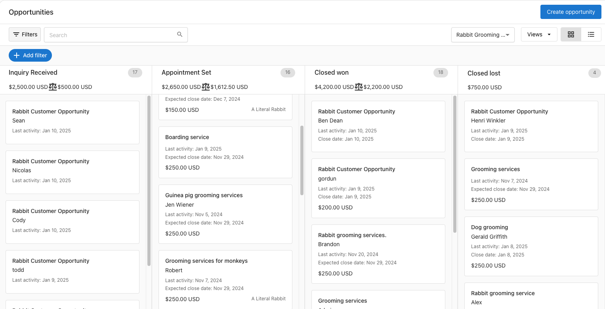
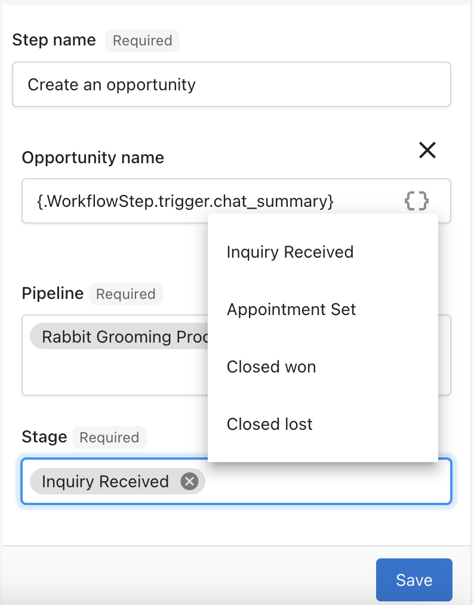

Vendasta's CRM offers an enhanced feature that displays both total and weighted revenue for each stage of your sales pipeline. This revenue data is calculated using the probability assigned to each stage, giving you a clear and actionable view of expected outcomes at every point in your sales process.

## What Does This Mean for You?

With this feature, you can:

- **Track Performance:** Easily demonstrate the total and expected revenue generated for your local business clients.
- **Improve Forecasting:** Understand the potential value of deals in progress and make informed decisions to drive sales.
- **Enhance Transparency:** Showcase proof of performance by quantifying your CRM's impact on revenue generation.

By incorporating total and weighted revenue metrics into your pipeline stages, you'll have a more accurate representation of your sales performance and potential outcomes.

**Flexibility to Create Opportunities in the Right Pipeline Stage**

We understand that not every contact starts at the same point in their customer journey. Some leads might already be further along when they enter your CRM—for example, if a contact has already booked an appointment. To address this, Vendasta's CRM allows you to create opportunities directly in the most appropriate stage of the pipeline.

## Key Benefits

- **Customize Based on Maturity:** Reflect the true position of a contact in their journey by assigning opportunities to the correct pipeline stage.
- **Streamline Automation:** Save time and avoid manual adjustments by setting opportunities to start where they belong.
- **Improve Workflow Accuracy:** Ensure your pipeline accurately mirrors the progress of every lead and opportunity.

This added flexibility ensures that your CRM setup aligns perfectly with the diverse needs of your customer base, enhancing the efficiency of your automation processes.