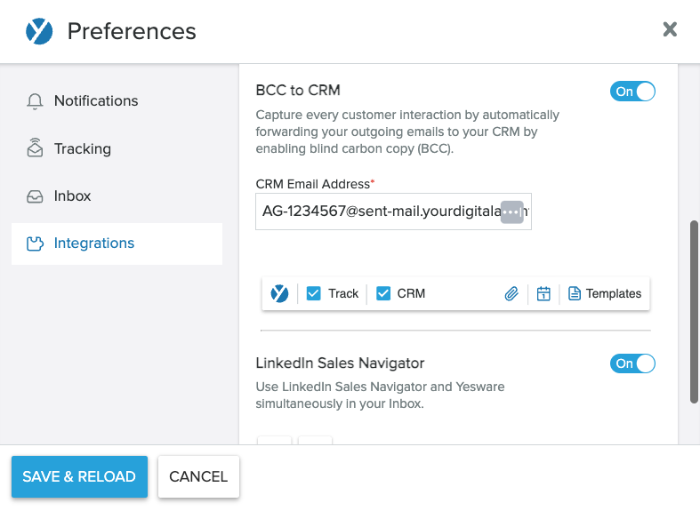

With Vendasta, you can automatically log emails sent from outside to the CRM through the BCC address and forwarding address.

Emails that are logged to the Vendasta CRM will include the email subject and contents with a max length of 4000 characters. The logged email will automatically be associated with the recipients contact record and its associated primary company record.

### Requirements for logging emails to the CRM using the BCC & forwarding address

**Your email must meet the following criteria in order to be logged in the CRM:**

- The email address from which you are sending the email must be a user in the platform
- The email address of the recipient is a contact record in the CRM
- It is important to note that there is no standard formatting for a forwarded email. If Vendasta is unable to process your email format, the email will not log to Vendasta CRM.

**Log Sent Emails**

When you send an email from your mail client, add the BCC address to the BCC line of the email. After sending, the email will be recorded in the Vendasta CRM automatically.

**For Partner Center CRM Users:**

- If you are setting this up for your own CRM in Partner Center, you can use your Partner ID as the prefix of the email address, following this format: [Partner ID]@sent-mail.yourdigitalagents.com
  - For example, if your Partner ID is VEND, your BCC email address will be VEND@sent-mail.yourdigitalagents.com

**For Client's CRM in the Business App:**

- If you are setting this up for your client's CRM in the Business App, you should use the account group ID as the prefix of the email address, following this format: [Account Group ID]@sent-mail.yourdigitalagents.com
- For example if your client's account group ID is AG-1234567, your client's BCC email address will be AG-1234567@sent-mail.yourdigitalagents.com

### Adding the BCC address automatically to the BCC line of the email through Yesware

There are a lot of software allowing you to add the BCC address automatically. In Vendasta, you can set this up through Yesware, if you have access to Yesware in your subscription. Here's how:

- Marketplace > My Purchases > Click into Yesware
- Install the [Yesware chrome extension](https://chrome.google.com/webstore/detail/yesware-for-chrome/gkjnkapjmjfpipfcccnjbjcbgdnahpjp?hl=en)
- Allow Yesware to access your Gmail
- When this is complete, refresh your Gmail tab and you should see the Yesware options at the top of your inbox.

- Using the Yesware drop-down menu in the top left corner of Gmail, select Preferences
- Go to the Integrations section
- Turn "BCC to CRM" to ON
- Input your unique BCC address
- Click "Save & Reload"
- Ensure that the "CRM" button is checked when you send out an email
- The "CRM" button will remain checked moving forward and your emails will be logged seamlessly right into Vendasta CRM

### Log Received Emails

Through Vendasta, you can use a forwarding address to log an email reply or any incoming emails from your clients. Before getting started, you will need to make sure your email client supports auto-forwarding. If your email client does not support auto-forwarding, you can forward the emails manually to have them captured in the Vendasta CRM.

Learn how to set up auto-forwarding on [**Outlook**](https://support.microsoft.com/en-au/office/turn-on-automatic-forwarding-in-outlook-7f2670a1-7fff-4475-8a3c-5822d63b0c8e)/[**Gmail**](https://support.google.com/mail/answer/10957?hl=en)/[**Apple Mail**](https://support.apple.com/en-hk/guide/icloud/mm6b1a3960/icloud)/[**Yahoo! Mail**](https://help.yahoo.com/kb/SLN29133.html).

**For Partner Center CRM Users:**

- If you are setting this up for your own CRM in Partner Center, you can use your Partner ID as the prefix of the email address, like this: [Partner ID]@received-mail.yourdigitalagents.com
  - For example, if your Partner ID is VEND, your forwarding email address will be VEND@received-mail.yourdigitalagents.com

**For Client's CRM in the Business App:**

- If you are setting this up for your client's CRM in the Business App, you should use the account group ID as the prefix of the email address, like this: [Account Group ID]@received-mail.yourdigitalagents.com
  - For example, if your client's account group ID is AG-1234567, your client's forwarding email address will be AG-1234567@received-mail.yourdigitalagents.com

The forwarded email will be logged to the contact's record, as well as the primary associated company in the Vendasta CRM.

### Privacy and Security note

As part of setting up an auto-forwarding rule, it's important to know that Vendasta will receive a copy of all emails you receive, however, we want to reassure you that our automated system is designed with your privacy in mind. The system discards any emails that do not include at least one contact's email address, ensuring only relevant communications are logged.

Furthermore, we can verify that the implementation does not retain a copy of those email bodies in our logs or audit tables. This measure is crucial to prevent any sensitive information, such as medical details sent through a work email, from being stored in our database. Our priority is to respect your privacy and security, ensuring that the Vendasta CRM remains a safe and reliable tool for managing your client interactions.