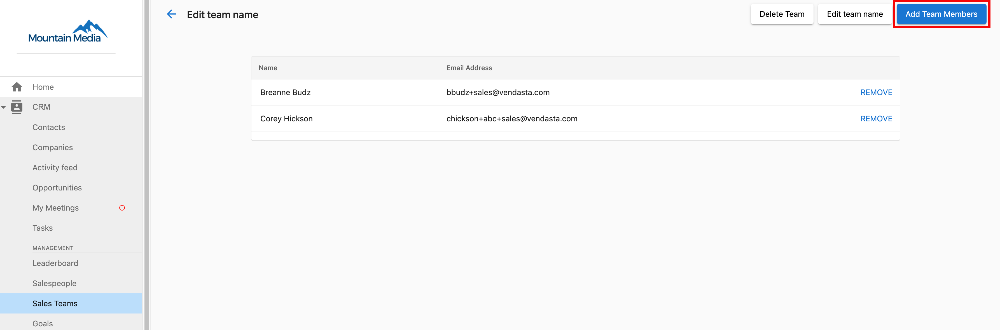

# Sales teams overview

Organize your sales operations effectively by grouping your salespeople into teams. Sales Teams in Vendasta's CRM allow you to better manage your sales force, track team performance, and create targeted sales strategies. This organizational structure enables more effective coaching, performance comparison, and resource allocation across your sales organization. Sales teams provide the foundation for collaborative selling and help ensure consistent performance standards across different market segments or product lines.

## Why use sales teams?

Transform your sales management with organized team structures that enable better performance tracking, targeted coaching, and strategic resource allocation. Sales teams eliminate management complexity and provide clear accountability structures that drive better results across your entire sales organization.

## What's included

- Step-by-step guide to creating and managing sales teams
- Instructions for adding salespeople to teams
- Sales team filtering capabilities for managers
- Market-based team organization

## Get started

1. **Check subscription requirements**
   - Ensure your subscription tier supports sales teams
   - Review available team management features

2. **Create your first sales team**
   - Plan team structure based on territories or specializations
   - Set up team naming conventions

3. **Add salespeople to teams**
   - Assign existing salespeople to appropriate teams
   - Configure team-specific settings and permissions

4. **Monitor team performance**
   - Use team-based filtering in reports and dashboards
   - Track performance metrics by team

## Team creation and management

To group your salespeople into teams, you'll first need to create sales teams, then add salespeople to the teams. This organizational approach enables more effective sales management through structured team hierarchies and performance tracking.

:::info
Sales teams are only available for Partners on certain [subscription tiers](https://www.vendasta.com/pricing/).
:::

## Create sales teams

To create a sales team:

1. Go to `Partner Center` > `CRM` > [Sales Teams](https://partners.vendasta.com/st/sales-teams).
2. Click `Create Team`.  
   
3. Enter a name for the sales team, and select the Market.
4. Click `Create`. 

<a style={{fontSize: '16px', fontWeight: 'bold', color: '#ffffff', backgroundColor: '#33ace2', textDecoration: 'none', borderRadius: '5px', padding: '10px 30px 9px 30px', border: '1px solid #33ACE2', display: 'inline-block', textAlign: 'center'}} href="https://partners.vendasta.com/st/sales-teams" target="_blank" rel="noopener">Create sales team</a>

## Add salespeople to sales teams

To add salespeople to a sales team:

1. Go to `Partner Center` > `CRM` > [Sales Teams](https://partners.vendasta.com/st/sales-teams).
2. Find the sales team you want to add salespeople to. Click the sales team name > `Add Team Member`.  
   
3. Select the salespeople you want to add to the team. 
   :::info
   Can't find a salesperson in the list? Make sure you've [created a salesperson profile](../../../administration/my-account/my-team/create-salespeople.mdx) for them.
   :::
4. Click `Add Team Members`. 
   

The salespeople you selected will now be grouped into the sales team. Sales managers can filter their salespeople by sales team (for their Market) within `Partner Center` > `CRM` > `Salespeople`.