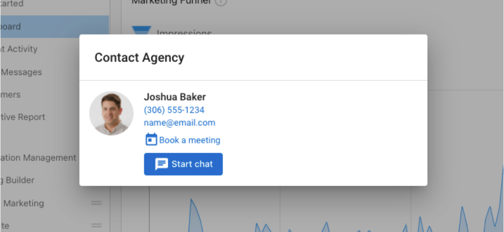

# Add a Booking Link in the Business App Contact Card

With the integration of a meeting scheduling link (like CalendarHero) in Business App, you can be more accessible to your clients. They will have an option for quick and easy bookings right from their mobile device or desktop browser on any platform they use.

Partners using Business App can display a CalendarHero meeting link (or any meeting scheduling links) on their salesperson profile, which will then appear inside the Business App contact card for accounts that have been assigned to that salesperson user.

### How to set up

**1. Add a link to salesperson profile:** To add a booking link to your salesperson profile, go to **Partner Center > Administration > My Team**. Find your Salesperson and click the 3 dots next to the name and select **Edit Salesperson**. Scroll down to find the field labeled **Book a meeting link** and enter your URL, then hit **save**.

**2. Assign the salesperson user to the account:** In **Partner Center > Accounts > Manage Accounts > Select Account > Edit > Administration**, ensure that the correct Salesperson is assigned to the account. Once set, users of that account will see a new **Book a meeting** button on the contact card of Business App.