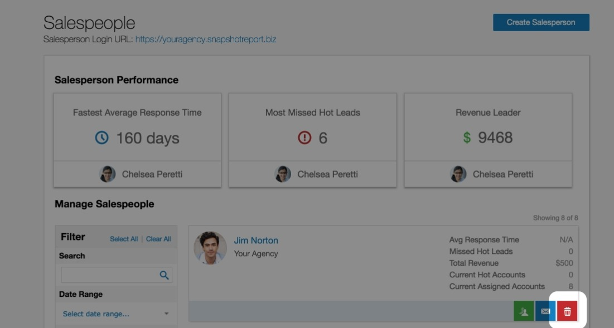

# Delete Salespeople

To delete a salesperson:

1. Go to **Partner Center** > **CRM** > [**Salespeople**](https://partners.vendasta.com/st/manage-accounts).
2. Click the **Delete** icon  beside the name of the salesperson you want to delete.

   

   :::caution
   All salesperson deletions are permanent. Before clicking **Delete**, make sure you want to delete this salesperson. Any accounts that were assigned to the salesperson before deletion will become unassigned. A Partner Center admin can reassign these accounts.
   :::

3. Click **Delete**.

  <a
    href="https://partners.vendasta.com/st/manage-accounts"
    target="_blank"
    rel="noopener noreferrer"
    style={{
      fontSize: '16px',
      fontWeight: 'bold',
      color: '#ffffff',
      backgroundColor: '#33ace2',
      textDecoration: 'none',
      borderRadius: '5px',
      padding: '10px 30px 9px 30px',
      border: '1px solid #33ACE2',
      display: 'inline-block',
      textAlign: 'center'
    }}
  >
    Delete Salespeople
  </a>

