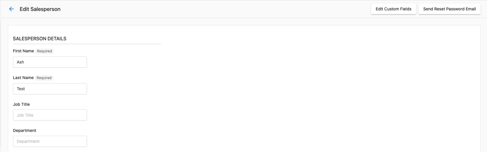
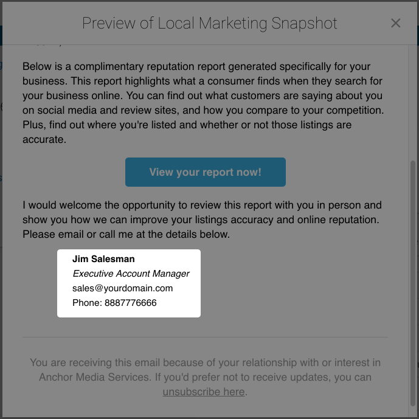

# Salespeople

Salespeople in the Partner Center CRM are the team members who work with your clients and manage accounts. You manage their profiles, contact information, passwords, and access at `Administration` → `My Team`, and their details appear in Snapshot Reports, Business App, and campaign emails.

## Why use salespeople management?

Salespeople management eliminates administrative overhead while enabling personalized client interactions and professional representation across all touchpoints.

## What's included

- **Password management**: Credential management and password reset procedures for sales team access
- **Contact information management**: Profile updates and contact details for professional client representation
- **Salesperson administration**: Proper procedures for adding, editing, and removing salespeople from the system
- **Integration capabilities**: Connect salespeople with `Snapshot Reports`, `Business App`, and campaign personalization

## Get started

1. **Navigate to salespeople management**
   - Go to `Partner Center` → `Administration` → `My Team`
   - Access your sales team management workspace

2. **Edit a salesperson profile**
   - Find the salesperson you want to edit
   - Click the **⋮** (three dots) next to their name
   - Select **Edit Salesperson**

3. **Configure salesperson details**
   - Edit name and contact information
   - Update job description
   - Scroll down to the salesperson photo section to add a photo
   - Configure permissions for the salesperson

4. **Connect integrations**
   - Link salespeople to their `Snapshot Reports`
   - Configure `Business App` personalizations
   - Set up booking links and scheduling tools

## Edit salesperson contact information

The CRM allows you to connect your salespeople with their `Snapshot Reports`, `Business App`, and campaign emails by adding in their personal contact information. When contact information is set for a salesperson, their details will automatically appear across various client touchpoints for a professional, personalized experience.

### Where salesperson information appears

#### Snapshot Report sidebar

When contact information is set for a salesperson, their details will automatically appear in the sidebar of any `Snapshot Report` created or updated by them.

#### Snapshot Report printout

Contact information will also appear on the `Snapshot Report` printout.

#### Business App

A salesperson's contact information will appear in `Business App` when a client is looking at the "Your Rep" section.

#### Campaign emails

You can also set up a default sender for campaigns - this would be your company's information, with your logo, etc. Alternatively, you can choose to have campaign emails come from each salesperson. To do this, the system pulls in the salesperson's contact information.

### How do I edit salesperson contact information? {#how-to-edit-salesperson-contact-information}

To add or edit salesperson contact information:

1. Go to `Partner Center` → `Administration` → `My Team`
2. Find the salesperson you want to edit
3. Click the **⋮** (three dots) next to their name
4. Select **Edit Salesperson**
5. Update their contact information, job description, or scroll down to add a photo
6. Click **Save**

#### Available contact fields

- **First Name** - The salesperson's first name
- **Last Name** - The salesperson's last name
- **Title** - Their job title (e.g., Account Manager, Sales Rep)
- **Email** - Their work email address. You can't change a team member's email address; to use a new email, create a new team member and delete the old one.
- **Phone** - Their work phone number
- **Photo** - A professional headshot (recommended size: 150x150 pixels)

#### Best practices

- Ensure all salespeople have complete contact information for a consistent client experience
- Use professional photos that are properly sized and cropped
- Keep contact information up to date, especially when staff changes occur
- Use consistent formatting for phone numbers and job titles across your team

## Password management

Maintaining secure access for your sales team is essential for protecting client information and ensuring smooth operations. The password reset functionality allows administrators to help salespeople regain access to their accounts when needed.

### How do I reset a salesperson's password? {#how-to-reset-passwords-for-salespeople}

To reset a salesperson's password:

1. Go to `Partner Center` → `Administration` → `My Team`
2. Find the salesperson whose password needs to be reset
3. Click the **⋮** (three dots) next to their name
4. Select **Edit Salesperson**
5. Click **Send Reset Password Email**

The salesperson will receive an email with instructions to create a new password. This process ensures security while allowing quick resolution of access issues.

## Delete salespeople

When a salesperson leaves your organization or no longer needs system access, you can remove them from the CRM. This process requires careful consideration as it has permanent effects on account assignments and data access.

### How do I delete a salesperson? {#how-to-delete-salespeople}

To delete a salesperson:

1. Go to `Partner Center` → `Administration` → `My Team`
2. Find the salesperson you want to delete
3. Click the **⋮** (three dots) next to their name
4. Select **Delete** or **Remove**
5. Confirm the deletion

:::caution
All salesperson deletions are permanent. Before clicking `Delete`, make sure you want to delete this salesperson. Any accounts that were assigned to the salesperson before deletion will become unassigned. A `Partner Center` admin can reassign these accounts.
:::

## Why can't a salesperson see companies assigned to them? {#why-a-salesperson-cant-see-companies-assigned-to-them}

Assigning a salesperson to a Company record is not enough for them to see it. Access to companies in the CRM requires **two things to match**:

1. The salesperson must have the appropriate CRM role/permissions.
2. The Company's market must be one the salesperson is **assigned to**.

If either layer doesn't match, the salesperson won't see the company — even if they're listed as the assigned salesperson on the record.

### How do I check and fix a market mismatch? {#how-to-check-and-fix-a-market-mismatch}

**Check the salesperson's market assignment:**

1. Go to `Partner Center` → `Administration` → `My team`.
2. Click the three dots next to the salesperson and select **Edit Salesperson**.
3. Review the **Markets** field to see which markets they're assigned to.

**Check the Company's market:**

1. Open the Company record in `Partner Center` → `CRM` → `Companies`.
2. Click **Edit** and go to **Basic Information**.
3. Check the **Market** field.

**Fix:** Update either the salesperson's market assignments or the Company's market so they match. Once they do, the salesperson will be able to see the Company in their CRM view.

## How do I find a salesperson ID? {#find-a-salesperson-id}

Each salesperson has a unique ID that may be needed when working with the Vendasta API or when troubleshooting with Vendasta Support.

To find a salesperson's ID:

1. Go to `Partner Center` → `Administration` → `My Team`
2. Click **⋮** next to the salesperson's name
3. Select **Edit Salesperson**
4. Look at the URL in your browser — the salesperson ID appears at the end of the URL

## How do I add a booking link to Snapshot Reports? {#add-a-booking-link-to-snapshot-reports}

You can add a salesperson's meeting booking URL to their Snapshot Reports so prospects can schedule time directly from the report.

:::note
The salesperson must have a meeting scheduler set up (such as Calendly or Microsoft Bookings) before adding this link.
:::

1. Go to `Partner Center` → `Administration` → `My Team`
2. Click **⋮** next to the salesperson's name
3. Select **Edit Salesperson**
4. Enter the booking URL in the **Book a Meeting** field
5. Click **Save**

The booking link will appear on any Snapshot Report created or regenerated after saving. It will not appear on previously generated reports.

## Salesperson access to Vendasta support

Salespeople cannot contact Vendasta Support directly. If a salesperson needs to escalate an issue, they must ask a Partner Center admin to contact support on their behalf.

## Administration and management

Manage your salespeople by going to `Partner Center` → `Administration` → `My Team`. Use it to maintain accurate salesperson information and ensure proper system access across your organization.

## Frequently asked questions

What happens to accounts when I delete a salesperson?

When you delete a salesperson, any accounts that were assigned to them will become unassigned. A `Partner Center` admin can reassign these accounts to other salespeople. The deletion is permanent and cannot be undone.

How do I add a new salesperson to the system?

To add a new salesperson, go to `Partner Center` → `Administration` → `My Team`, then click **Add Team Member**. Fill in their contact information and set appropriate permissions for their role.

Can salespeople reset their own passwords?

Salespeople can use the standard login page password reset functionality. However, administrators can also reset passwords for salespeople through `Partner Center` → `Administration` → `My Team` when additional assistance is needed.

Where will my salesperson's photo appear?

Professional photos you upload for salespeople will appear in `Snapshot Reports` (both sidebar and printout), `Business App` contact cards, and campaign emails when the salesperson is set as the sender.

What's the recommended size for salesperson photos?

We recommend using professional headshots sized at 150x150 pixels. Photos should be properly cropped and professionally presented to maintain a consistent client experience.

Can I bulk edit salesperson information?

Salesperson information must be edited individually through `Partner Center` → `Administration` → `My Team`. Each salesperson's profile can be accessed by clicking the **⋮** (three dots) next to their name and selecting **Edit Salesperson**.

How do I add a booking link to my salesperson's Business App profile?

Booking links for `Business App` are configured in the salesperson profile under the "Book a meeting link" field. For detailed instructions, see the [Add a booking link in the Business App contact card](/administration/platform-settings/customize-business-app/branding-settings#how-do-i-customize-the-contact-us-card) article.

Why doesn't my contact information appear on my Snapshot Reports?

Salesperson details appear in the sidebar and printout of any `Snapshot Report` created or updated by that salesperson, once contact information is set on their profile. Go to `Partner Center` → `Administration` → `My Team`, click **⋮** next to the salesperson, select **Edit Salesperson**, add their contact information, and click **Save**.

How do I update a salesperson's photo?

Go to `Partner Center` → `Administration` → `My Team`, click **⋮** next to the salesperson, and select **Edit Salesperson**. Scroll down to the salesperson photo section to add a photo, then click **Save**.

Can I change a salesperson's email address?

No. You can't change a Partner Center team member's email address. To use a new email, create a new team member and delete the old one.

