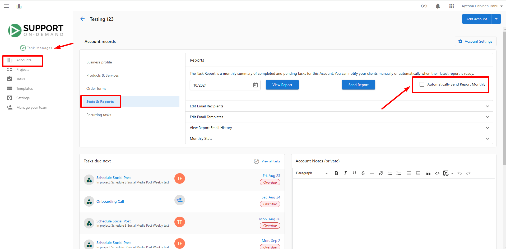

## What is Account Management in Task Manager?

Account management in Task Manager is the central hub for organizing and tracking all customer accounts you're providing fulfillment services for. Each account represents a customer and contains all the essential information needed to manage their projects, tasks, and ongoing relationships.

## Why is Account Management Important?

Effective account management in Task Manager enables you to:

- Keep track of all customers you're working with in one centralized location
- Monitor account statuses to understand which accounts are active, paused, or deactivated
- Assign team members as primary points of contact for each account
- Record important client interactions and maintain detailed account notes
- Generate automatic monthly reports and manage reporting preferences
- Filter and organize accounts based on various criteria for better workflow management

## What's Included with Account Management?

Task Manager's account management system includes:

- **Account Status Management**: Control whether accounts are active, paused, or deactivated
- **Account Assignee System**: Designate primary points of contact for each account
- **Account Notes**: Private notes visible only to your team for important account details
- **Client Interaction Logging**: Record phone calls, emails, and video meetings
- **Automatic Report Settings**: Configure monthly report delivery preferences
- **Account Activity Tracking**: View complete history of all account interactions

## How to Add Accounts to Task Manager

If you notice an account is not found in Task Manager, it's likely because no action has been taken on the account yet. Once an action, such as creating a task or project has been taken, an account will automatically be created in Task Manager.

You can also manually create an account in Task Manager:

1. Navigate to `Fulfillment` > `Open Task Manager` > `Accounts`
2. If your search comes up with no results, click `Add Account`

:::info
By default, new accounts are added in an active state. You can change this default setting under `Settings` > `Account settings`.
:::

## Account Status Management

### Understanding Account Statuses

There are three types of account statuses in Task Manager:

- **Active** - An account that you are currently working with. The selected task types will automatically generate when there is relevant work.
- **Paused** - An account you have temporarily stopped working with or one that you temporarily don't want tasks to auto-generate for.
- **Deactivated** - An account you have deactivated temporarily for business. You may wish to bring it back to active at some point in time.

### How to Change Account Status

You can change the status of an account following these steps:

1. Navigate to `Fulfillment` > `Open Task Manager` > `Accounts`
2. Search for the account you're looking for
   - If you do not see the account, you may need to check the account filters in the event the default filter is set to Status: Active
3. Change the account status by clicking on the menu (3 dots) to the far right beside the status column
4. Change the status by selecting `Activate account`, `Pause account`, or `Deactivate account`

## Account Assignee Management

### Why Account Assignees Are Important

All accounts in Task Manager have an assignee. Account assignees are commonly designated to determine who the primary point of contact is or who is managing the fulfillment of the account.

The account assignee field is responsible for:

- When a client asks a question through Business App, the account assignee is notified
- A visual indicator to other agents of who the primary point of contact is
- Tracking how many accounts an assignee manages at once to balance team workloads

### How to Assign an Account

1. Navigate to `Fulfillment` > `Open Task Manager` > `Accounts`
2. Find the account
   - If you don't see the account, you may need to remove yourself from the account filters
3. Click on the name in the `Assignee` column
4. Select the new assignee

## Account Notes Management

### Why Account Notes Are Important

Account notes help you keep track of important details surrounding your accounts. You may wish to use them for:

- Log details about the client that aren't covered by their business profile
  - *For example, what hobbies do they have, and what specific requests do they have for the work you are doing*
- Put important, must-see notes front and center
  - *For example, you have a client that only posts on social media about a small number of subjects*
- Share important communications with other team members working on the account
  - *For example, a client is going through a hard time, so use extra discretion when talking with them about a subject*

Account notes show at the top of all tasks, ensuring they aren't missed. These notes are only visible to you and your team, so you don't need to worry about clients seeing what you've written.

### How to Use Account Notes

1. Go to `Fulfillment` > `Open Task Manager` > `Accounts`
2. Click on the name of the account and you'll see `Account notes` near the top of the page

3. After you've edited your notes, click save

:::info
In order to make notes visible to your customer, notes need to be made at the project and task level.
:::

## Client Interaction Logging

### Why Logging Client Interactions Is Important

When your team has interacted with a client, it can be beneficial to record any important details worth noting via email, video, or phone. This makes it easy for anyone on the team to review recent actions or see a history of previous interactions.

### How to Record Account Activity

1. Navigate to `Fulfillment` > `Open Task Manager` > `Accounts`
2. Click on the `Account name`
   - If you don't see the account, you may need to consider any filters on the Accounts page
3. Enter details about the activity in the `Account Activity` field by clicking on `manually record activity`
   
   

4. Choose the type of activity and log the activity by selecting any of the below activity options:
   -  - Had a video call
   -  - Sent an email
   -  - Had a phone call

## Automatic Monthly Reports Management

### How to Disable Automatic Monthly Reports

If you'd prefer not to send automatic monthly reports for a specific account:

1. Navigate to `Fulfillment` > `Open Task Manager`
2. Go to the `Accounts` tab and choose the account you wish to update
3. Once in the account, click on the `Stats & Reports` tab
4. Locate the toggle labeled `Automatically Send Report Monthly` and switch it off

After completing these steps, automatic monthly reports for the selected account will no longer be sent.

## Frequently Asked Questions (FAQs)

Why don't I see an account in Task Manager?

If an account is not found in Task Manager, it's likely because no action has been taken on the account yet. Once an action, such as creating a task or project has been taken, an account will automatically be created in Task Manager. You can also manually add accounts.

What's the difference between paused and deactivated accounts?

Paused accounts are temporarily stopped or you don't want tasks to auto-generate for them. Deactivated accounts are temporarily deactivated for business reasons, but you may wish to bring them back to active status at some point.

Can clients see my account notes?

No, account notes are only visible to you and your team. Clients cannot see what you've written in account notes. If you want to make notes visible to customers, you need to add them at the project and task level.

What happens when I assign someone to an account?

The account assignee becomes the primary point of contact and will be notified when a client asks a question through Business App. It also serves as a visual indicator to other team members of who is managing the account.

How do I change the default account status for new accounts?

You can change the default account status under `Settings` > `Account settings`. By default, accounts are added as active.

What types of client interactions can I log?

You can currently log three types of interactions: video calls, emails, and phone calls. Each interaction type has its own icon and tracking system.

Can I filter accounts by assignee?

Yes, you can use filters to find all accounts associated with a specific assignee. This helps with workload management and team organization.

Where do account notes appear besides the account page?

Account notes show at the top of all tasks related to that account, ensuring important information isn't missed during task execution.

Can I turn off automatic reports for all accounts at once?

The documentation shows how to disable automatic reports on a per-account basis. You'll need to adjust this setting individually for each account you want to modify.

What information should I include in account notes?

Include client details not covered by their business profile, important must-see notes, specific client preferences, and important communications that other team members should know about.

