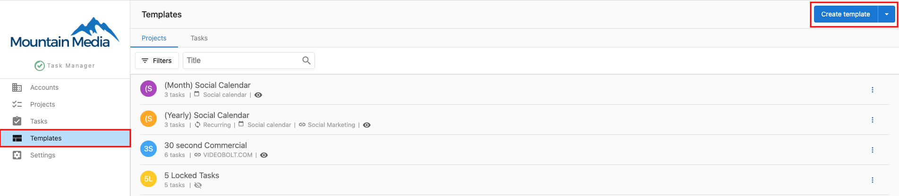
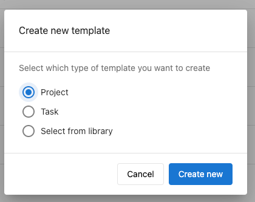
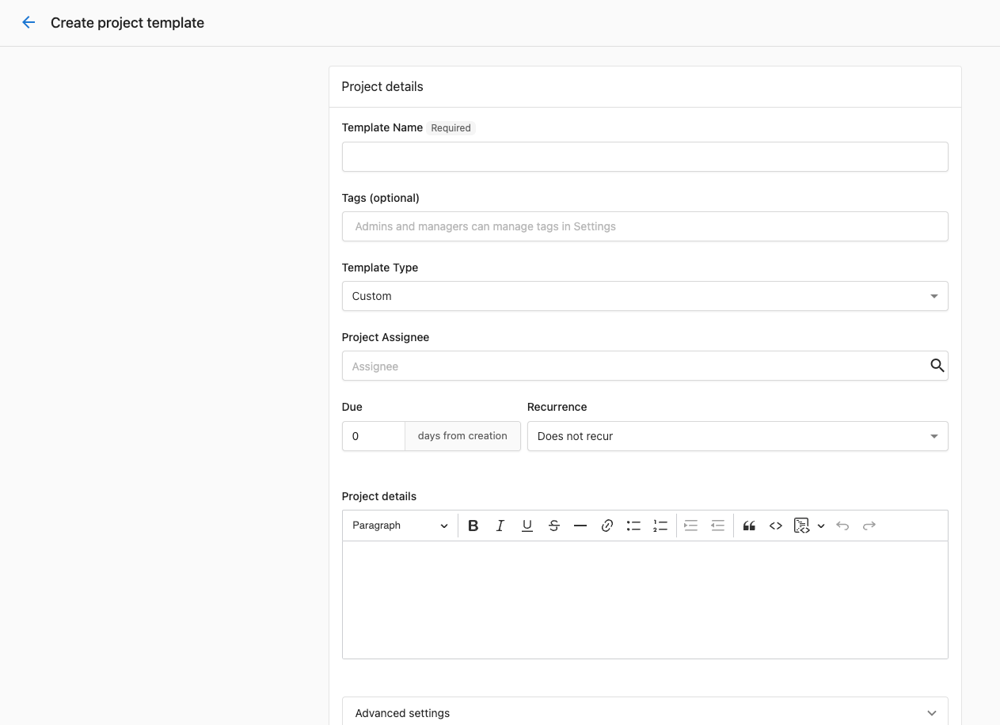

You can set projects to automatically create when specific products are activated on accounts:

1. Go to **Task Manager > Templates.**
2. Click **Create Template.**
   
   - Select what kind of template you would like to create, or choose from the library. 
     
3. Enter the **Template Name**.
4. *Optional* – Fill in the following optional fields:
   - Assignee
   - How many days the project is due after it is created.
   - Recurrence
5. Click **Associate with items in Marketplace** field under **Advanced Settings** and select the product you wish to trigger this project's creation.
6. Add the tasks you wish to create for projects created with this template.
7. Click **Create Template**.
   

When a product is activated on an account in Task Manager, it will automatically create a project on that account based on the template you created.

Please note that if you activated a product within the last 24 hours on an account, the project will be created on that account as well.