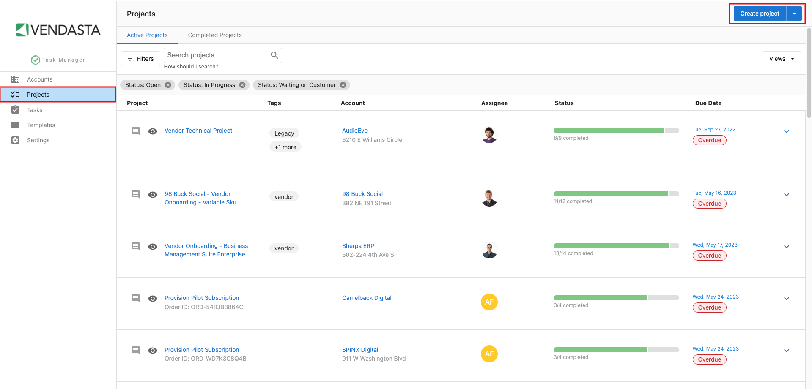
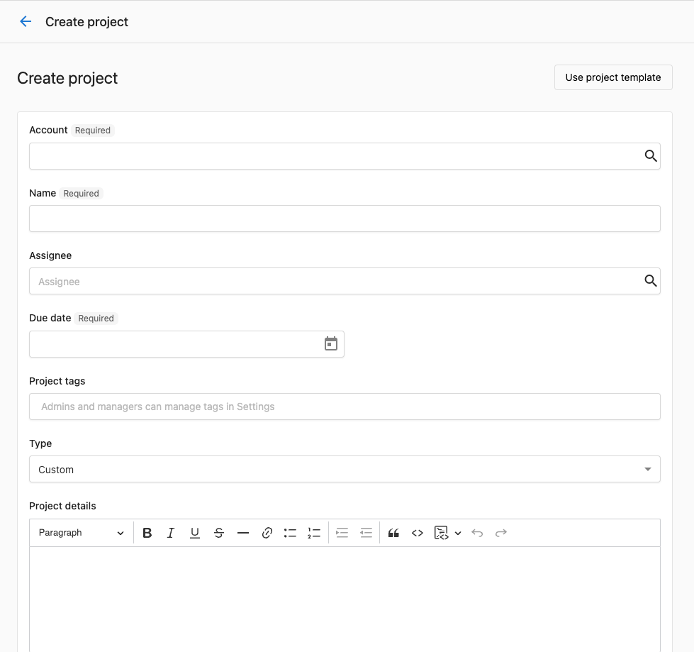
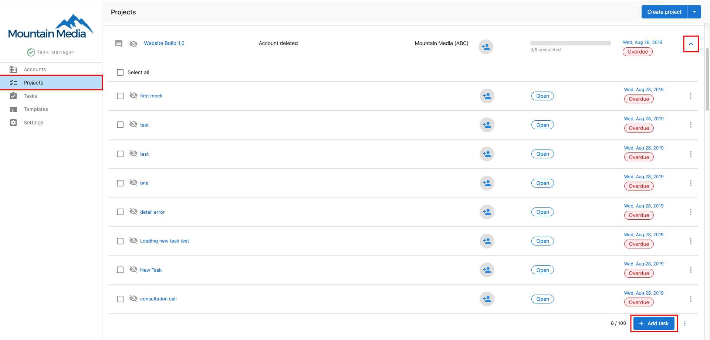
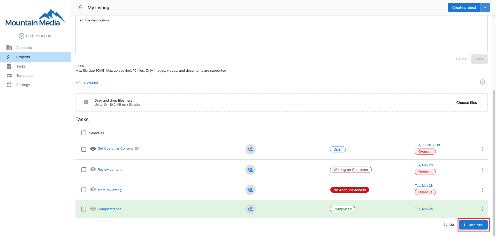
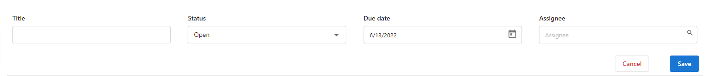

## What is project creation and management?

Project creation and management in Task Manager involves setting up organized workspaces for client deliverables, adding specific tasks, and coordinating team members to complete work on schedule.

## Why is project management important?

Effective project management helps you deliver consistent results by organizing work into clear structures, assigning responsibilities, and tracking progress toward deadlines.

## What's included with project creation and management?

### Project Setup
- Account association for client organization
- Project type selection (Custom or Social Calendar)
- Team member assignment and permissions
- Due date and timeline configuration

### Task Management
- Individual task creation with detailed descriptions
- Team member assignment for specific tasks
- Deadline setting and dependency management
- Progress tracking and status updates

### Team Collaboration
- Multi-user project access and editing
- Task assignment and responsibility tracking
- Communication tools and progress updates

## How to create projects in Task Manager

### Step 1: Start a new project

1. Navigate to **Task Manager** from the main navigation menu
2. Click the **Projects** tab to access your projects dashboard
3. Click **Create Project** to open the project creation form

### Step 2: Configure project basics

1. **Select the Account** (required) - Choose the client account this project belongs to
2. **Enter the Project name** (required) - Use a descriptive name that clearly identifies the project scope
3. **Choose the Project Type**:
   - **Custom**: For general project management and most types of client work
   - **Social Calendar**: For social media content creation and posting projects

### Step 3: Set project details

1. **Choose an Assignee** (optional) - Select the primary team member responsible for project oversight
2. **Set the Due Date** - Establish when the entire project should be completed
3. **Configure project-specific options**:

#### For Social Calendar projects:
- **Content Call**: Schedule a call to discuss content strategy and requirements
- **Schedule Social Posts**: Automatically generate social post tasks within the project
- **Client Review**: Require client approval before content goes live

### Step 4: Complete project creation

1. Add any initial tasks if you want to start with specific deliverables
2. Click **Create project** to save your new project

## How to add tasks to projects

### Step 1: Access your project

1. Navigate to **Task Manager** from the main navigation menu
2. Click on any project displayed on your dashboard to open it
3. Click the **Add Tasks** dropdown button to start creating new tasks

### Step 2: Create individual tasks

1. Enter a descriptive name for your task in the **Project Name** field

2. Fill out the complete task details in the form:

   - **Name**: Add a clear, descriptive name that explains what needs to be accomplished
   - **Description**: Include detailed information about requirements, deliverables, and any special instructions
   - **Assignee**: Select the team member(s) responsible for completing this specific task
   - **Due Date**: Set a realistic deadline for task completion that aligns with your project timeline
   - **Dependency**: Optionally select other tasks that must be completed before this task can start

3. Click **Add** to save the task to your project

### Step 3: Organize and manage tasks

After creating tasks, you can:

- **Track Progress**: Monitor task completion as team members update their status
- **Edit Details**: Modify task descriptions, deadlines, or assignments if requirements change
- **Reassign Work**: Move tasks between team members based on availability or expertise
- **Monitor Deadlines**: Use your dashboard to identify approaching due dates and potential delays
- **Manage Dependencies**: Ensure prerequisite tasks complete before dependent work begins

## Managing project workflows

### Project Organization
- Group related tasks logically within projects
- Use clear naming conventions for easy identification
- Set realistic timelines that account for dependencies and team capacity

### Team Coordination
- Assign tasks based on team member skills and availability
- Communicate changes and updates promptly
- Review progress regularly to identify potential issues early

### Progress Tracking
- Monitor individual task completion rates
- Identify bottlenecks or delays before they impact deadlines
- Adjust assignments or timelines when necessary to maintain project momentum

## Best practices for project management

### Planning Phase
- Break large deliverables into specific, actionable tasks
- Involve team members in timeline estimation for realistic scheduling
- Consider task dependencies when setting up project workflows

### Execution Phase
- Check project status regularly and communicate with your team
- Update task descriptions if requirements change during the project
- Use the dashboard to stay aware of approaching deadlines

### Communication
- Ensure clear task descriptions so team members understand expectations
- Update project status to keep stakeholders informed of progress
- Address questions or obstacles promptly to maintain project momentum

By effectively creating and managing projects in Task Manager, you can ensure clear communication of responsibilities and deadlines with your team while maintaining organized workflows for client deliverables.