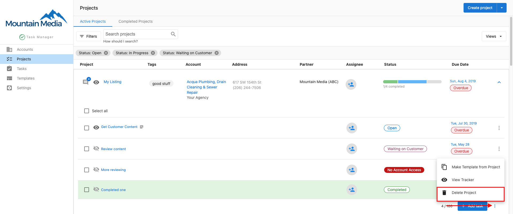
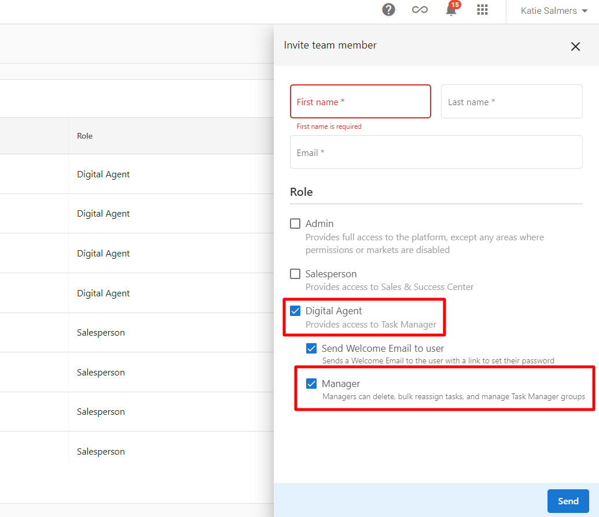
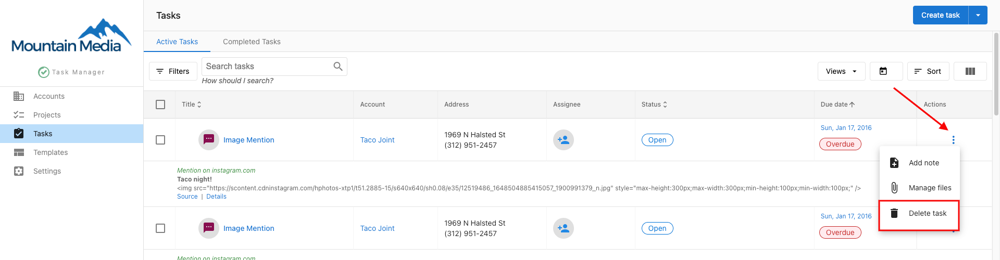

# Delete Projects and Tasks in Task Manager

Task Manager can help you keep track of important tasks for your business. As your needs change, you may find that you need to delete projects or tasks that are no longer relevant. This article will walk you through the steps to delete projects and tasks in Task Manager.

## Delete a Project

Deleting a project will remove the project and all associated tasks. Follow these steps to delete a project:

1. Navigate to **Projects** in Task Manager
2. Locate the project you want to delete
3. Click the **trash can** icon next to the project name

4. Confirm that you want to delete the project

## Remove User Permissions

If you need to remove a user's access to a project without deleting the project itself, you can remove their permissions:

1. Navigate to the **Permissions** tab in the project
2. Find the user you want to remove
3. Click the **trash can** icon next to their name

## Delete a Task

If you only need to delete specific tasks within a project, follow these steps:

1. Navigate to the project containing the tasks
2. Find the task you want to delete
3. Click the **trash can** icon next to the task

4. Confirm that you want to delete the task

## Note

* Deleting projects or tasks cannot be undone
* Consider archiving projects instead of deleting them if you may need to reference them in the future
* Only users with appropriate permissions can delete projects and tasks