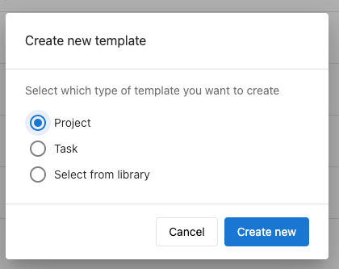

## What are project templates and automation?

Project templates are reusable project structures that include predefined tasks, assignments, and timelines. Automation allows these templates to automatically create new projects when specific conditions are met, such as product activation or scheduled intervals.

## Why are templates and automation important?

Templates and automation save time and ensure consistency by eliminating the need to manually recreate similar projects. You can standardize your workflow processes and automatically generate projects when clients purchase specific products or services.

## What's included with templates and automation?

### Template Creation
- Reusable project structures with predefined tasks
- Default assignees and timeline configurations
- Custom fields and project-specific settings
- Template library for common workflow patterns

### Automation Features
- Product-triggered project creation from marketplace activations
- Recurring project generation on scheduled intervals
- Automatic task assignment based on template configurations
- Integration with client account management

### Template Management
- Template library organization and categorization
- Version control and template updates
- Sharing templates across team members
- Template performance tracking and optimization

## How to create project templates

### Step 1: Access template creation

1. Navigate to **Fulfillment > Open Task Manager > Templates**
2. Click **Create template** to start building a new template
3. Select your template type:
   - **Project**: Create a complete project template with multiple tasks
   - **Task**: Create a single task template for reuse
   - **Select from library**: Choose from existing template patterns

4. Click **Create new** to proceed with template creation

### Step 2: Configure template basics

Fill in the general template details:

- **Template Name** (required): Choose a descriptive name that clearly identifies the template purpose
- **Tags** (optional): Add organizational tags for easy template discovery
- **Template Type**: Select **Custom** for general projects or **Social Calendar** for social media workflows
- **Project Assignee**: Set the default team member who will be assigned to projects created from this template
- **Due __ days from creation**: Specify how many days after creation the project should be due
- **Project details**: Add any standard notes or instructions that apply to all projects using this template

### Step 3: Configure automation settings

#### Recurrence Options
Set up automatic project recreation:
- **Recurrence**: Choose how often the project should automatically recreate
- **Custom intervals**: For **Custom** recurrence, you can specify detailed scheduling options

#### Advanced Settings
- **Associate with Product in the Marketplace**: Select specific products that will trigger automatic project creation when activated on client accounts
- **Custom fields**: Add specialized fields relevant to your workflow requirements

### Step 4: Define template tasks

Create the tasks that will be included in every project using this template:

- **Task Name**: Provide clear, descriptive names for each task in your workflow
- **Assignee**: Set default team members responsible for each task type
- **Due __ days from project creation**: Specify when each task should be completed relative to project start

:::info
You can add multiple tasks by selecting **Add Another Task** or **Add task template**. Remove unwanted tasks by selecting **Delete Task**.
:::

### Step 5: Save your template

1. Review all template settings and task configurations
2. Click **Create Template** to save your template to the library

## How to set up automatic project creation

### Product-triggered automation

1. Navigate to **Task Manager > Templates**
2. Select an existing template or create a new one
3. In **Advanced Settings**, click **Associate with items in Marketplace**
4. Select the specific product that should trigger project creation
5. Save your template configuration

When the selected product is activated on any client account, Task Manager will automatically create a project based on your template.

:::warning
If you activated a product within the last 24 hours on an account, the automated project will be created on that account as well when you set up the automation.
:::

### Recurring project automation

1. Create or edit a project template
2. Configure the **Recurrence** setting with your desired frequency
3. For custom recurrence patterns, select **Custom** and specify detailed scheduling
4. Save the template to activate recurring project creation

## Managing your template library

### Template Organization
- Use descriptive names that clearly indicate template purpose and scope
- Apply consistent tagging to group related templates
- Regularly review and update templates based on workflow improvements

### Template Optimization
- Monitor project success rates for different templates
- Gather team feedback on template effectiveness
- Update task assignments and timelines based on actual completion data

### Template Sharing
- Ensure all team members have access to relevant templates
- Document template usage guidelines and best practices
- Coordinate template updates across team members

## Best practices for templates and automation

### Template Design
- Include all essential tasks for complete project delivery
- Set realistic default timelines based on historical project data
- Use clear task descriptions that work for different team members

### Automation Setup
- Test automation triggers before deploying to client accounts
- Monitor automated project creation to ensure proper functionality
- Review and adjust automation settings based on client feedback

### Maintenance
- Regularly update templates to reflect process improvements
- Archive outdated templates to keep your library organized
- Document template changes for team awareness

By effectively using project templates and automation, you can standardize your workflows, reduce manual project setup time, and ensure consistent delivery of client projects while maintaining high-quality standards across your team.