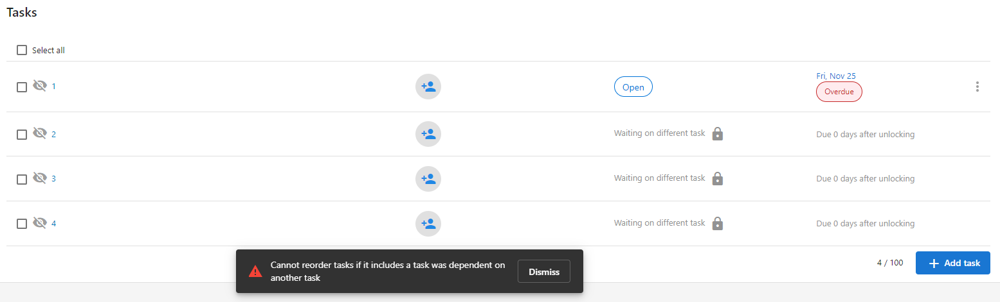
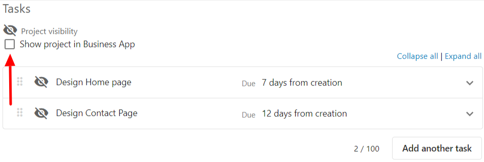

# Projects FAQ

**Question: Can I reorder Project tasks if one or more tasks are locked?**

If there is a Project Task that is dependent on a locked task, you will not be able to reorder any of the Project tasks within the associated Project. However, in 'Templates,' this functionality is available even if one or more tasks are locked.

**Question: How can I make Task Manager Projects visible in the Executive Report?**

Any tasks and projects that Task Manager users have set as **'Visible in Business App'** will display in the Executive Report for that business.

Please note that if this option is toggled on after the project or task has been created, the Task Manager user will need to update the notes or status on that project or task to have it appear in the Executive Report.