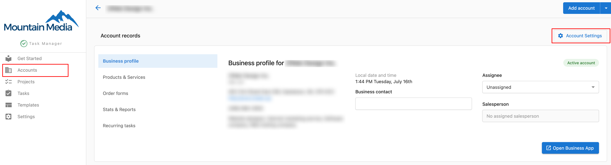
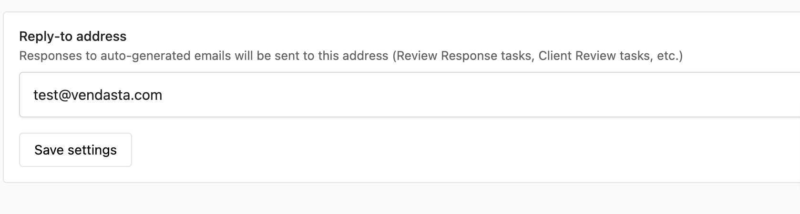

# Task Manager Settings FAQ

## Q: What happens to my accounts if I update my General Settings in Task Manager?

**A:** Any changes will only affect **NEW** accounts created moving forward. Any pre-existing accounts will need to have changes made via the Account Settings.

## Q: When you send an email to a client via Task Manager, which email address does it come from?

**A:** You can configure the Task Manager 'Send from' email address by navigating to **Fulfillment > Open Task Manager > Settings > Email Settings.**

## Q: How do I upload a profile photo in Task Manager?

**A:** Uploading a profile picture can make it easier to identify Task assignees at a glance.

1. Navigate to **Fulfillment > Open Task Manager > Settings > User settings.**
2. Click **Edit.**
3. Drag an image into the uploader or click Upload image.