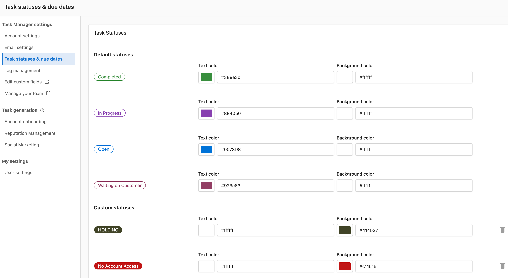
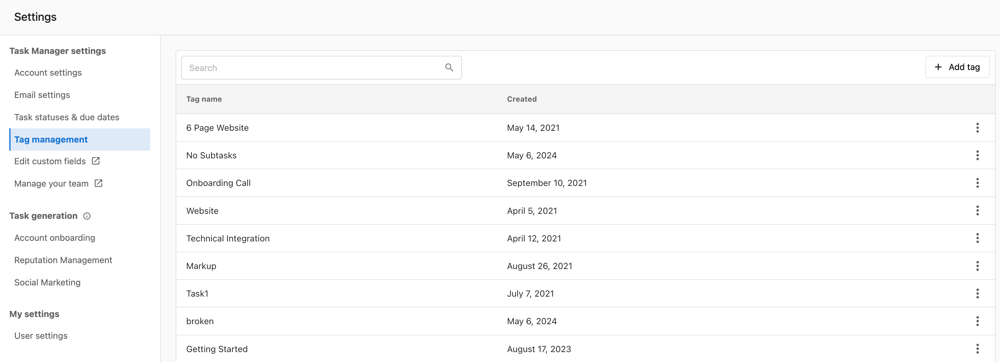
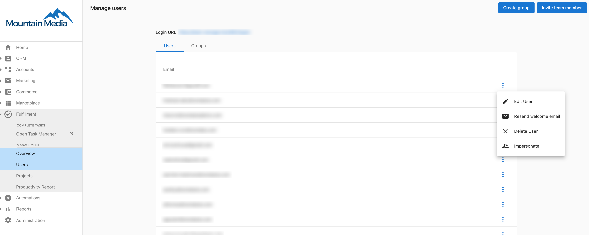
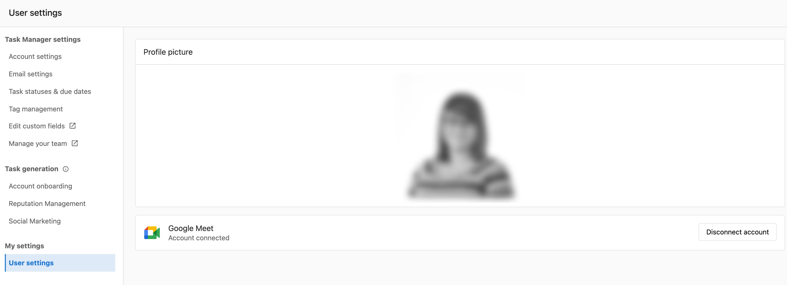

# Settings

## What is Task Manager Settings?

Task Manager Settings is a comprehensive configuration panel that allows you to customize workflows, automate processes, and enhance team collaboration within your task management system. You can configure everything from email notifications to team permissions and task statuses.

## Why are Task Manager Settings important?

Proper configuration of Task Manager settings ensures your team operates efficiently by:
- Standardizing workflows across your organization
- Automating routine task management processes
- Customizing notifications to reduce interruptions
- Managing team access and permissions effectively

## What's Included with Task Manager Settings?

Task Manager Settings includes seven main configuration areas:
- Company Details management
- Due Dates configuration
- Email Settings customization
- Task Statuses definitions
- Tag Management system
- Team Management controls
- User Settings preferences

## How to Access Task Manager Settings

To access Task Manager settings:

1. Navigate to **Fulfillment > Open Task Manager**
2. Click the gear icon in the top right corner of the screen

## Company Details

Manage your company information including name, address, phone number, and email. This information is used across the Task Manager for communications and reports.

## Due Dates

Configure due date settings for tasks, including:
- Default due dates for new tasks
- How tasks are prioritized based on due dates
- Notification settings for upcoming and overdue tasks

## Email Settings

Customize email notifications and templates for task-related communications:
- Email notification preferences
- Email templates for task assignments, updates, and completions
- Custom email signatures for task communications

You can configure the Task Manager 'Send from' email address by navigating to **Fulfillment > Open Task Manager > Settings > Email Settings**.

## Task Statuses

Define and customize task statuses to match your workflow:
- Create custom statuses
- Edit existing statuses
- Set default statuses for new tasks
- Configure status transitions and automations

## Tag Management

Create and manage tags for organizing and filtering tasks:
- Create custom tags
- Edit tag names and colors
- Archive unused tags
- Set permissions for tag usage

## Team Management

Manage team members and their permissions:
- Add or remove team members
- Set role-based permissions
- Create team groups for task assignments
- Configure accessibility settings

## User Settings

Individual users can customize their Task Manager experience:
- Notification preferences
- Display preferences
- Default views and filters
- Time zone settings

You can upload a profile picture to make it easier to identify task assignees at a glance:

1. Navigate to **Fulfillment > Open Task Manager > Settings > User settings**
2. Click **Edit**
3. Drag an image into the uploader or click **Upload image**

## Best Practices

- **Review settings regularly**: As your workflow evolves, regularly review and update settings to maintain efficiency
- **Train team members**: Ensure all team members understand how to use the settings that affect their work
- **Start simple**: Begin with basic settings and gradually implement more advanced features as your team becomes familiar with the system
- **Document changes**: Keep a record of setting changes to track how they impact workflow and productivity

## Frequently Asked Questions

What happens to my accounts if I update my General Settings in Task Manager?

Any changes will only affect **NEW** accounts created moving forward. Any pre-existing accounts will need to have changes made via the Account Settings.

When you send an email to a client via Task Manager, which email address does it come from?

You can configure the Task Manager 'Send from' email address by navigating to **Fulfillment > Open Task Manager > Settings > Email Settings**.

How do I upload a profile photo in Task Manager?

Uploading a profile picture can make it easier to identify Task assignees at a glance.

1. Navigate to **Fulfillment > Open Task Manager > Settings > User settings**
2. Click **Edit**
3. Drag an image into the uploader or click **Upload image**

Do setting changes affect existing tasks?

Most setting changes only apply to new tasks created after the change. Existing tasks typically retain their original configuration unless manually updated.

Can I customize task statuses for different types of work?

Yes, you can create custom statuses in the Task Statuses section to match your specific workflow requirements and configure transitions between statuses.

How do I manage team permissions for different settings?

Use the Team Management section to set role-based permissions that control which team members can access and modify specific settings areas.

Can I set different notification preferences for different types of tasks?

Yes, you can customize email notification preferences in the Email Settings section and configure user-specific preferences in User Settings.

What happens if I delete a tag that's already assigned to tasks?

Before deleting a tag, you should remove it from all assigned tasks or archive it instead to maintain task organization and historical data.

