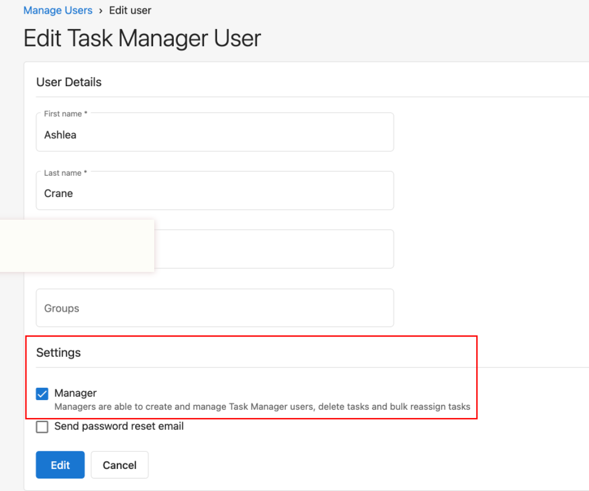
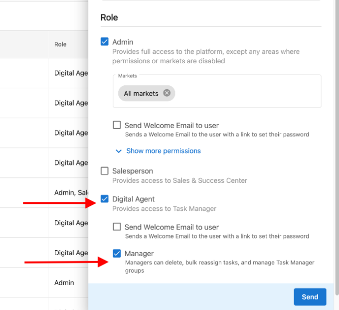
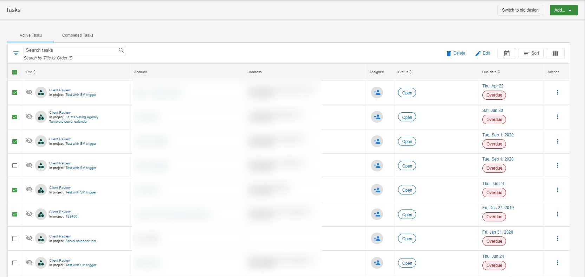

# Bulk Edit Tasks

Bulk editing tasks allows you to quickly update multiple tasks at once. This feature saves time by applying the same changes to multiple tasks simultaneously.

## Setting Up User Permissions

Before you can bulk edit tasks, you need to ensure you have the appropriate permissions:

1. **Account User Manager Role**: You must have the Account User Manager role, which gives you permission to manage users and their access levels.

   

2. **Team Member with Admin Access**: You need to be a team member with administrative permissions for the accounts whose tasks you want to edit.

   

3. **Login and Task Management Permissions**: These permissions must be set up correctly in the user's profile. In order for a Task Manager user to complete bulk actions, they must be set up as a User > Manager. If the user does not have a manager role, they will not be able to complete bulk actions. To view whether or not a User has this set up for their user, please refer to the following screenshots:

Navigate to Partner Center > Fulfillment > Users > Manage Users
Click on the menu and Edit User
Select Manager

   

## Bulk Editing Process

Once you have the necessary permissions, you can bulk edit tasks using the following steps:

1. **Select Tasks to Edit**:
   - Navigate to the Tasks section of your dashboard
   - Select multiple tasks by checking the boxes next to each task you want to edit
   - You can filter tasks by status, date, or other criteria before selecting them

   

2. **Apply Bulk Edits**:
   - After selecting tasks, click the "Edit" button at the top of the task list
   - A dialog will open with options for bulk editing
   - Choose the fields you want to update (e.g., status, assignee, due date)
   - Make your changes to the selected fields
   - Click "Save" to apply the changes to all selected tasks

   

3. **Review Your Changes**:
   - After saving, the tasks will be updated with your changes
   - Verify that the edits were applied correctly

## Best Practices

- **Filter Tasks First**: Use filters to narrow down the list of tasks before selecting them for bulk editing
- **Double-Check Selection**: Make sure you've selected only the tasks you want to edit before applying changes
- **Communicate Changes**: If you're editing tasks assigned to other team members, make sure to communicate the changes you've made
- **Regular Updates**: Use bulk editing regularly to keep tasks organized and up-to-date

## Limitations

- Some task fields may not be available for bulk editing
- You cannot edit tasks from different accounts simultaneously
- Custom fields may have specific requirements or limitations for bulk editing