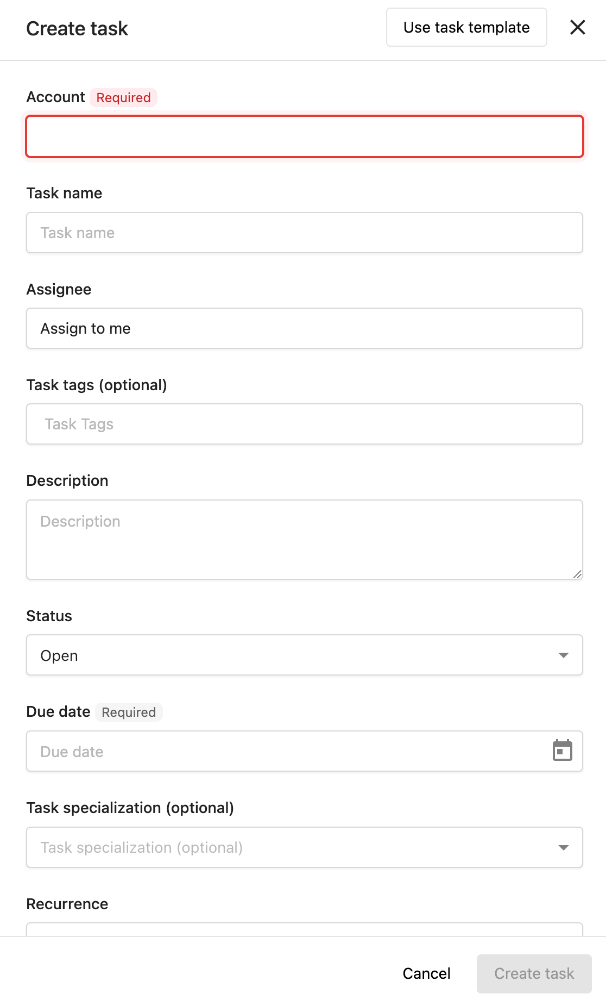

# Creating and Managing Tasks

## What is Task Creation and Management?

Task creation and management involves both manual task creation for custom work and automated task generation based on account activity. This streamlined process ensures all client work is tracked and organized effectively.

## Why is Task Creation Important?

Effective task creation helps you:

- **Track All Work**: Ensure no client activities fall through the cracks
- **Automate Routine Tasks**: Generate tasks automatically for common activities
- **Scale Operations**: Handle more accounts without missing important work
- **Maintain Consistency**: Apply the same processes across all accounts

## How to Create Tasks Manually

### Manual Task Creation Process

1. Navigate to `Fulfillment` > `Open Task Manager` > `Tasks`
2. Click `Create task`
3. Select the **Account** you're creating the task for
4. Enter information into all appropriate fields - Due date and Account are the only required fields
5. Click `Create task`

### When to Create Manual Tasks

Create manual tasks for:
- Custom client requests
- One-off projects
- Account-specific work
- Tasks not covered by auto-generation

## How to Set Up Auto-Generated Tasks

Auto-generated tasks streamline your fulfillment process by automatically creating tasks based on account activity and configured settings.

:::info
This guide covers default task types. You can auto-generate custom tasks using project templates.
:::

### Auto-Generate Tasks for All New Accounts

Set default task generation for new accounts:

1. Go to `Task Manager` > `Settings`
2. Click `Reputation Management` or `Social Marketing`
3. Move the toggle to the on or off state to control automatic task generation

### Auto-Generate Tasks per Account

Configure task generation for individual accounts:

1. Go to `Open Task Manager` > `Accounts`
2. Select the respective account
3. Click `Account Settings`
4. Navigate to `Task generation`
5. Toggle task types on/off as needed

:::warning
Certain products may need to be active before you can auto-generate tasks on the account.
:::

## Task Types Available for Auto-Generation

### Listings Tasks
- **Purpose**: Tasks that generate when listings are inaccurate
- **Setup**: Configure listing sources you manage for clients on the **Listings** tab
- **When Generated**: When listing data becomes inconsistent or inaccurate

### Mentions Tasks
- **Purpose**: Tasks for business mentions across the web
- **Requirements**: Reputation Management must be active
- **Setup**: Configure types of mentions to manage for clients
- **When Generated**: When the business is mentioned online

### Reviews Tasks
- **Purpose**: Tasks for new customer reviews
- **Requirements**: Reputation Management must be active
- **When Generated**: When new reviews are posted for businesses

### Social Posts Tasks
- **Purpose**: Tasks prompting social media posting
- **Requirements**: Social Marketing must be active
- **Setup**: Configure content type and posting commitments on individual accounts
- **When Generated**: Based on posting schedule and commitments

### Socialize Tasks
- **Purpose**: Tasks for customer interactions on social media
- **When Generated**: When customers post on client's social media pages and accounts

### Google Q&A Tasks
- **Purpose**: Tasks for new questions posted to Google Business Profile
- **Requirements**: Google account connected in Reputation Management
- **When Generated**: When new questions are posted to Google Business Profile

## Account-Specific Configuration

### Individual Account Settings

Each account can have unique task generation settings:

1. Navigate to `Open Task Manager` > `Accounts`
2. Select the account
3. Click `Account Settings`
4. Navigate to `Task generation`
5. Configure specific settings for:
   - Which task types to generate
   - Frequency of generation
   - Specific sources to monitor

### Product Requirements

Some task types require specific products to be active:

- **Mentions and Reviews**: Require Reputation Management
- **Social Posts and Socialize**: Require Social Marketing
- **Google Q&A**: Requires Google account connection

## Best Practices for Task Creation

### Manual Task Creation
- Use clear, descriptive task titles
- Set realistic due dates
- Include all relevant details in the description
- Assign tasks to appropriate team members
- Add relevant tags for organization

### Auto-Generated Task Setup
- Start with conservative settings and adjust based on workload
- Review auto-generated tasks regularly to ensure quality
- Customize settings per account based on client needs
- Monitor task volume to prevent overwhelm

### Task Management
- Review task generation settings quarterly
- Adjust settings based on team capacity
- Use bulk editing to manage similar tasks efficiently
- Communicate changes to team members

## Frequently Asked Questions

How do auto-generated tasks work?

Auto-generated tasks are created automatically based on account activity and your configured settings. For example, when new reviews are posted, new mentions appear online, or questions are asked on Google Business Profile, tasks will generate automatically if those task types are enabled for the account.

How do I turn off auto-generated tasks for specific accounts?

Go to Open Task Manager > Accounts, select the account, click Account Settings, navigate to Task generation, and toggle the specific task types off. You can control this for individual accounts or set defaults for all new accounts in Settings.

Can I create custom task templates?

While the system doesn't detail custom task creation templates, you can create review response templates for different star ratings and business categories. For other custom tasks, you'll need to create them manually or use the auto-generation features for standard task types.

What products need to be active for auto-generated tasks?

Mentions and Reviews tasks require Reputation Management to be active. Social Posts and Socialize tasks require Social Marketing to be active. Google Q&A tasks require the Google account to be connected in Reputation Management.

Can I set different auto-generation settings for different accounts?

Yes, you can configure task generation settings individually for each account in Account Settings > Task generation, or set defaults for all new accounts in the main Settings area.

