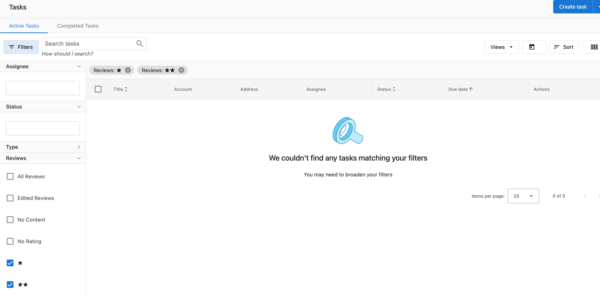

# FAQ Article for Tasks

**Question: Why are my Task Manager reviews disappearing when I filter by multiple star ratings?**

Currently, the star rating review filters in our system are treated to be "AND" statements instead of "OR" to help narrow down review searches more easily. For example:

With multiple filters, it finds reviews by combining searches that meet all 3 of the selected criteria:
"1-star AND 2-star AND 3-star"

Instead of returning criteria that meets any of the 3 selected criteria:
"1-star OR 2-star OR 3-star".

This is why the reviews disappear when using multiple-star ratings, as the system is filtering by "1-star **AND** 2-star" instead of "1-star **OR** 2-star," and it would be impossible for a review to have a rating of both 1-star and 2-star. You must select one start rating at a time.

You can still use star rating, task status, and assignee filters together, as it is possible for a single review to meet all of these criteria, you just wouldn't be able to use multiple star ratings in the same set of filters.

