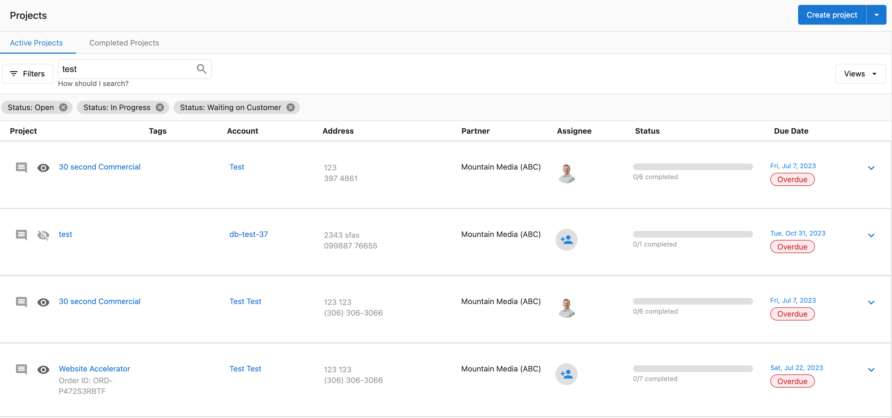
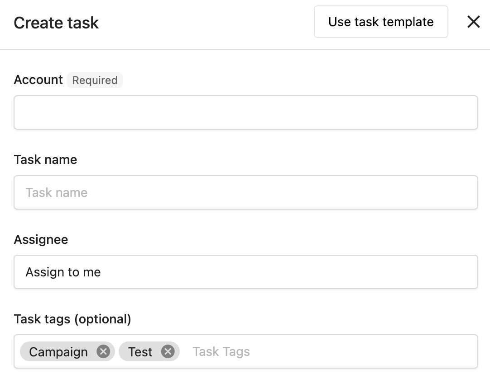
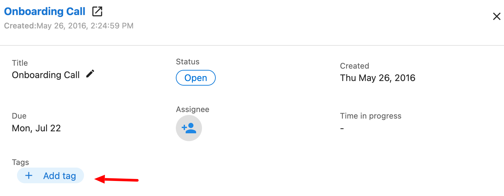
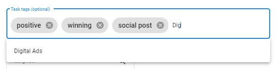

# Finding and Organizing Tasks

## What is Task Finding and Organization?

Task finding and organization involves using Task Manager's search, sorting, and tagging capabilities to quickly locate specific tasks and maintain an organized workflow. These features help you manage large volumes of tasks efficiently.

## Why is Task Organization Important?

Effective task organization helps you:

- **Find Tasks Quickly**: Locate specific tasks without scrolling through long lists
- **Prioritize Work**: Organize tasks by urgency, due date, or other criteria
- **Improve Efficiency**: Spend less time searching and more time completing work
- **Scale Operations**: Manage increasing task volumes without losing control

## How to Use Enhanced Search

Task Manager's enhanced search allows you to find tasks using various parameters beyond just task names.

### Search Parameters

You can search for tasks using any of the following:

- **Name**: Task title or description
- **Account**: Client account name
- **Contact**: Contact person associated with the task
- **Address**: Business address
- **Order ID**: Associated order or project ID
- **Tags**: Custom tags applied to tasks

### Search Process

1. Go to `Task Manager` > `Projects` or `Task Manager` > `Tasks`
2. Set filters as desired
3. Type one of the search parameters into the search field
4. Use quotation marks ("") to search for exact matches
5. Adjust sorting settings once search results are displayed
6. To conduct another search, clear the text and start again

:::info
Using search will reset sorting settings. You can adjust these as needed once your search results are displayed.
:::

### Search Tips

- **Partial Matches**: Search works with partial information - you don't need complete names or addresses
- **Exact Phrases**: Use quotation marks for exact phrase matches
- **Multiple Terms**: Search for multiple keywords to narrow results
- **Filter First**: Apply filters before searching to reduce the scope

## How to Sort Tasks

### Available Sorting Options

1. Navigate to `Fulfillment` > `Open Task Manager` > `Tasks`
2. Click the `Sort` button
3. Choose one or multiple columns to sort by:
   - None
   - Title
   - Status
   - Created date
   - Modified date
   - Completed date
   - Due date

4. Select Ascending (earliest to latest) or Descending order (latest to earliest)
5. Click `Update`

### Multiple Column Sorting

When selecting multiple columns for sorting:
- Sorting is prioritized starting with the first column selected
- Columns can be reordered for different priorities
- Example: Sort by Title, then by Due date

:::info
If you choose multiple columns, sorting will be prioritized starting with the first column selected. Tasks with the same due date will be ordered alphabetically.
:::

### Common Sorting Strategies

- **By Due Date**: Focus on urgent tasks first
- **By Status**: Group tasks by completion status
- **By Account**: Work on one client at a time
- **By Created Date**: Handle older tasks first
- **By Modified Date**: See recently updated tasks

## How to Use Tags for Organization

Tags provide flexible organization beyond standard categories and help with filtering and identification.

### Adding Tags to Tasks

#### When Creating a New Task
Add tags in the "Tags" field during task creation.

#### To Existing Tasks
1. Navigate to `Fulfillment` > `Open Task Manager` > `Tasks`
2. Search for and click on the task
3. Click `+ Add tag` and enter your tags

### Tag Suggestions

As you type tags, Task Manager suggests existing tags you've used before. You can:
- Select from existing suggestions for consistency
- Create new tags by typing unique names
- Use the same tags across tasks, projects, and templates

### Tag Organization Strategies

#### By Priority
- `urgent`
- `high-priority`
- `medium-priority`
- `low-priority`

#### By Client Type
- `restaurant`
- `retail`
- `healthcare`
- `automotive`

#### By Work Type
- `onboarding`
- `monthly-maintenance`
- `emergency-fix`
- `review-response`

#### By Location (for multi-location clients)
- `location-downtown`
- `location-north`
- `location-franchise-1`

### Tag Benefits

- **Improved Organization**: Categorize tasks by client, status, priority, or custom criteria
- **Quick Filtering**: Easily filter task lists to focus on specific work types
- **Consistent Classification**: Apply the same tags across tasks, projects, and templates
- **Flexible Management**: Add or remove tags as organizational needs change

## Advanced Organization Techniques

### Combining Search, Sort, and Tags

1. **Start with Tags**: Apply relevant tags to categorize tasks
2. **Filter by Status**: Use status filters to focus on active work
3. **Search by Keywords**: Use search to find specific accounts or work types
4. **Sort by Priority**: Order results by due date or priority tags

### Creating Workflows

1. **Daily Workflow**: Sort by due date, filter by assigned user
2. **Client Review**: Search by account name, sort by creation date
3. **Emergency Response**: Filter by "urgent" tag, sort by due date
4. **Weekly Planning**: Sort by status, filter by upcoming due dates

### Bulk Organization

Use search and filtering to identify groups of tasks for bulk operations:
1. Search for tasks needing similar updates
2. Select multiple tasks using checkboxes
3. Apply bulk edits to standardize tags, status, or assignments

## Frequently Asked Questions

Can I search for tasks using partial information?

Yes, the enhanced search functionality allows you to search using partial matches for names, accounts, contacts, addresses, order IDs, and tags. Use quotation marks for exact phrase matches.

How do I organize tasks by priority or urgency?

Use tags to create your own priority system (e.g., "urgent", "high-priority", "low-priority") and combine this with sorting by due date. You can also use the bulk edit feature to quickly update multiple tasks with priority tags.

What should I do if I can't find a specific task?

Use the enhanced search feature to search by account name, contact, address, order ID, or tags. You can also apply filters by status, assignee, or task type, then sort results by creation date, due date, or other criteria to locate the task.

How do I manage tasks for multi-location businesses?

Use tags to organize tasks by location, and leverage the enhanced search to find tasks by address or location-specific keywords. You can also use bulk editing to apply changes across multiple location-related tasks efficiently.

Can I save my search and sort preferences?

Search and sort settings don't persist between sessions, but you can quickly reapply them. Consider using consistent tagging strategies to make filtering faster and more reliable.

How many tags can I add to a task?

There's no specific limit mentioned for tags per task. Use as many as needed for organization, but keep them manageable and consistent for best results.

Do tags work across projects and templates too?

Yes, you can use tags consistently across tasks, projects, and templates for unified organization. This creates a coherent tagging system throughout Task Manager.

