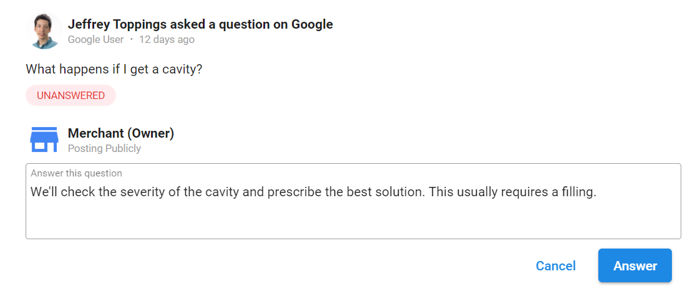

One of the key benefits of using Task Manager for Google Q&A is the ability to respond to questions directly from Task Manager. You are notified when new questions are posted, you can keep track of a large number of accounts without needing to manually check them repeatedly. In Task Manager, there are a few basics to set up Google Q&A tasks.

### **Why are Google Q&A Tasks Important?**

Google Q&A is used to let potential customers ask specific questions about a business. These are powerful for a few reasons:

- Answering questions here helps clarify for other customers who might be wondering the same thing.
- They are a great opportunity to humanize a business and show that the business cares about potential customers.

### **How to Use Google Q&A Tasks**

1. To populate Google Q&A tasks, you'll first need to connect the Google account in Reputation Management for each account.

2. If there are questions that need an answer, a task will be automatically be created. To respond to the questions asked:

   1. Navigate to **Open Task Manager > Tasks.**
   2. Click the Google Q&A task.
   3. Answer the question.
   4. Click **Answer.**
   
      

### **Turn Google Q&A on and off**

Google Q&A task generation is on by default. If you wish to turn this off—or back on if you've disabled this—you can do so under **Settings**:

1. **Open Task Manager.**
2. Go to **Settings > Reputation Management.**
3. Click the toggle next to **Google Q&A.**