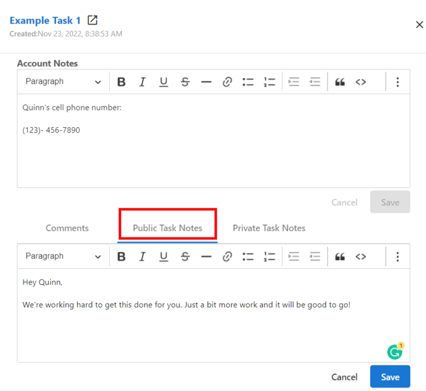
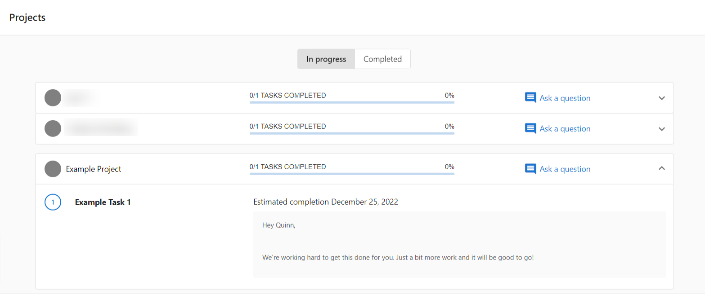
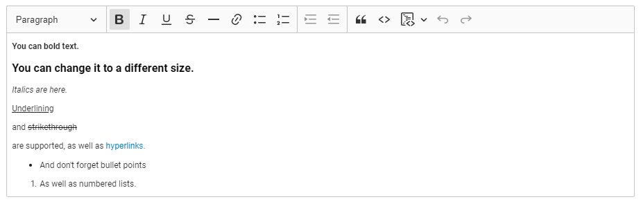
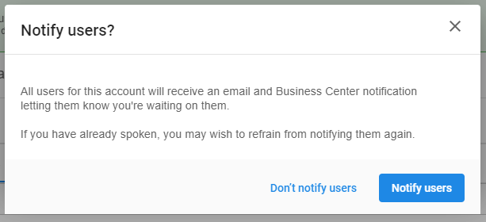

### **Public notes in Business App**

If you have any public notes on tasks that are visible to Business App users, these will appear by those tasks in Business App. This should make it easier to communicate with your clients and give you more control over exactly what information they have access to.

This will only affect tasks that you've set to show in Business App. Should you have any public notes that you do not wish to share, please move these over to private notes.

### **Rich text support for task notes**

You can bold, italicize, and add hyperlinks to your task notes. This should make it easier to emphasize important information between agents and ensure your customers are getting the best service possible. You won't need to worry about important information getting buried in a wall of text anymore. Plus, variety is fun, so adding a few bells and whistles to your notes can break up the monotony of day-to-day work.

Perhaps the greatest improvement this brings about is the ability to add hyperlinks. You'll be able to stop looking through links without knowing what they are for now.

### **Notify clients when setting visible tasks to "Waiting on Customer"**

When setting visible tasks to "Waiting on Customer", you'll be asked if you wish to notify your client. If so, they'll receive a Business App notification and email. Clicking on these will take them to the Projects page in the Business App where they can view the projects you're working on for them.

### **How does it work?**

**Public notes** 

Any public notes you've set to visible will appear in Business App. In Task Manager, the field looks as follows:

These then appear in Business App under **Projects**:

**Rich text**

You can add rich text formatting to notes and project descriptions.

**Notify clients when setting visible tasks to "Waiting on Customer"**

When setting a task to "Waiting on Customer", you'll see the following:

Clicking **Notify users** will send a Business App notification and email.