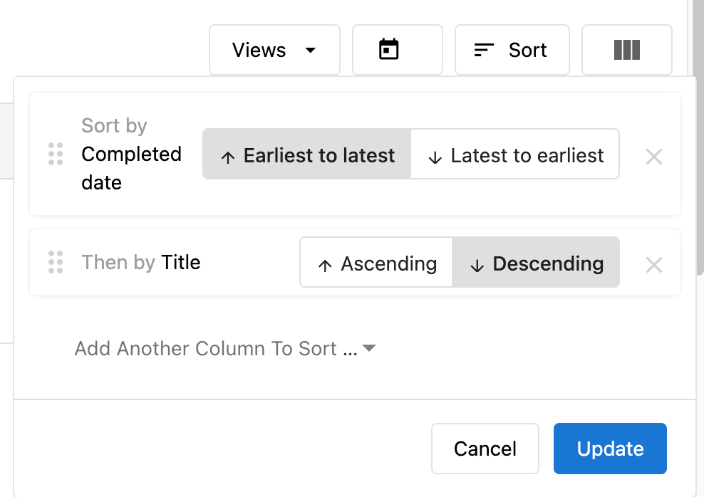

# Sort Tasks

When Task Manager users access the **Tasks** page, they'll see a button called **Sort**. Clicking on this will give you options for sorting your tasks.

### How does sorting tasks work?

1. Navigate to **Fulfillment > Open Task Manager > Tasks**, and click on Sort.

2. Choose a column or multiple to sort by:
   - None
   - Title
   - Status
   - Created date
   - Modified date
   - Completed date
   - Due date

**NOTE:** If you choose **multiple columns**, the sorting will be prioritized starting with the first column selected. Columns can be reordered. For example: Sort by Title, Then by Due date

3. Sort by Ascending (Earliest to latest) or Descending order (Latest to earliest). This level of sorting allows you to organize your tasks in the way you see fit.

**NOTE: Any tasks that have the same due date will be ordered alphabetically.**

4. Click Update