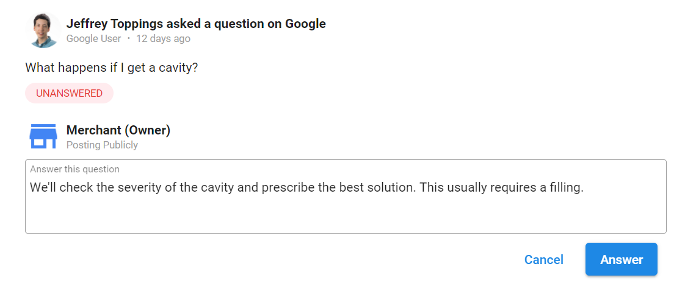
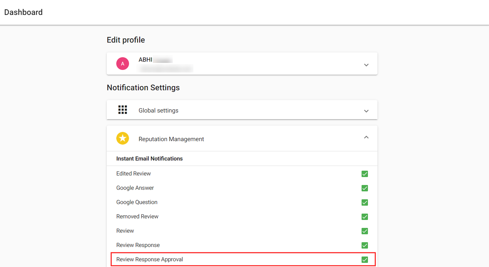

# Specialized Task Types

## What are Specialized Task Types?

Specialized task types are specific workflows designed for particular business activities like responding to Google Q&A questions, managing review responses, handling login credentials, and managing approval processes. These tasks have unique interfaces and processes tailored to their specific purposes.

## Why are Specialized Tasks Important?

Specialized tasks help you:

- **Handle Specific Workflows**: Use purpose-built interfaces for common activities
- **Maintain Consistency**: Apply standardized processes across similar tasks
- **Improve Efficiency**: Access specialized tools and templates
- **Ensure Quality**: Use guided workflows for important client interactions

## Google Q&A Tasks

Google Q&A tasks help you respond to customer questions posted to Google Business Profile listings.

### Why are Google Q&A Tasks Important?

Google Q&A provides powerful benefits:
- **Clarify Information**: Answer questions for potential customers with the same concerns
- **Humanize Business**: Show that the business cares about potential customers
- **Improve Visibility**: Active Q&A engagement can improve local search performance

### How to Set Up Google Q&A Tasks

1. **Connect Google Account**: Connect the Google account in Reputation Management for each account
2. **Automatic Generation**: Tasks will automatically generate when new questions are posted

### How to Respond to Google Q&A Questions

1. Navigate to `Open Task Manager` > `Tasks`
2. Click the Google Q&A task
3. Review the question posted by the customer
4. Answer the question in the provided field
5. Click `Answer` to publish your response

### How to Toggle Google Q&A On/Off

1. Open `Task Manager`
2. Go to `Settings` > `Reputation Management`
3. Click the toggle next to `Google Q&A`

:::info
Google Q&A task generation is enabled by default. You can disable it per account or globally in settings.
:::

## Review Response Tasks

Review response tasks help you manage and respond to customer reviews with approval workflows and templated responses.

### Why are Review Response Tasks Important?

Review responses are crucial for:
- **Customer Relations**: Show you value customer feedback
- **Reputation Management**: Address concerns publicly and professionally
- **Scaling Efficiency**: Use templates to maintain quality while saving time
- **Client Approval**: Ensure clients approve responses before publication

### How to Request Approval for Review Responses

Before responding to customer reviews, you may need client approval:

1. Navigate to `Open Task Manager` > `Tasks`
2. Use filters to find review tasks requiring responses (suggest using Open status and reviews filter)
3. Choose from:
   - AI suggested response
   - Existing template
   - Custom response
4. Click `Request Approval`

#### Approval Email Details

The approval email includes:
- Custom greeting
- Review source
- Reviewer name
- Request body (e.g., "Please approve within 24 hours")
- Review content
- Professional signature

After sending, Task Manager:
- Records the time in a public note
- Changes task status to "Waiting on Customer"

:::info
Approval emails are sent to Business App users and notification recipients who have **Review Response Approval** enabled in Business App > Settings > Notification Settings > Reputation Management.
:::

### How to Create Review Response Templates

Templates help maintain consistency and save time when responding to reviews.

1. Log in to `Task Manager`
2. Go to `Settings` > `Task generation` > `Reputation Management`
3. Click `Manage Templates`

4. Click `+ Add New Template`
5. Configure template settings:
   - **Title**: Descriptive name for the template
   - **Response Content**: The template text
   - **Star Rating**: Which star ratings this template applies to
   - **Business Categories**: Optional category restrictions
6. Click `Save`

### How Review Templates Work

- **Randomization**: Responses are randomized based on criteria to avoid repetitive responses
- **Criteria Matching**: Templates are selected based on star rating and business category
- **Customization**: You can edit suggested responses before sending

## Login Credentials Management

Securely manage client usernames and passwords for task completion.

### Why is Credentials Management Important?

Secure credential storage helps you:
- **Complete Tasks Efficiently**: Access client accounts when needed
- **Maintain Security**: Store credentials securely within Task Manager
- **Streamline Onboarding**: Collect credentials during client setup
- **Organize Access**: Keep all client access information in one place

### How to Add Credentials via Onboarding Tasks

1. Navigate to `Fulfillment` > `Open Task Manager` > `Tasks`
2. Use filters and/or search to find the Onboarding Task
3. In the Onboarding task, click the `+Add Credentials` link
4. Enter the client's login information securely

### How to Add Credentials via Account Settings

1. Navigate to `Fulfillment` > `Open Task Manager` > `Accounts`
2. Use search to find the account
3. Click `Account Settings`
4. Navigate to `Source Settings`
5. Expand relevant sections:
   - Search engines
   - Review Sites
   - Directories
   - Social Sites
6. Click `Edit Credentials` to enter Username and Password
7. Click `Save`

### Credential Security Best Practices

- Only store credentials when necessary for task completion
- Use the most specific access level possible
- Regularly review and update stored credentials
- Follow your organization's security policies
- Remove credentials when no longer needed

## Approval Workflows

### Review Response Approval Process

1. **Create Response**: Draft response in review task
2. **Request Approval**: Click "Request Approval" button
3. **Email Sent**: Approval request sent to designated recipients
4. **Status Change**: Task status changes to "Waiting on Customer"
5. **Client Response**: Client approves or requests changes
6. **Completion**: Publish approved response or make requested changes

### Approval Notification Settings

Clients must enable notifications in their Business App:
- Navigate to Business App > Settings > Notification Settings
- Enable "Review Response Approval" under Reputation Management
- Configure email preferences

## Best Practices for Specialized Tasks

### Google Q&A Tasks
- Respond promptly to questions
- Provide helpful, accurate information
- Use a professional but friendly tone
- Include relevant business details when appropriate

### Review Response Tasks
- Create templates for common review types
- Personalize responses when possible
- Always request approval for sensitive responses
- Track response times and client approval rates

### Credentials Management
- Use strong, unique passwords when creating accounts
- Store only necessary login information
- Document any special access requirements
- Regularly audit stored credentials

## Frequently Asked Questions

What happens when I request approval for a review response?

The approval request email is sent to all Business App users and notification recipients on that account who have Review Response Approval enabled. Task Manager records the time in a public note and changes the task status to "Waiting on Customer."

Can I create custom task templates?

You can create review response templates for different star ratings and business categories in Settings > Task generation > Reputation Management. For other types of custom tasks, you'll need to create them manually or use the auto-generation features for standard task types.

How do I ensure Google Q&A tasks are generated?

Make sure the Google account is connected in Reputation Management for each account, and verify that Google Q&A task generation is enabled in Settings > Reputation Management.

Where are login credentials stored and how secure are they?

Login credentials are stored securely within Task Manager and can be accessed through Onboarding tasks or Account Settings. Follow your organization's security policies and only store credentials when necessary for task completion.

Can I customize the approval email content?

The approval email includes standard elements like greeting, review source, reviewer name, and review content. The body text appears to be configurable (e.g., "Please approve within 24 hours"), but specific customization options aren't detailed in the available documentation.

How do I handle Google Q&A questions that require technical knowledge?

For technical questions, you can tag team members with relevant expertise in the task comments, or escalate to the client if the question requires specific business knowledge. Always ensure accuracy in your responses.

What's the difference between AI suggested responses and templates for reviews?

AI suggested responses are generated automatically based on the review content, while templates are pre-written responses you create for specific star ratings and business categories. Both can be customized before sending and require client approval.

Can I disable specific types of auto-generated tasks?

Yes, you can control task generation at both the global level (Settings > Reputation Management or Social Marketing) and per account (Account Settings > Task generation). Each task type can be toggled independently.

