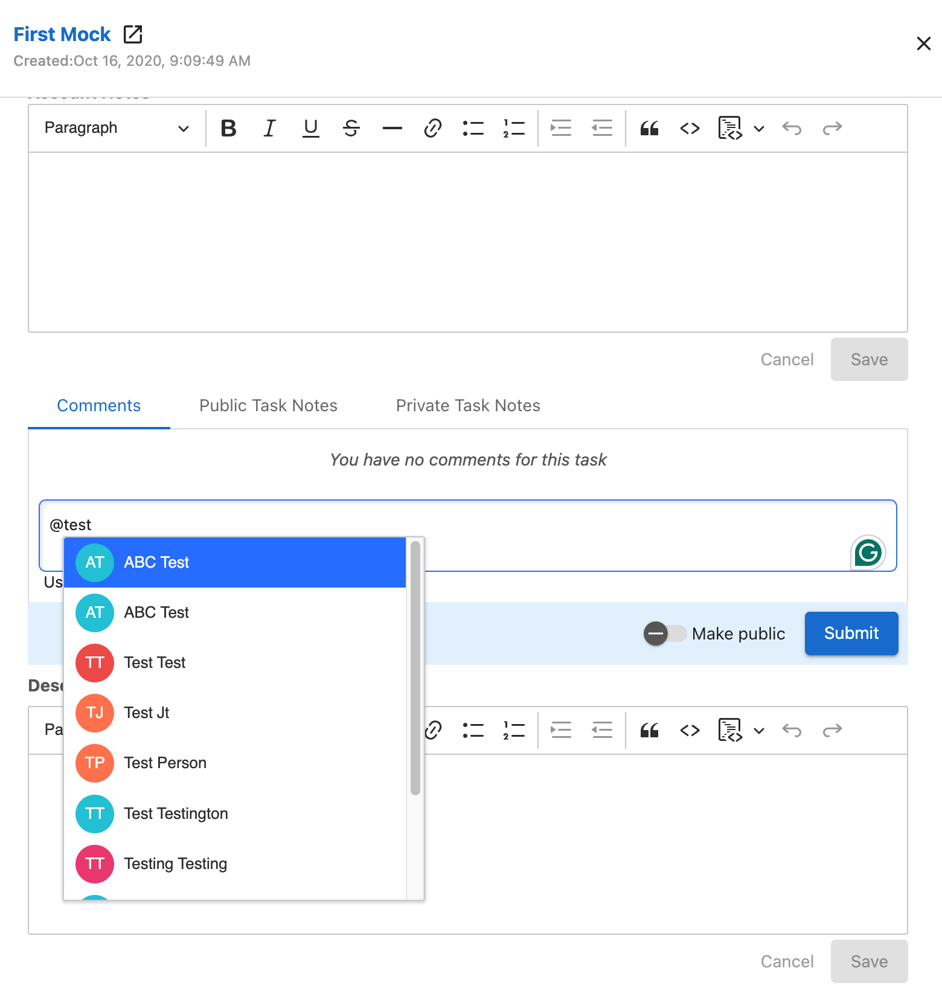

# Tagging Users in Task Comments

Fulfillment is largely about communication. Especially with larger projects, it's important to keep your coworkers in the loop. Maybe you need to get information from another on the team, or you answered a call relating to another agent's work.

To assist with communicating with other Task Manager Users, Task Manager supports tagging other users. This helps keep all relevant information in one place on your tasks and cuts down on the number of emails, Slack messages, and calls needed to complete a task.

## How to tag users in task comments

1. Navigate to Fulfillment > Open Task Manager > Tasks
2. Click on one of your tasks
3. In the side-panel, click Comments
4. Type your comment. To tag an agent, enter **@** and begin typing their name
5. Click on the user you wish to tag
6. Click Submit 

## How do task comment notifications work?

When tagged, the agent will receive both an in-app notification and an email notice, provided they haven't disabled these notifications. The in-app notification contains a direct link to the task, and the email contains the content of the message itself.