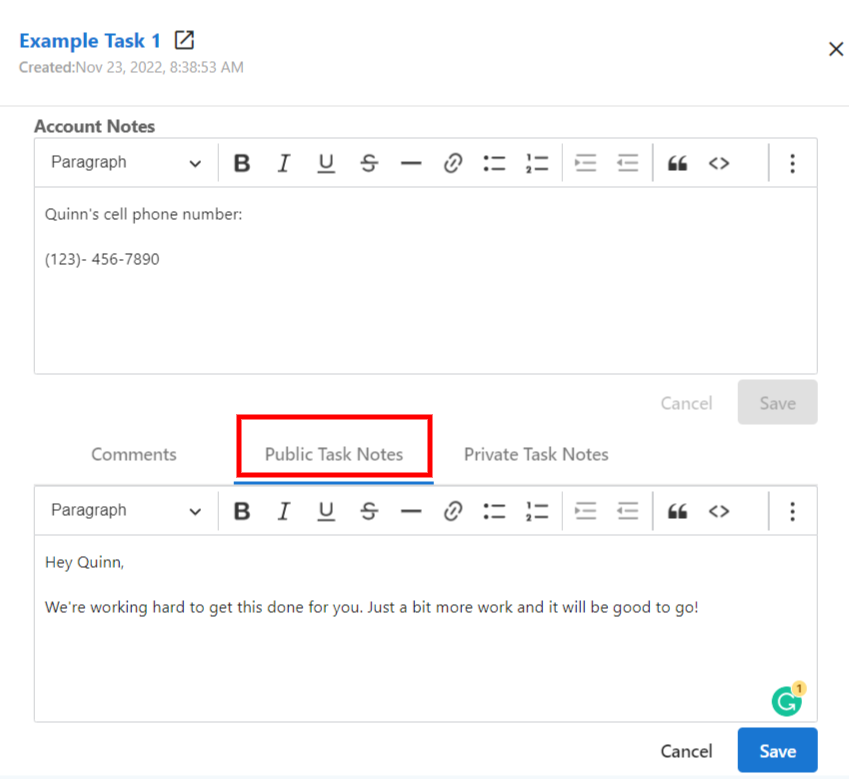
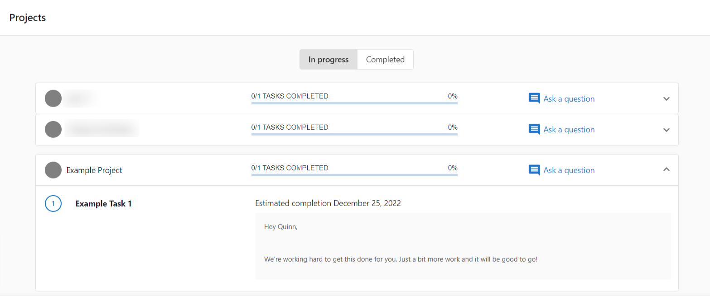
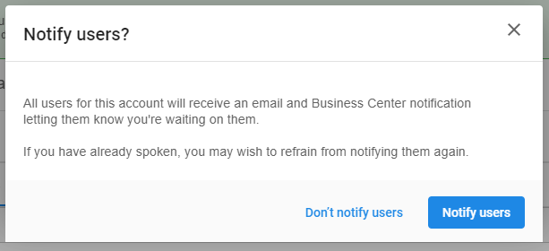

# Task Communication and Collaboration

## What is Task Communication and Collaboration?

Task communication and collaboration features enable effective teamwork and client interaction through tasks. These tools include rich text formatting, user tagging, public notes for clients, approval workflows, and bulk editing capabilities.

## Why is Communication Important in Tasks?

Effective task communication helps you:

- **Improve Teamwork**: Keep team members informed and engaged
- **Enhance Client Relations**: Share appropriate information with clients
- **Streamline Workflows**: Reduce emails and external communication
- **Maintain Accountability**: Track decisions and approvals within tasks
- **Scale Operations**: Manage communication efficiently across multiple tasks

## How to Use Rich Text in Task Notes

### Rich Text Formatting Options

You can format task notes and project descriptions using:
- **Bold text** for emphasis
- *Italic text* for subtle emphasis
- Hyperlinks to relevant resources

This helps emphasize important information and keeps all relevant details organized within tasks.

### Best Practices for Rich Text

- **Bold** for critical information or deadlines
- *Italics* for optional or supplementary details
- **Hyperlinks** for relevant documentation, resources, or external sites
- Keep formatting consistent across your team

## How to Use Public vs Private Notes

### Public Notes in Business App

Public notes on tasks visible to Business App users will appear in the client's Business App interface under Projects. This improves client communication and gives you control over shared information.

Public notes then appear in Business App:

### When to Use Public Notes
- Project status updates
- Next steps for clients
- Required client actions
- General progress information

### When to Use Private Notes
- Internal team discussions
- Sensitive client information
- Technical details
- Strategy discussions

:::warning
If you have public notes you don't wish to share, move them to private notes before making tasks visible to clients.
:::

## How to Tag Users in Comments

### Tagging Process

1. Navigate to `Fulfillment` > `Open Task Manager` > `Tasks`
2. Click on a task
3. In the side panel, click `Comments`
4. Type your comment and enter `@` followed by a team member's name
5. Click on the user you wish to tag
6. Click `Submit`

### Comment Notifications

When tagged, users receive:
- **In-app notification** with a direct link to the task
- **Email notice** containing the comment content (unless disabled in their notification settings)

### Best Practices for User Tagging

- Tag relevant team members for input or action
- Use clear, specific messages when tagging
- Don't over-tag - only include necessary people
- Follow up on tags to ensure action is taken

## How to Use Bulk Editing for Collaboration

Bulk editing allows you to quickly update multiple tasks simultaneously, improving team efficiency and consistency.

### Prerequisites for Bulk Editing

Before bulk editing tasks, ensure you have:

1. **Account User Manager Role**: Permission to manage users and access levels
2. **Team Member with Admin Access**: Administrative permissions for the accounts
3. **Manager Role**: Users must be set up as Manager in their profile to complete bulk actions

### Setting Up Manager Role
1. Navigate to `Partner Center` > `Fulfillment` > `Users` > `Manage Users`
2. Click on the menu and `Edit User`
3. Select `Manager`

### Bulk Editing Process

#### 1. Select Tasks
- Navigate to the Tasks section
- Check boxes next to tasks you want to edit
- Use filters to narrow down tasks before selecting

#### 2. Apply Edits
- Click the `Edit` button at the top of the task list
- Choose fields to update (status, assignee, due date)
- Make your changes
- Click `Save` to apply changes to all selected tasks

#### 3. Review Changes
Verify that edits were applied correctly and communicate changes to affected team members.

### Bulk Editing Best Practices

- **Filter First**: Use filters to narrow down your selection before bulk editing
- **Double-Check Selection**: Verify you've selected only the tasks you want to edit
- **Communicate Changes**: Inform affected team members about bulk changes
- **Use Regularly**: Implement bulk editing as part of regular task maintenance

:::warning
**Bulk Editing Limitations:**
- Some task fields may not be available for bulk editing
- You cannot edit tasks from different accounts simultaneously
- Custom fields may have specific requirements or limitations
:::

## How to Manage Waiting on Customer Status

### Setting Tasks to "Waiting on Customer"

When setting visible tasks to "Waiting on Customer", you can notify clients who will receive:
- Business App notifications
- Email notifications directing them to the Projects page

### When to Use "Waiting on Customer"
- Awaiting client approval
- Requiring client information
- Pending client decision
- Client needs to complete an action

### Notification Process
1. Change task status to "Waiting on Customer"
2. Choose whether to notify the client
3. Add public notes explaining what you're waiting for
4. Client receives notification with link to Business App

## Collaboration Workflows

### Internal Team Collaboration
1. Use private notes for team discussions
2. Tag team members for input or action
3. Use bulk editing to assign tasks to team members
4. Track progress through status updates

### Client Collaboration
1. Use public notes for client updates
2. Set appropriate tasks as visible in Business App
3. Use "Waiting on Customer" status when client action is needed
4. Format important information with rich text

### Cross-Account Collaboration
1. Use consistent tagging across accounts
2. Bulk edit similar tasks across multiple accounts
3. Maintain consistent communication standards
4. Share templates and best practices

## Frequently Asked Questions

What happens when I tag someone in a task comment?

Tagged users receive both an in-app notification and an email notice (unless they've disabled notifications). The in-app notification includes a direct link to the task, and the email contains the comment content.

Can I use rich text formatting in all task notes?

Yes, you can use bold, italics, and hyperlinks in both task notes and project descriptions. This helps emphasize important information and organize content effectively.

What's the difference between public and private notes?

Public notes on tasks visible to Business App users will appear in the client's interface under Projects. Private notes remain internal to your team. If you have sensitive information, keep it in private notes.

What permissions do I need to bulk edit tasks?

You need three things: Account User Manager role, Team Member with Admin Access for the relevant accounts, and Manager role in your user profile. Without the Manager role, you cannot complete bulk actions in Task Manager.

Can I edit tasks from different accounts at the same time?

No, you cannot bulk edit tasks from different accounts simultaneously. You can only bulk edit tasks within the same account at one time.

How do I ensure clients see important task updates?

Use public notes for information you want clients to see, set tasks to visible in Business App, and use the "Waiting on Customer" status with notifications when client input is needed. Rich text formatting can help emphasize important information in public notes.

Can I disable notifications for tagged comments?

Yes, users can disable notifications in their personal settings. However, the tagging feature itself will still work - they just won't receive automatic notifications about being tagged.

What happens when I bulk edit task assignments?

When you bulk edit task assignments, all selected tasks will be assigned to the new team member. Make sure to communicate these changes to both the previous and new assignees to ensure smooth handoffs.

