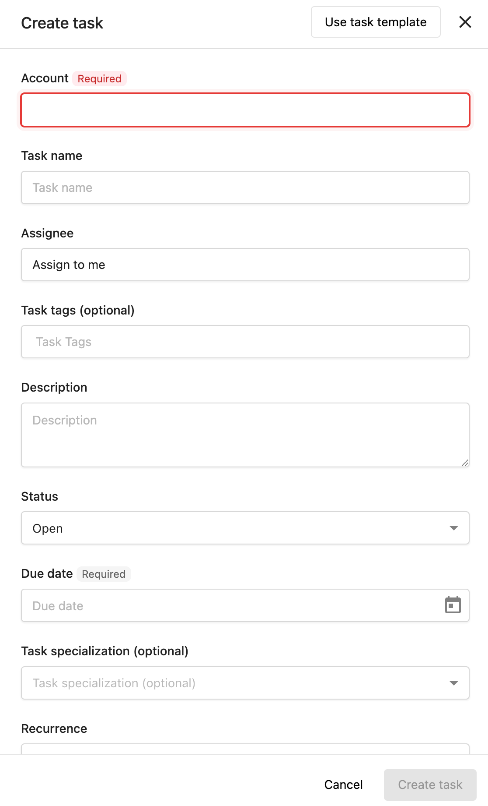
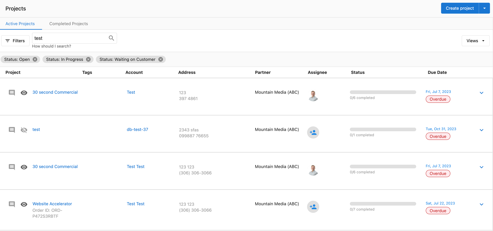
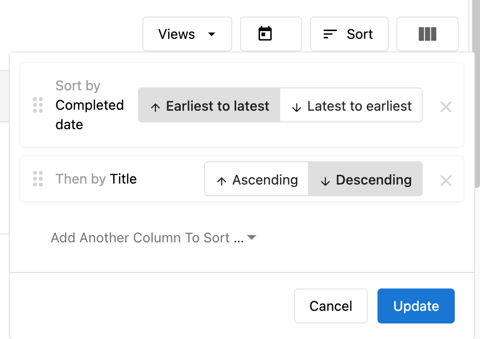
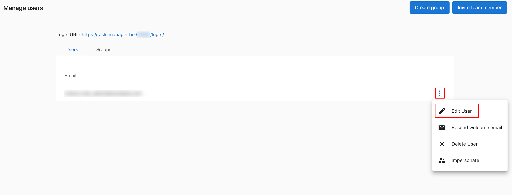
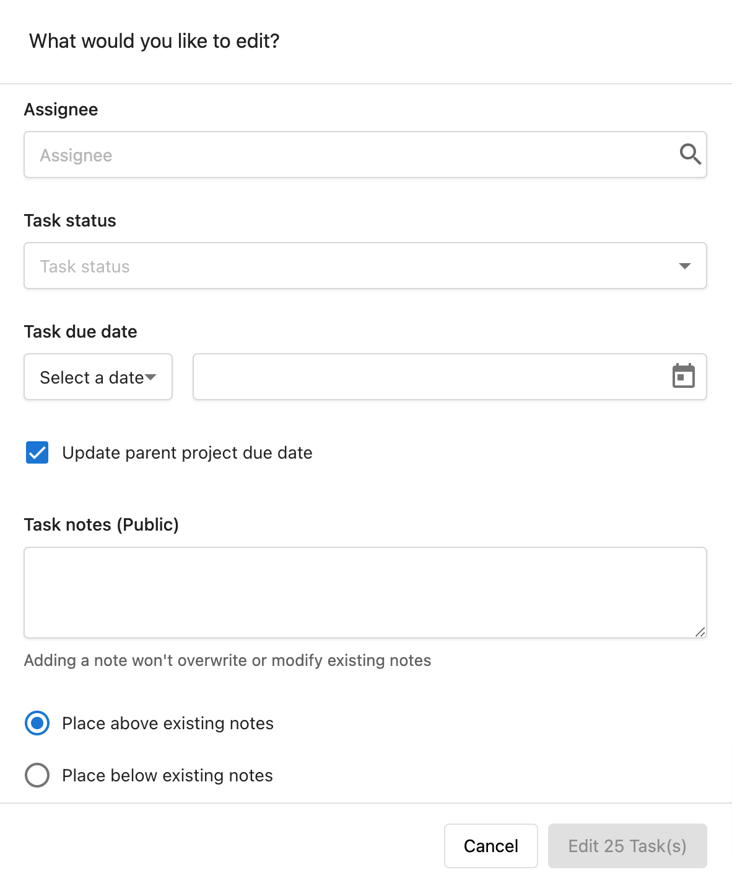
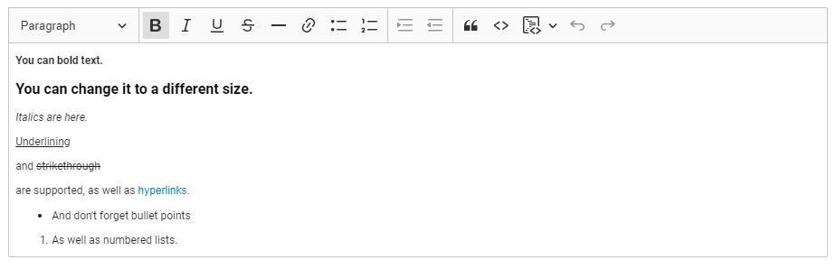

# Tasks Overview

## What are Tasks?

Tasks are the backbone of Task Manager that allow you to view and track the work you need to fulfill. They provide easy access to the tools necessary to complete various fulfillment activities for your clients. Tasks can be created manually or generated automatically based on specific triggers and account settings.

## Why are Tasks Important?

Tasks streamline your fulfillment workflow by:

- **Organizing Work**: Providing a centralized location to track all client-related activities
- **Improving Efficiency**: Enabling bulk operations and automated task generation
- **Enhancing Communication**: Supporting rich text notes, user tagging, and approval workflows
- **Maintaining Accountability**: Tracking due dates, assignments, and completion status
- **Scaling Operations**: Using templates and automation to handle increasing workloads

## What's Included with Tasks?

Task Manager provides comprehensive task management capabilities including:

- **Manual Task Creation**: Create custom tasks for any account or project
- **Auto-Generated Tasks**: Automatically create tasks based on account activity
- **Bulk Operations**: Edit multiple tasks simultaneously to save time
- **Enhanced Search**: Find tasks using keywords, account names, contacts, addresses, order IDs, and tags
- **Flexible Sorting**: Organize tasks by multiple criteria including due date, status, and creation date
- **Rich Text Support**: Format notes with bold, italics, and hyperlinks
- **User Tagging**: Mention team members in comments to improve communication
- **Task Tags**: Organize and categorize tasks for better filtering and management
- **Approval Workflows**: Request client approval for review responses directly from tasks

## How to Create Tasks

### Manual Task Creation

1. Navigate to `Fulfillment` > `Open Task Manager` > `Tasks`
2. Click `Create task`
3. Select the **Account** you're creating the task for
4. Enter information into all appropriate fields - Due date and Account are the only required fields
5. Click `Create task`

### Auto-Generated Tasks

#### Set Up Auto-Generation for All New Accounts

1. Go to `Task Manager` > `Settings`
2. Click `Reputation Management` or `Social Marketing`
3. Move the toggle to the on or off state to control automatic task generation

#### Configure Auto-Generation per Account

1. Go to `Open Task Manager` > `Accounts`
2. Select the respective account
3. Click `Account Settings`
4. Navigate to `Task generation`
5. Toggle task types on/off as needed

:::info
Certain products may need to be active before you can auto-generate tasks on the account.
:::

### Task Types Available for Auto-Generation

- **Listings**: Tasks that generate when listings are inaccurate
- **Mentions**: Tasks for business mentions across the web (requires Reputation Management)
- **Reviews**: Tasks for new customer reviews (requires Reputation Management)
- **Social Posts**: Tasks prompting social media posting (requires Social Marketing)
- **Socialize**: Tasks for customer interactions on social media pages
- **Google Q&A**: Tasks for new questions posted to Google Business Profile

## How to Search and Filter Tasks

### Enhanced Search Functionality

You can search for tasks using any of the following parameters:

- Name
- Account
- Contact
- Address
- Order ID
- Tags

#### Search Process

1. Go to `Task Manager` > `Projects` or `Task Manager` > `Tasks`
2. Set filters as desired
3. Type one of the search parameters into the search field
4. Use quotation marks ("") to search for exact matches
5. Adjust sorting settings once search results are displayed
6. To conduct another search, clear the text and start again

:::info
Using search will reset sorting settings. You can adjust these as needed once your search results are displayed.
:::

## How to Sort Tasks

### Sorting Options

1. Navigate to `Fulfillment` > `Open Task Manager` > `Tasks`
2. Click the `Sort` button
3. Choose one or multiple columns to sort by:
   - None
   - Title
   - Status
   - Created date
   - Modified date
   - Completed date
   - Due date

4. Select Ascending (earliest to latest) or Descending order (latest to earliest)
5. Click `Update`

:::info
If you choose multiple columns, sorting will be prioritized starting with the first column selected. Tasks with the same due date will be ordered alphabetically.
:::

## How to Use Tags for Organization

### Adding Tags to Tasks

#### When Creating a New Task
Add tags in the "Tags" field during task creation.

#### To Existing Tasks
1. Navigate to `Fulfillment` > `Open Task Manager` > `Tasks`
2. Search for and click on the task
3. Click `+ Add tag` and enter your tags

### Tag Benefits

- **Improved Organization**: Categorize tasks by client, status, priority, or custom criteria
- **Quick Filtering**: Easily filter task lists to focus on specific work types
- **Consistent Classification**: Apply the same tags across tasks, projects, and templates
- **Flexible Management**: Add or remove tags as organizational needs change

## How to Bulk Edit Tasks

### Prerequisites for Bulk Editing

Before bulk editing tasks, ensure you have:

1. **Account User Manager Role**: Permission to manage users and access levels
2. **Team Member with Admin Access**: Administrative permissions for the accounts
3. **Manager Role**: Users must be set up as Manager in their profile to complete bulk actions

#### Setting Up Manager Role
1. Navigate to `Partner Center` > `Fulfillment` > `Users` > `Manage Users`
2. Click on the menu and `Edit User`
3. Select `Manager`

### Bulk Editing Process

1. **Select Tasks**:
   - Navigate to the Tasks section
   - Check boxes next to tasks you want to edit
   - Use filters to narrow down tasks before selecting

2. **Apply Edits**:
   - Click the `Edit` button at the top of the task list
   - Choose fields to update (status, assignee, due date)
   - Make your changes
   - Click `Save` to apply changes to all selected tasks

3. **Review Changes**: Verify that edits were applied correctly

### Bulk Editing Best Practices

- Filter tasks first to narrow down your selection
- Double-check your selection before applying changes
- Communicate changes to affected team members
- Use bulk editing regularly to maintain organization

:::warning
- Some task fields may not be available for bulk editing
- You cannot edit tasks from different accounts simultaneously
- Custom fields may have specific requirements or limitations
:::

## How to Communicate Using Tasks

### Tagging Users in Comments

1. Navigate to `Fulfillment` > `Open Task Manager` > `Tasks`
2. Click on a task
3. In the side panel, click `Comments`
4. Type your comment and enter `@` followed by a team member's name
5. Click on the user you wish to tag
6. Click `Submit`

### Comment Notifications

When tagged, users receive both in-app notifications and email notices (unless disabled). The in-app notification contains a direct link to the task, and the email contains the message content.

### Rich Text Support for Notes

You can format task notes using:
- **Bold text**
- *Italic text*
- Hyperlinks

This helps emphasize important information and keeps all relevant details organized within tasks.

### Public Notes in Business App

Public notes on tasks visible to Business App users will appear in the client's Business App interface. This improves client communication and gives you control over shared information.

:::warning
If you have public notes you don't wish to share, move them to private notes.
:::

## How to Manage Special Task Types

### Google Q&A Tasks

Google Q&A tasks help you respond to customer questions posted to Google Business Profile listings.

#### Setting Up Google Q&A Tasks
1. Connect the Google account in Reputation Management for each account
2. Tasks will automatically generate when new questions are posted

#### Responding to Questions
1. Navigate to `Open Task Manager` > `Tasks`
2. Click the Google Q&A task
3. Answer the question
4. Click `Answer`

#### Toggle Google Q&A On/Off
1. Open `Task Manager`
2. Go to `Settings` > `Reputation Management`
3. Click the toggle next to `Google Q&A`

### Review Response Tasks

#### Requesting Approval for Review Responses
1. Navigate to `Open Task Manager` > `Tasks`
2. Use filters to find review tasks requiring responses
3. Choose from AI suggested responses, templates, or draft your own
4. Click `Request Approval`

The email will be delivered to all Business App users and notification recipients with `Review Response Approval` enabled in their notification settings.

#### Creating Review Response Templates
1. Log in to `Task Manager`
2. Go to `Settings` > `Task generation` > `Reputation Management`
3. Click `Manage Templates`
4. Click `+ Add New Template`
5. Add title, response content, star rating criteria, and optional business categories
6. Click `Save`

### Managing Login Credentials

You can securely save client usernames and passwords for task completion.

#### Via Onboarding Tasks
1. Navigate to `Fulfillment` > `Open Task Manager` > `Tasks`
2. Find the Onboarding Task using filters or search
3. Click the `+Add Credentials` link in the task

#### Via Account Settings
1. Navigate to `Fulfillment` > `Open Task Manager` > `Accounts`
2. Search for and select the account
3. Click `Account Settings`
4. Navigate to `Source Settings` and expand relevant sections
5. Click `Edit Credentials` to enter username and password
6. Click `Save`

## Waiting on Customer Notifications

When setting visible tasks to "Waiting on Customer", you can notify clients who will receive Business App notifications and emails directing them to the Projects page.

## Frequently Asked Questions

Why are my reviews disappearing when I filter by multiple star ratings?

The star rating filters use "AND" logic instead of "OR" logic. When you select multiple star ratings, the system looks for reviews that match ALL selected criteria simultaneously (1-star AND 2-star AND 3-star), which is impossible. Select one star rating at a time for filtering. You can still combine star rating filters with task status and assignee filters.

What permissions do I need to bulk edit tasks?

You need three things: Account User Manager role, Team Member with Admin Access for the relevant accounts, and Manager role in your user profile. Without the Manager role, you cannot complete bulk actions in Task Manager.

Can I edit tasks from different accounts at the same time?

No, you cannot bulk edit tasks from different accounts simultaneously. You can only bulk edit tasks within the same account at one time.

How do auto-generated tasks work?

Auto-generated tasks are created automatically based on account activity and your configured settings. For example, when new reviews are posted, new mentions appear online, or questions are asked on Google Business Profile, tasks will generate automatically if those task types are enabled for the account.

What happens when I tag someone in a task comment?

Tagged users receive both an in-app notification and an email notice (unless they've disabled notifications). The in-app notification includes a direct link to the task, and the email contains the comment content.

Can I use rich text formatting in all task notes?

Yes, you can use bold, italics, and hyperlinks in both task notes and project descriptions. This helps emphasize important information and organize content effectively.

How do I turn off auto-generated tasks for specific accounts?

Go to Open Task Manager > Accounts, select the account, click Account Settings, navigate to Task generation, and toggle the specific task types off. You can control this for individual accounts or set defaults for all new accounts in Settings.

What's the difference between public and private notes?

Public notes on tasks visible to Business App users will appear in the client's interface under Projects. Private notes remain internal to your team. If you have sensitive information, keep it in private notes.

Can I search for tasks using partial information?

Yes, the enhanced search functionality allows you to search using partial matches for names, accounts, contacts, addresses, order IDs, and tags. Use quotation marks for exact phrase matches.

How do I organize tasks by priority or urgency?

Use tags to create your own priority system (e.g., "urgent", "high-priority", "low-priority") and combine this with sorting by due date. You can also use the bulk edit feature to quickly update multiple tasks with priority tags.

What happens when I request approval for a review response?

The approval request email is sent to all Business App users and notification recipients on that account who have Review Response Approval enabled. Task Manager records the time in a public note and changes the task status to "Waiting on Customer."

Can I create custom task templates?

While the documents don't detail custom task creation templates, you can create review response templates for different star ratings and business categories. For other custom tasks, you'll need to create them manually or use the auto-generation features for standard task types.

How do I manage tasks for multi-location businesses?

Use tags to organize tasks by location, and leverage the enhanced search to find tasks by address or location-specific keywords. You can also use bulk editing to apply changes across multiple location-related tasks efficiently.

What should I do if I can't find a specific task?

Use the enhanced search feature to search by account name, contact, address, order ID, or tags. You can also apply filters by status, assignee, or task type, then sort results by creation date, due date, or other criteria to locate the task.

How do I ensure clients see important task updates?

Use public notes for information you want clients to see, set tasks to visible in Business App, and use the "Waiting on Customer" status with notifications when client input is needed. Rich text formatting can help emphasize important information in public notes.

