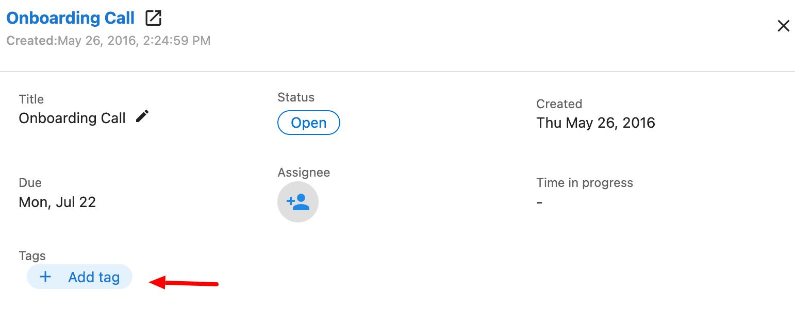

# Using Tags in Task Manager

## Introduction

In the Task Manager, you can use tags to organize and quickly identify your tasks, projects, and templates. Tags provide an additional layer of organization beyond task and project categories.

## Using Tags

As you type in a tag, Task Manager will suggest existing tags you've used before. You can select one of these suggestions or create a new tag by typing a unique name.

### Adding Tags to Tasks

#### When Creating a New Task

When creating a new task, you can add tags in the "Tags" field:

#### To an Existing Task

To add tags to an existing task:

Navigate to Fulfillment > Open Task Manager > Tasks.
Search for the task you want to add a tag to and click on it.
Click + Add tag and enter your tags

### Adding Tags to Projects

#### When Creating a New Project

When creating a new project, you can add tags in the "Tags" field:

#### To an Existing Project

To add tags to an existing project:

1. Open the project you want to tag
2. Click in the "Tags" field 
3. Type your tag name or select from existing suggestions

### Adding Tags to Templates

Adding tags to new and existing templates is done by filling in the Template tags field.

Navigate to Fulfillment > Open Task Manager > Templates.
Search for the template you want to add a tag to and click edit it or create a template.
Click + Add tag and enter your tags.

## Benefits of Using Tags

- **Improved Organization**: Categorize tasks and projects by client, status, priority, or any other criteria
- **Quick Filtering**: Easily filter your task list to focus on specific types of work
- **Consistent Classification**: Apply the same tags across tasks, projects, and templates for unified organization
- **Flexible Management**: Tags can be added or removed at any time as your organizational needs change