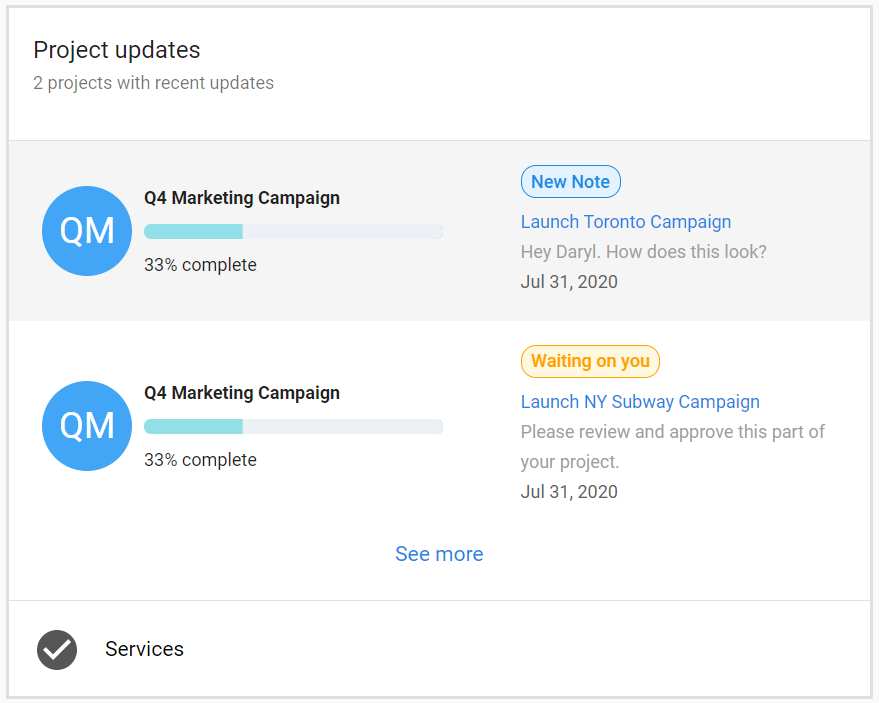

# Projects

## What are Projects?

Projects in the fulfillment system help you organize, track, and communicate about your work with team members and clients. You can manage all aspects of project delivery from a central workspace, including task assignment, client communication, progress tracking, and reporting.

## Why are Projects important?

Projects and their tasks can have many moving parts and involved parties, making context valuable when making fulfillment decisions. By keeping all communication in one place and within view of the task at hand, context remains easily accessible and hard to miss.

Projects deliver a more cohesive experience for your clients, with all communication visible in real-time within their main Inbox portal in Business App. You can respond quickly and easily to questions or comments to keep project progress moving forward efficiently.

## What's Included with Projects?

### Project Communications
Collaborate with teammates and communicate with clients directly within the project workspace. All communication stays organized around specific tasks and projects.

### Notifications and Updates
Stay informed about project updates, status changes, and important milestones. Automatic email notifications keep all parties informed when key events occur.

### Executive Reporting
Track project progress and generate reports for stakeholders. Project updates appear in Executive Report to showcase work completed during selected time periods.

### Task Management
Organize and assign tasks within projects to ensure timely completion. Tasks can be made visible to clients and configured for approval workflows.

## How to Set Up Project Communications

1. Go to **Task Manager**
2. Open a project or task (the task must be associated with the project)
3. Add a comment in the **Comments** tab
4. Use "@" to tag another user in your comment
5. To make comments visible to the client, switch on the **Public** toggle

6. To allow Business App users to see the task and project, click the eye icon to make them "Visible in Business App"

### Client Approval Settings

When a task and project are visible in Task Manager, you can open a task and check the box to allow Business App users to approve and provide feedback on that task in Business App.

## How Project Notifications Work

The Business App User or Digital Agent User will receive an email notification with comments or status updates in these situations:

- When the order begins
- When the status changes to waiting on customer
- When the due date is changed
- When comments are added to public tasks

### Notification Workflow

- **Business App Users** can review comments and provide feedback, or approve tasks within Business App by navigating to **My Business > Projects**
- **Digital Agent Users** can review and respond to comments within the Project Task in Task Manager
- You can notify relevant parties without a comment when you change the due date, add a collaborator, or change the status to waiting on customer

## Project Updates in Executive Report

Executive Report showcases work done on projects in Task Manager through the project updates card. This feature supplements the fulfillment projects card by providing detailed visibility into project activities.

### What Appears in Executive Report

The project updates card allows business owners to see exactly what is happening with projects. It showcases each update made during the selected time period and includes badges to indicate what types of updates have been made.

### Requirements for Executive Report Display

Any projects and tasks that have been set to 'visible in Business App' will show in Executive Report, provided an update was made during the selected time period.

## Frequently Asked Questions (FAQs)

How do I make a project visible to my clients?

Click the eye icon next to the project or task to make it "Visible in Business App." This allows Business App users to see the project and receive updates.

What's the difference between public and private comments?

Public comments are visible to clients when the Public toggle is switched on. Private comments are only visible to internal team members.

When do clients receive email notifications?

Clients receive notifications when the order begins, when status changes to waiting on customer, when due dates change, and when public comments are added.

How do I tag team members in comments?

Use the "@" symbol followed by the user's name in the Comments tab to tag another user and notify them about the comment.

Can clients approve tasks directly?

Yes, when you enable the approval setting for a task, Business App users can approve and provide feedback on that task within Business App.

Why don't my projects appear in Executive Report?

Projects must be set to 'visible in Business App' and have updates made during the selected time period to appear in Executive Report.

Where do clients view project updates?

Clients can view project updates in their Business App by navigating to **My Business > Projects**.

How do I change a project's due date?

You can change the due date within Task Manager. Relevant parties will be automatically notified of the change via email.

Can I communicate about multiple tasks within one project?

Yes, you can add comments to individual tasks within a project. Each task maintains its own comment thread while remaining part of the larger project.

What happens when I change a task status to "waiting on customer"?

The customer will receive an automatic email notification informing them that their input or action is required to continue the project.

