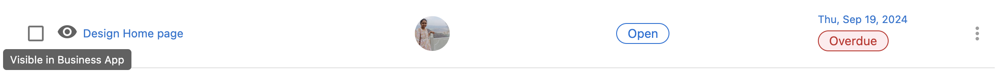
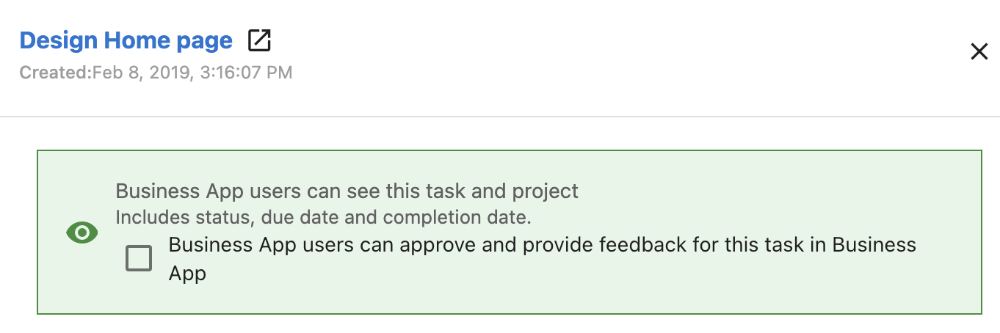

Partners can communicate with all parties associated with a project right within Task Manager. Collaborate with teammates, respond to questions from clients, and keep all communication around a project in one place. Project updates can be seen directly within the Task Manager, Business App, and Partner Center. 

Any questions or comments will be updated immediately and email notifications will be sent to relevant parties when: the order begins, the status changes to waiting on a customer, or when the due date is changed.

### **Why are project task communications important?**

Projects and their tasks can have a lot of moving parts and involved parties, and context is valuable when making fulfillment decisions. By keeping all communication in one place and within view of the task at hand, context is easily accessible and hard to miss. 

Bringing communication to Task Manager delivers a more cohesive experience for your clients, with all communication visible in real-time within their main Inbox portal in Business App. Respond quickly and easily to questions or comments to keep a project's progress moving forward efficiently and delight clients with attentive service.

### **How do project task communications work?**

1. Go to **Task Manager.**
2. Open a project or task. Note, the Task must be associated with the project
3. Add a comment in the **Comments** tab. Use "@" to tag another user.
4. To make comments visible to the client, switch on the **Public** toggle.

6. To allow Business App users to see the task and project, click the eye to make them "Visible in Business App." 

- When a task and project are visible in Task Manager, you can also open a task and check the box to allow Business App users to approve and provide feedback on that task in Business App. 

### **How do project task notifications work?**

The Business App User or Digital Agent User will receive an email notification with a comment or status update

- **Business App Users** can review the comment and provide feedback, or approve the task within Business App, by navigating to **My Business > Projects.**
- The **Digital Agent User** can review and respond to the comment within the Project Task within Task Manager
- You can also notify relevant parties without a comment when you change the due date, add a collaborator, or change the status to waiting on customer.