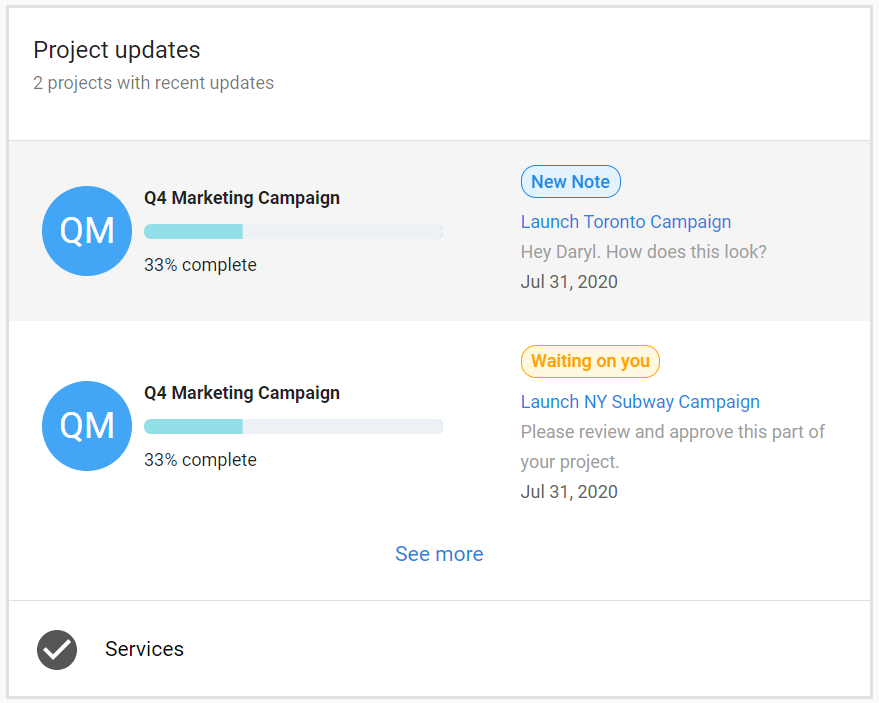

# Project updates in Executive Report

Executive Report is a powerful tool to showcase work done on projects in Task Manager. We previously rolled out the fulfillment projects card and the **project updates** card supplements it.

This card allows business owners to see exactly what is going on with projects. It showcases each update made during the selected time period, and it comes complete with badges to let them know what sort of updates have been made.

### **How do I get my projects to show in Executive Report?**

Any projects and tasks that have been set to 'visible in Business App' will show in Executive Report, provided an update was made for the selected time period.