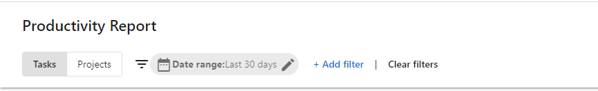
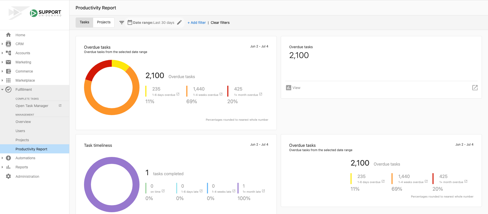

# Productivity Report – Complete Analytics Guide

## What is the Productivity Report?

The Productivity Report is a comprehensive analytics tool that helps you understand how your fulfillment teams are performing. You can track task completion rates, project progress, due date adherence, and team productivity across both individual tasks and entire projects.

## Why is the Productivity Report important?

Tracking how your teams are doing overall can be challenging without proper visibility. The Productivity Report provides superior insights into staff performance and makes it easier to address problem areas while identifying which fulfillment agents excel.

The report helps you monitor execution across multiple projects happening simultaneously, giving managers clear views of completed and overdue work to gauge their team's effectiveness.

## What's Included with the Productivity Report?

### Task Analytics
- Task completion rates and timing
- Due date adherence tracking
- Overdue task identification
- Individual employee performance summaries
- Task status breakdowns

### Project Analytics
- Completed project tracking
- Overdue project monitoring
- Project execution timelines
- Team performance across multiple projects
- Project status analytics

### Performance Insights
- Staff productivity metrics
- Resource allocation analysis
- Workload distribution tracking
- Problem area identification
- Excellence recognition data

### Filtering and Customization
- Filter by tasks or projects
- Filter by assignee
- Filter by group
- Custom date range selection
- Detailed breakdowns by time period

## How to Access the Productivity Report

1. Go to `Partner Center` > `Fulfillment` > `Productivity Report`
2. Choose your view: **Tasks** tab or **Projects** tab
3. Apply filters as needed:
   - Filter by assignee
   - Filter by group
   - Set date ranges
4. Review the analytics and insights provided

## How to Use Task Analytics

The task analytics view provides detailed insights into individual task performance and team productivity.

### Key Task Metrics

The Productivity Report tracks several important task statistics:

- **Task completion timing**: How close to their due dates your team completes tasks
- **Overdue resolution time**: How long overdue tasks remain before resolution
- **Completed task count**: Number of tasks completed during set periods
- **Due task tracking**: Number of tasks that were due during specific timeframes
- **Overdue task count**: Current number of overdue tasks

### Task Performance Analysis

You can use the task analytics to:

- Anticipate workload spikes on specific days
- Alter due dates and timelines for more even work distribution
- Compare overdue tasks against completed tasks from previous days
- Determine if resources are allocated appropriately
- Identify productivity patterns and bottlenecks

## How to Use Project Analytics

The project analytics view helps you track multiple projects and assess team execution across larger initiatives.

### Accessing Project Analytics

1. Go to `Partner Center` > `Fulfillment` > `Productivity Report`
2. Select the **Projects** tab
3. Set your desired date range
4. Review analytics on completed and overdue projects

### Project Performance Insights

The projects view allows managers to:

- Stay on top of team progress across multiple simultaneous projects
- Track completed project rates
- Monitor overdue project trends
- Assess team execution effectiveness
- Identify project management improvements

## Access Requirements and Permissions

:::warning
Only administrators and managers have access to Productivity Report features. Regular team members cannot view these analytics.
:::

## Reporting and Communication

The Productivity Report provides valuable data for stakeholder communication. Managers can use the dashboard to:

- Grab important statistics for reports
- Communicate performance metrics to leadership
- Provide data-driven insights to decision makers
- Track progress against goals and targets

## Frequently Asked Questions (FAQs)

Who can access the Productivity Report?

Only administrators and managers have access to Productivity Report features. Regular team members cannot view these analytics.

Can I filter the report by specific team members?

Yes, you can filter the Productivity Report by assignee to view individual team member performance and metrics.

What's the difference between task and project analytics?

Task analytics focus on individual task completion, due dates, and overdue items. Project analytics provide broader views of project completion rates and execution across multiple simultaneous projects.

How do I identify if my team has too much work on specific days?

Use the task analytics to review due date distributions. If you see an inordinate amount of work scheduled for any one day, you can alter due dates to create a more even workload spread.

Can I track performance by team groups?

Yes, the Productivity Report allows you to filter by group, making it easy to track performance across different teams or departments.

How do I know if resources are allocated appropriately?

Compare overdue tasks against completed tasks from previous periods. If overdue tasks frequently match or exceed completed tasks, this may indicate resource allocation issues.

What time periods can I analyze?

You can set custom date ranges in the Productivity Report to analyze performance over specific periods that match your reporting needs.

How often should I review the Productivity Report?

Regular review helps identify patterns and trends. Many managers check weekly to stay on top of team performance and address issues promptly.

Can I export the productivity data?

The report provides visual dashboards and statistics that you can use for stakeholder communication and reporting purposes.

What should I do if I notice productivity issues?

Use the detailed metrics to identify specific problem areas, whether they're related to individual performance, workload distribution, or project management processes.

How do I track team performance across multiple projects?

Use the Projects tab in the Productivity Report to get a comprehensive view of how your team is executing across all simultaneous projects.

Can I see which team members excel at meeting deadlines?

Yes, the individual employee performance summaries and due date adherence tracking help identify which team members consistently meet or exceed expectations.

