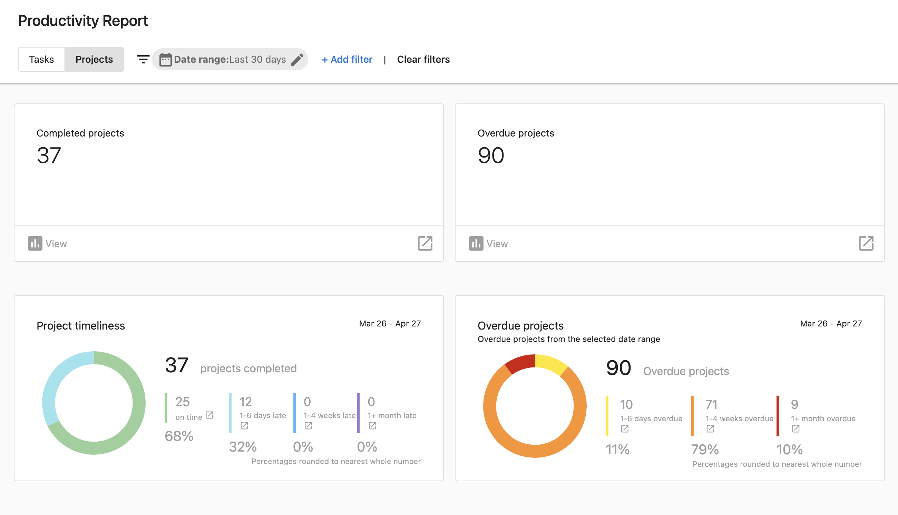

# Productivity Reports for Projects

Keeping track of multiple projects happening simultaneously is challenging. With Productivity Reports for Projects, managers can gauge their team's execution with views of completed and overdue projects.

### **Why are productivity reports for projects important?**

Managers can easily stay on top of their team's progress on projects now with the new Projects tab in Productivity Reports.

### **How do productivity reports for projects work?**

1. Go to **Partner Center > Fulfillment > Productivity Report**
2. Select the **Projects** tab
3. Set the desired date range
4. View analytics on completed and overdue projects

