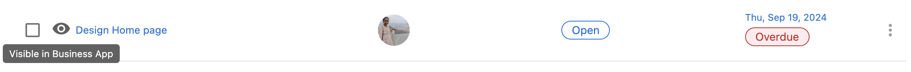
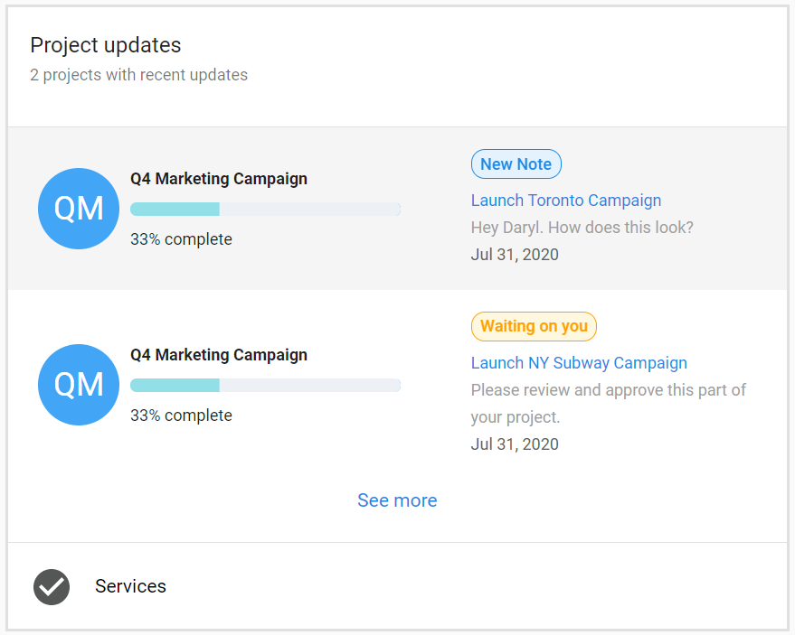

# Projects

Projects in Task Manager help you organize related tasks, assign team members, and track progress for client work. You can create custom projects or use Social Calendar projects for social media management, set deadlines, and share progress with clients through Business App.

## Why are Projects important?

Projects provide structure for complex work by breaking down deliverables into manageable tasks. You can:

- Organize related tasks under a single project umbrella
- Assign team members and track individual responsibilities
- Set deadlines and monitor progress across client accounts
- Share real-time updates with clients through Business App integration
- Automate project creation when products are activated
- Create reusable templates for common workflows

## What's included with Projects?

### Project types

**Custom Projects**: General-purpose project management for any type of client work. Standard task management, team assignment, and deadline tracking.

**Social Calendar Projects**: For social media content creation and management: content calls, automated social post task generation, and client review workflows.

### Core features

- **Task organization** – Break down projects into specific, actionable tasks
- **Team assignment** – Assign projects and tasks to team members
- **Deadline management** – Due dates for projects and individual tasks
- **Progress tracking** – Monitor completion and identify delays
- **Dependency management** – Task sequences where some tasks must complete before others begin

### Client collaboration

- **Business App integration** – Share project progress with clients in real time
- **Executive Report visibility** – Display project status in client-facing Executive Reports
- **Communications** – Collaborate with teammates and clients in the project workspace; automatic email notifications when order begins, status changes to waiting on customer, due date changes, or public comments are added

## Articles in this section

- **[Create and manage projects](./create-and-manage-projects.mdx)** – Create projects, add tasks, assign team members
- **[Delete and archive projects](./delete-and-archive-projects.mdx)** – Archive, delete, and restore projects
- **[Project templates and automation](./project-templates-and-automation.mdx)** – Templates and auto-create projects

## How to get started with projects

1. Navigate to **Task Manager** and click the **Projects** tab
2. Select **Create Project** and choose project type (Custom or Social Calendar)
3. Associate the project with a client account
4. Add tasks, assign team members, set deadlines
5. Configure client visibility (**Visible in Business App**) if you want to share progress

## How to set up project communications

1. Open a project or task in **Task Manager**
2. Add a comment in the **Comments** tab; use **@** to tag another user
3. Switch on the **Public** toggle to make comments visible to the client
4. Click the eye icon to make the task or project **Visible in Business App** so clients can see it

### Client approval

When a task and project are visible in Task Manager, you can allow Business App users to approve and provide feedback on that task in Business App.

## Project updates in Executive Report

Set projects and tasks to **Visible in Business App** so they appear in the client's Executive Report (with updates during the selected time period). The project updates card shows what’s happening with projects and the types of updates made.

## Frequently asked questions

Can I reorder project tasks if one or more tasks are locked?

If a project task depends on a locked task, you cannot reorder any project tasks within that project. In Templates, you can reorder tasks even if some are locked.

How can I make projects visible in the Executive Report?

Set tasks and projects as **Visible in Business App**. If you enable this after creation, update the notes or status for it to appear in the report.

What's the difference between Custom and Social Calendar projects?

Custom projects are general-purpose. Social Calendar projects add features for social media: content call scheduling, automated social post task generation, and client review workflows.

Can I automatically create projects when products are activated?

Yes. Create project templates and associate them with marketplace products in the template's Advanced Settings so new projects generate when those products are activated.

How do I share project progress with clients?

Enable **Visible in Business App** on projects and their tasks. At least one task must be visible for the project to appear in the client's Business App.

Can I delete projects and tasks?

Yes, but deletion cannot be undone. Consider archiving instead. Only users with appropriate permissions can delete.

Can tasks exist without being part of a project?

You can create standalone tasks, but tasks without a project cannot be shared in Business App or included in client-facing Executive Reports.

How do I preview how a project will look to clients?

Use **View Tracker** in the project menu (three dots next to **+ Add task**) to preview the project in Business App.

When do clients receive email notifications?

When the order begins, when status changes to waiting on customer, when due dates change, and when public comments are added.

Can clients approve tasks directly?

Yes. Enable the approval setting for a task so Business App users can approve and give feedback in Business App.

