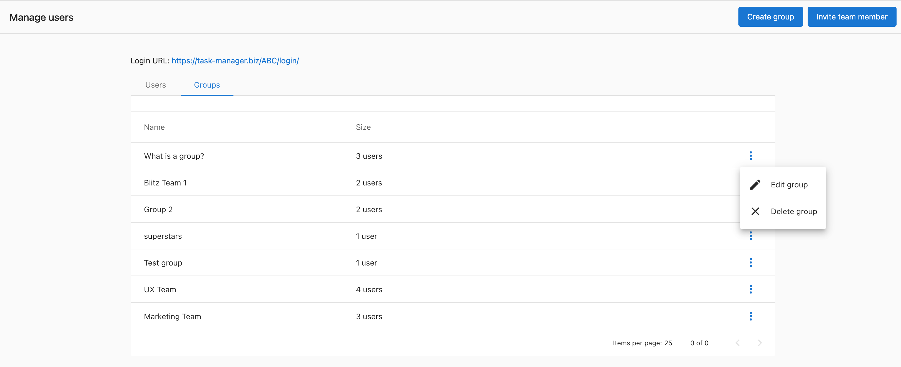

# Add/Remove Task Manager users or groups to existing groups

You can add users and groups to other groups. This relationship isn't one-to-one, so you can add the same users and groups to multiple groups.

## How to add users and groups to other groups:

1. Go to **Partner Center > Fulfillment > Users**
2. Click **Groups**
3. Click on the **menu (3 dots)** > **Edit group** next to the group you wish to add users or other groups
4. Click on the **Users** fields to add or remove users or groups
5. Click **Edit group**

